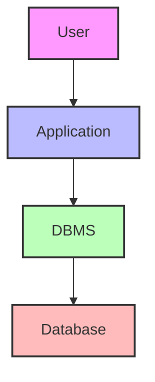
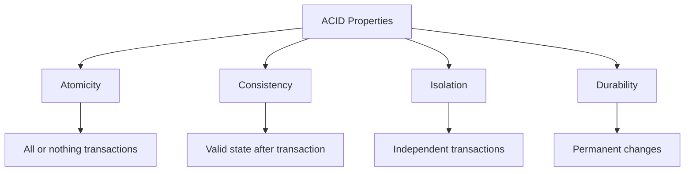

# Database Management System (DBMS): The Ultimate Guide

## 🎯 Learning Outcomes
By the end of this guide, you will be able to:
- Understand what a DBMS is and why it matters
- Grasp the evolution and architecture of DBMS
- Comprehend data models and database design principles
- Master normalization, ACID properties, and transaction management
- Apply practical SQL and database operations
- Appreciate advanced topics and real-world applications

---

## 👶 What is a Database? (For Beginners)
Imagine a giant digital notebook where you can store anything: your friends' names, your favorite games, your school marks, or even your Pokémon collection. A **database** is just that—a place to store and organize information so you can find it easily later.

- **Example:**
  - A list of your friends and their birthdays
  - A library catalog with books, authors, and genres

## 🧑‍🎓 What is a DBMS?
A **Database Management System (DBMS)** is like a super-smart librarian for your digital notebook. It helps you:
- Store data safely
- Find information quickly
- Change or delete data when needed
- Make sure only the right people can see or change things

**Analogy:**
- If a database is a library, the DBMS is the librarian who organizes, tracks, and protects all the books.

---

## 📚 Why Do We Need a DBMS?
### Problems with Old File Systems
- Data duplication (same info in many places)
- Hard to update or find data
- No security or access control
- Prone to errors and inconsistencies

### How DBMS Solves These Problems
- Centralizes data storage
- Reduces duplication and errors
- Provides security and access control
- Supports multiple users at once
- Maintains data integrity

---

## 🏗️ DBMS Architecture: How Does It Work?

### 1. Single-Tier (Centralized)
- Everything happens in one place (like a personal diary)

### 2. Two-Tier (Client-Server)
- User interacts with an application, which talks to the database

### 3. Three-Tier (Web/Enterprise)
- User (browser/app) → Application server → Database server

---

## 🧩 Key Features of a DBMS

### 1. Real-World Entity Representation
- Stores data as real things (students, books, products)
- Example: Student table with name, age, grade

### 2. Relation-Based Tables
- Data is organized in tables (rows and columns)
- Easy to visualize and query

### 3. Data-Application Isolation
- Data is separate from the programs that use it
- Makes updates and changes easier

### 4. Reduced Redundancy
- Normalization removes duplicate data
- Example: Store student info once, not in every class record

### 5. Consistency & Integrity
- Rules ensure data is always correct
- Example: No two students with the same ID

### 6. Query Language Support
- Use SQL to ask questions and get answers
- Example: "Show all students older than 15"

### 7. Security & Access Control
- Only authorized users can see or change data
- Example: Teachers can update grades, students can only view

### 8. Multi-User Support
- Many people can use the database at once
- Handles conflicts and keeps data safe

---

## 🔑 ACID Properties: The Heart of Reliable Databases

- **Atomicity:** All steps in a transaction happen, or none do
- **Consistency:** Data always follows the rules
- **Isolation:** Transactions don't interfere with each other
- **Durability:** Once done, changes stay even if the system crashes

---

## 🗂️ Types of Databases

### 1. Relational Databases (SQL)
- Data in tables with rows and columns
- Use SQL for queries
- Examples: MySQL, PostgreSQL, Oracle

### 2. NoSQL Databases
- Flexible structure (documents, key-value, graphs)
- Great for big data and fast changes
- Examples: MongoDB, Redis, Neo4j

---

## 🧑‍💻 Who Uses a DBMS?
- **Database Administrators (DBA):** Manage and secure databases
- **Developers:** Build apps that use databases
- **Data Analysts/Scientists:** Analyze and visualize data
- **End Users:** Use apps that rely on databases (everyone!)

---

## 🏆 Real-World Examples
- **Banking:** Track accounts, transactions, and balances
- **E-commerce:** Manage products, orders, and customers
- **Social Media:** Store user profiles, posts, and messages
- **Healthcare:** Patient records, appointments, and billing

---

## 🧠 Advanced Concepts (For Experts)
- **Normalization:** Organize data to reduce redundancy
- **Transactions:** Group operations for reliability
- **Indexes:** Speed up data retrieval
- **Views:** Virtual tables for custom data access
- **Stored Procedures & Triggers:** Automate tasks and enforce rules
- **Replication & Sharding:** Scale databases for big applications
- **Security:** Encryption, auditing, and compliance

---

## 📝 Quick Summary
- DBMS is the backbone of modern data management
- Organizes, secures, and optimizes data storage and access
- Supports multiple users, complex queries, and large-scale applications
- Essential for businesses, science, and technology

---

## 📚 Further Reading & Practice
- "Database System Concepts" by Silberschatz, Korth, and Sudarshan
- "Database Design for Mere Mortals" by Michael J. Hernandez
- Online platforms: LeetCode (SQL), HackerRank (Databases), W3Schools (SQL)
- Practice: Install MySQL/PostgreSQL and try creating your own database!

---
*This guide is designed to be the most comprehensive and accessible introduction to Database Management Systems. For hands-on practice, refer to the exercises and projects in the course materials.* 