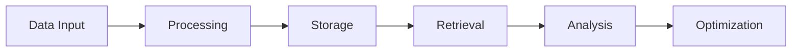
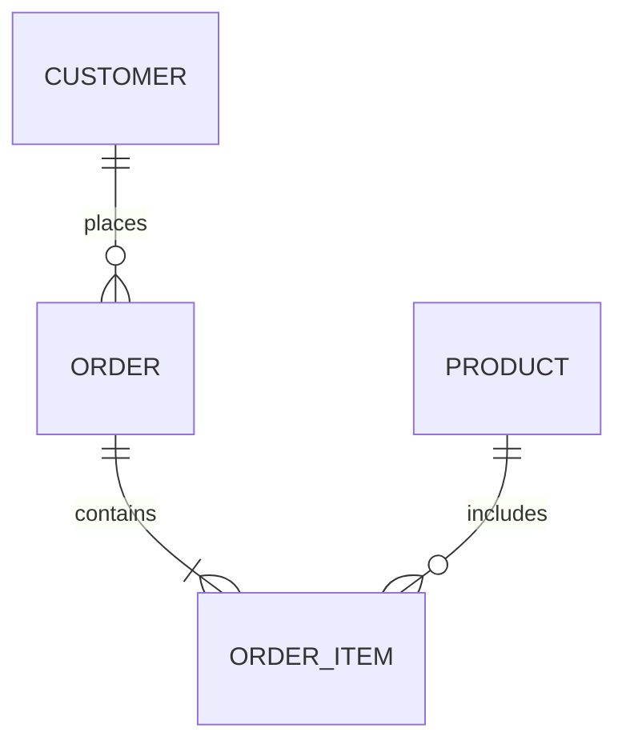

# Understanding Databases: A PostgreSQL-Centric Guide 🗄️

## 📌 Introduction

A database is a structured collection of data that is organized, stored, and managed electronically. In the context of PostgreSQL, it's a powerful, open-source object-relational database system that provides robust data management capabilities with ACID compliance, extensibility, and advanced features.

### Why PostgreSQL?
- **Enterprise-Grade**: Used by major companies like Apple, Instagram, and Spotify
- **ACID Compliant**: Ensures data integrity and reliability
- **Extensible**: Supports custom data types, functions, and extensions
- **Advanced Features**: JSON support, full-text search, and geospatial capabilities

## 🎯 Learning Outcomes

By the end of this module, you will be able to:

1. **Design** and implement normalized database schemas using PostgreSQL
2. **Query** and manipulate data using PostgreSQL-specific SQL syntax
3. **Optimize** database performance through proper indexing and query planning
4. **Implement** data integrity constraints and relationships
5. **Analyze** and solve real-world database problems using PostgreSQL features

## 🧠 Concept Breakdown

### 1. Database Types
- **Relational Databases (PostgreSQL)**
  - Structured data in tables
  - ACID compliance
  - Complex queries and joins
  - Data integrity constraints

- **NoSQL Databases**
  - Document-based (MongoDB)
  - Key-value stores (Redis)
  - Graph databases (Neo4j)
  - Column-family stores (Cassandra)

### 2. PostgreSQL Architecture
```
┌─────────────────────────────────────────────────────────────┐
│                     PostgreSQL System                        │
├─────────────────┬─────────────────┬─────────────────────────┤
│   Client        │   Server        │    Storage              │
│   Applications  │   Process       │    Engine               │
└────────┬────────┴────────┬────────┴──────────┬──────────────┘
         │                  │                   │
         ▼                  ▼                   ▼
┌─────────────────┐ ┌─────────────────┐ ┌─────────────────┐
│  Connection     │ │  Query          │ │  Data Files     │
│  Pool          │ │  Planner        │ │  & WAL          │
└─────────────────┘ └─────────────────┘ └─────────────────┘
```

### 3. Key PostgreSQL Features
- **Data Types**
  - Built-in types (INTEGER, VARCHAR, TIMESTAMP)
  - Custom types (ENUM, ARRAY, JSONB)
  - Geometric and network types

- **Indexing**
  - B-tree (default)
  - GiST (Geometric)
  - GIN (Full-text search)
  - BRIN (Block Range)

## 📊 Visual Representation

### Database Lifecycle


### Table Relationships


## 💻 PostgreSQL Code Examples

### 1. Creating a Database Schema
```sql
-- Create a new database
CREATE DATABASE ecommerce;

-- Create tables with relationships
CREATE TABLE customers (
    customer_id SERIAL PRIMARY KEY,
    name VARCHAR(100) NOT NULL,
    email VARCHAR(255) UNIQUE,
    created_at TIMESTAMP DEFAULT CURRENT_TIMESTAMP
);

CREATE TABLE orders (
    order_id SERIAL PRIMARY KEY,
    customer_id INTEGER REFERENCES customers(customer_id),
    order_date TIMESTAMP DEFAULT CURRENT_TIMESTAMP,
    total_amount DECIMAL(10,2)
);

-- Create indexes for performance
CREATE INDEX idx_customer_email ON customers(email);
CREATE INDEX idx_order_customer ON orders(customer_id);
```

### 2. Basic Queries
```sql
-- Insert data
INSERT INTO customers (name, email)
VALUES ('John Doe', 'john@example.com');

-- Query with JOIN
SELECT c.name, o.order_id, o.total_amount
FROM customers c
JOIN orders o ON c.customer_id = o.customer_id
WHERE c.email = 'john@example.com';

-- Use EXPLAIN to analyze query performance
EXPLAIN ANALYZE SELECT * FROM customers WHERE email = 'john@example.com';
```

## 💡 Real-World Use Case: E-commerce Platform

### PostgreSQL Implementation
- **Product Catalog**: Efficient storage and retrieval of product data
- **Order Management**: ACID transactions for order processing
- **User Management**: Secure storage of customer information
- **Analytics**: Complex queries for business intelligence

## 🛠️ Hands-On Project: Library Management System

### Project Requirements
1. Design a normalized database schema
2. Implement tables for:
   - Books (id, title, author, isbn, status)
   - Members (id, name, email, join_date)
   - Borrowing Records (id, book_id, member_id, dates)

### Implementation Steps
```sql
-- Create the database schema
CREATE DATABASE library;

-- Create tables with proper constraints
CREATE TABLE books (
    book_id SERIAL PRIMARY KEY,
    title VARCHAR(255) NOT NULL,
    author VARCHAR(100),
    isbn VARCHAR(13) UNIQUE,
    status VARCHAR(20) DEFAULT 'available'
);

CREATE TABLE members (
    member_id SERIAL PRIMARY KEY,
    name VARCHAR(100) NOT NULL,
    email VARCHAR(255) UNIQUE,
    join_date TIMESTAMP DEFAULT CURRENT_TIMESTAMP
);

CREATE TABLE borrowing_records (
    record_id SERIAL PRIMARY KEY,
    book_id INTEGER REFERENCES books(book_id),
    member_id INTEGER REFERENCES members(member_id),
    borrow_date TIMESTAMP DEFAULT CURRENT_TIMESTAMP,
    return_date TIMESTAMP,
    CONSTRAINT valid_dates CHECK (return_date > borrow_date)
);
```

### Testing Criteria
1. Data integrity through constraints
2. Query performance with indexes
3. Proper relationship implementation
4. Error handling and validation

## 🧾 Key Takeaways

1. **Data Organization**: PostgreSQL provides robust tools for structured data management
2. **Performance**: Proper indexing and query optimization are crucial
3. **Integrity**: ACID compliance ensures reliable transactions
4. **Scalability**: PostgreSQL can handle growing data needs
5. **Flexibility**: Extensive feature set for various use cases

## 📚 Further Reading & Resources

1. [PostgreSQL Official Documentation](https://www.postgresql.org/docs/)
2. [PostgreSQL Tutorial](https://www.postgresqltutorial.com/)
3. [PostgreSQL Performance Tuning](https://www.postgresql.org/docs/current/performance-tips.html)
4. [PostgreSQL Community Forums](https://www.postgresql.org/community/)
5. [PostgreSQL Interactive Learning](https://pgexercises.com/)

---

*Note: This guide is designed for educational purposes. Always refer to official PostgreSQL documentation for production implementations.* 