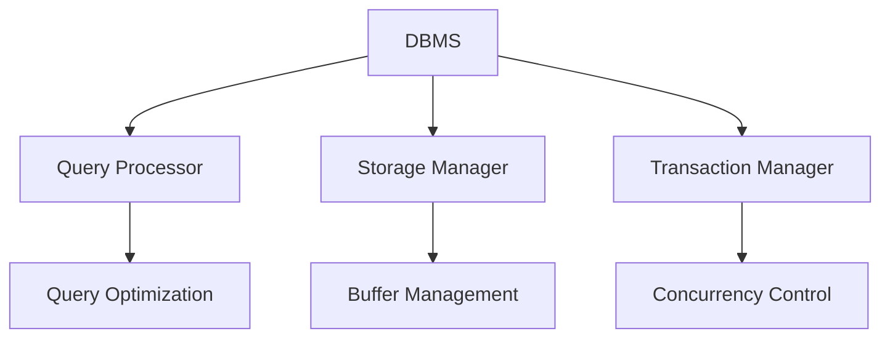
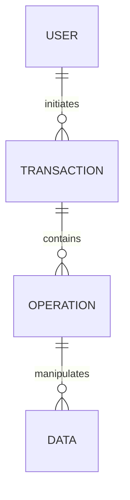

# Database Management System (DBMS) Tutorial 🗄️

## 📌 Introduction

A Database Management System (DBMS) is a software system designed to store, retrieve, and manage data efficiently. PostgreSQL, as a modern DBMS, provides robust features for data management, security, and scalability. This tutorial covers fundamental DBMS concepts with a focus on PostgreSQL implementation.

### Why Learn DBMS?
- **Data Organization**: Efficient storage and retrieval of structured data
- **Data Security**: Advanced security features and access control
- **Data Integrity**: ACID compliance and data consistency
- **Scalability**: Handle growing data needs effectively
- **Career Growth**: High demand for DBMS professionals

## 🎯 Learning Outcomes

By the end of this module, you will be able to:

1. **Design** and implement database schemas using PostgreSQL
2. **Apply** ACID properties in database transactions
3. **Implement** security measures and access control
4. **Optimize** database performance and queries
5. **Manage** concurrent user access and data consistency

## 🧠 Concept Breakdown

### 1. DBMS Architecture
```
┌─────────────────────────────────────────────────────────────┐
│                     DBMS Architecture                        │
├─────────────────┬─────────────────┬─────────────────────────┤
│   External      │   Conceptual    │    Internal             │
│   Level         │   Level         │    Level                │
└────────┬────────┴────────┬────────┴──────────┬──────────────┘
         │                  │                   │
         ▼                  ▼                   ▼
┌─────────────────┐ ┌─────────────────┐ ┌─────────────────┐
│  User Views     │ │  Logical        │ │  Physical       │
│  & Interfaces   │ │  Schema         │ │  Storage        │
└─────────────────┘ └─────────────────┘ └─────────────────┘
```

### 2. Key DBMS Characteristics
- **ACID Properties**
  - Atomicity: All-or-nothing transactions
  - Consistency: Data remains valid
  - Isolation: Concurrent transactions
  - Durability: Committed changes persist

- **Data Independence**
  - Physical Independence
  - Logical Independence

- **Security Features**
  - Authentication
  - Authorization
  - Encryption
  - Audit Logging

## 📊 Visual Representation

### DBMS Components


### Data Flow


## 💻 PostgreSQL Implementation Examples

### 1. Basic Database Operations
```sql
-- Create a new database
CREATE DATABASE company_db;

-- Create tables with constraints
CREATE TABLE employees (
    emp_id SERIAL PRIMARY KEY,
    name VARCHAR(100) NOT NULL,
    email VARCHAR(255) UNIQUE,
    department VARCHAR(50),
    salary DECIMAL(10,2),
    hire_date TIMESTAMP DEFAULT CURRENT_TIMESTAMP
);

-- Create indexes
CREATE INDEX idx_emp_dept ON employees(department);
CREATE INDEX idx_emp_salary ON employees(salary);

-- Insert data
INSERT INTO employees (name, email, department, salary)
VALUES 
    ('John Doe', 'john@company.com', 'IT', 75000.00),
    ('Jane Smith', 'jane@company.com', 'HR', 65000.00);
```

### 2. Transaction Management
```sql
-- Begin transaction
BEGIN;

-- Perform operations
UPDATE employees 
SET salary = salary * 1.1 
WHERE department = 'IT';

-- Commit transaction
COMMIT;

-- Rollback example
BEGIN;
UPDATE employees SET salary = 0;
ROLLBACK;
```

### 3. Security Implementation
```sql
-- Create role
CREATE ROLE hr_manager;

-- Grant permissions
GRANT SELECT, UPDATE ON employees TO hr_manager;

-- Create user
CREATE USER jane_hr WITH PASSWORD 'secure_password';

-- Assign role
GRANT hr_manager TO jane_hr;
```

## 💡 Real-World Use Case: Enterprise HR System

### Business Scenario
A large organization needs a secure and efficient system to manage employee data, including personal information, salary details, and department assignments.

### PostgreSQL Implementation
```sql
-- Create schema
CREATE SCHEMA hr;

-- Create tables with proper constraints
CREATE TABLE hr.employees (
    emp_id SERIAL PRIMARY KEY,
    name VARCHAR(100) NOT NULL,
    email VARCHAR(255) UNIQUE,
    department_id INTEGER,
    manager_id INTEGER,
    hire_date DATE,
    salary DECIMAL(10,2),
    CONSTRAINT valid_salary CHECK (salary > 0)
);

-- Implement security
CREATE ROLE hr_admin;
GRANT ALL ON SCHEMA hr TO hr_admin;
GRANT ALL ON ALL TABLES IN SCHEMA hr TO hr_admin;
```

## 🛠️ Hands-On Project: Library Management System

### Project Requirements
1. Design a normalized database schema
2. Implement security measures
3. Create necessary indexes
4. Handle concurrent access

### Implementation Steps
```sql
-- Create database
CREATE DATABASE library;

-- Create tables
CREATE TABLE books (
    book_id SERIAL PRIMARY KEY,
    title VARCHAR(255) NOT NULL,
    author VARCHAR(100),
    isbn VARCHAR(13) UNIQUE,
    status VARCHAR(20) DEFAULT 'available'
);

CREATE TABLE members (
    member_id SERIAL PRIMARY KEY,
    name VARCHAR(100) NOT NULL,
    email VARCHAR(255) UNIQUE,
    join_date TIMESTAMP DEFAULT CURRENT_TIMESTAMP
);

-- Implement security
CREATE ROLE librarian;
GRANT SELECT, INSERT, UPDATE ON books TO librarian;
GRANT SELECT, INSERT, UPDATE ON members TO librarian;
```

### Testing Criteria
1. Data integrity through constraints
2. Transaction handling
3. Security implementation
4. Performance optimization

## 🧾 Key Takeaways

1. **Data Organization**: DBMS provides structured data management
2. **Security**: Multiple levels of data protection
3. **Performance**: Efficient data retrieval and manipulation
4. **Scalability**: Handle growing data needs
5. **Reliability**: ACID compliance ensures data consistency

## 📚 Further Reading & Resources

1. [PostgreSQL Documentation](https://www.postgresql.org/docs/)
2. [Database Design Best Practices](https://www.postgresql.org/docs/current/ddl.html)
3. [PostgreSQL Security Guide](https://www.postgresql.org/docs/current/security.html)
4. [Database Performance Tuning](https://www.postgresql.org/docs/current/performance-tips.html)
5. [PostgreSQL Administration](https://www.postgresql.org/docs/current/admin.html)

---

*Note: This guide is designed for educational purposes. Always refer to official PostgreSQL documentation for production implementations.* 