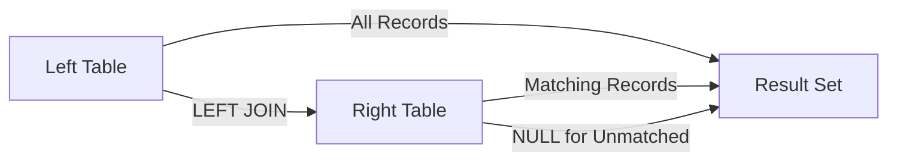
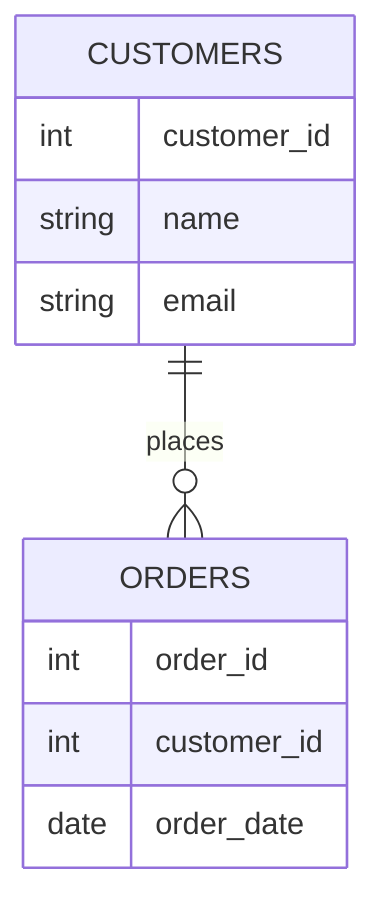

# Understanding LEFT JOIN in PostgreSQL 🔄

## 📌 Introduction

A LEFT JOIN (or LEFT OUTER JOIN) is a type of SQL join that returns all records from the left table and matching records from the right table. If there's no match, NULL values are returned for columns from the right table. This is particularly useful in PostgreSQL for data analysis and reporting where you need to preserve all records from one table regardless of matches in another.

### Why LEFT JOIN Matters in PostgreSQL
- **Data Preservation**: Keeps all records from the left table
- **NULL Handling**: PostgreSQL's efficient NULL handling makes LEFT JOINs performant
- **Analytics**: Essential for business intelligence and reporting
- **Data Integrity**: Helps identify missing relationships in your data

## 🎯 Learning Outcomes

By the end of this module, you will be able to:

1. **Implement** LEFT JOIN queries in PostgreSQL for various use cases
2. **Analyze** and optimize LEFT JOIN performance using EXPLAIN
3. **Design** database queries that preserve data from the primary table
4. **Troubleshoot** common LEFT JOIN issues and NULL handling
5. **Apply** LEFT JOIN in real-world scenarios for data analysis

## 🧠 Concept Breakdown

### 1. Types of Joins in PostgreSQL
- **INNER JOIN**: Returns only matching records
- **LEFT JOIN**: Returns all left table records + matching right table records
- **RIGHT JOIN**: Returns all right table records + matching left table records
- **FULL JOIN**: Returns all records from both tables

### 2. LEFT JOIN Syntax
```sql
SELECT columns
FROM left_table
LEFT JOIN right_table
ON left_table.column = right_table.column;
```

### 3. Key Concepts
- **Left Table**: The table specified in the FROM clause
- **Right Table**: The table specified after LEFT JOIN
- **Join Condition**: The ON clause that defines the relationship
- **NULL Handling**: How PostgreSQL handles unmatched records

## 📊 Visual Representation

### LEFT JOIN Visualization


### Example Data Flow


## 💻 PostgreSQL Code Examples

### 1. Basic LEFT JOIN
```sql
-- Create sample tables
CREATE TABLE customers (
    customer_id SERIAL PRIMARY KEY,
    name VARCHAR(100),
    email VARCHAR(255)
);

CREATE TABLE orders (
    order_id SERIAL PRIMARY KEY,
    customer_id INTEGER,
    order_date TIMESTAMP DEFAULT CURRENT_TIMESTAMP,
    amount DECIMAL(10,2)
);

-- Insert sample data
INSERT INTO customers (name, email) VALUES
    ('John Doe', 'john@example.com'),
    ('Jane Smith', 'jane@example.com'),
    ('Bob Johnson', 'bob@example.com');

INSERT INTO orders (customer_id, amount) VALUES
    (1, 100.00),
    (1, 200.00),
    (3, 150.00);

-- Basic LEFT JOIN query
SELECT 
    c.customer_id,
    c.name,
    o.order_id,
    o.amount
FROM customers c
LEFT JOIN orders o ON c.customer_id = o.customer_id;
```

### 2. Advanced LEFT JOIN with Aggregation
```sql
-- Find total orders per customer, including customers with no orders
SELECT 
    c.customer_id,
    c.name,
    COUNT(o.order_id) as total_orders,
    COALESCE(SUM(o.amount), 0) as total_amount
FROM customers c
LEFT JOIN orders o ON c.customer_id = o.customer_id
GROUP BY c.customer_id, c.name;
```

### 3. Performance Analysis
```sql
-- Analyze query performance
EXPLAIN ANALYZE
SELECT c.name, o.order_id
FROM customers c
LEFT JOIN orders o ON c.customer_id = o.customer_id
WHERE o.amount > 100;
```

## 💡 Real-World Use Case: E-commerce Analytics

### Business Scenario
An e-commerce platform needs to analyze customer purchasing patterns, including customers who haven't made any purchases.

### PostgreSQL Implementation
```sql
-- Create indexes for better performance
CREATE INDEX idx_orders_customer ON orders(customer_id);

-- Analyze customer purchase patterns
SELECT 
    c.customer_id,
    c.name,
    COUNT(o.order_id) as purchase_count,
    COALESCE(SUM(o.amount), 0) as total_spent,
    CASE 
        WHEN COUNT(o.order_id) = 0 THEN 'No Purchase'
        WHEN COUNT(o.order_id) = 1 THEN 'One-time Buyer'
        ELSE 'Repeat Customer'
    END as customer_type
FROM customers c
LEFT JOIN orders o ON c.customer_id = o.customer_id
GROUP BY c.customer_id, c.name
ORDER BY total_spent DESC;
```

## 🛠️ Hands-On Project: Customer Analytics System

### Project Requirements
1. Design a database schema for customer and order tracking
2. Implement LEFT JOIN queries for:
   - Customer purchase history
   - Product popularity analysis
   - Customer segmentation

### Implementation Steps
```sql
-- Create the database schema
CREATE DATABASE customer_analytics;

-- Create tables
CREATE TABLE products (
    product_id SERIAL PRIMARY KEY,
    name VARCHAR(100),
    price DECIMAL(10,2)
);

CREATE TABLE customer_orders (
    order_id SERIAL PRIMARY KEY,
    customer_id INTEGER,
    product_id INTEGER,
    order_date TIMESTAMP DEFAULT CURRENT_TIMESTAMP,
    quantity INTEGER
);

-- Sample analytics query
SELECT 
    p.product_id,
    p.name,
    COUNT(co.order_id) as total_orders,
    COALESCE(SUM(co.quantity), 0) as total_quantity
FROM products p
LEFT JOIN customer_orders co ON p.product_id = co.product_id
GROUP BY p.product_id, p.name
ORDER BY total_quantity DESC;
```

### Testing Criteria
1. Query performance with large datasets
2. Correct handling of NULL values
3. Accurate aggregation results
4. Proper index utilization

## 🧾 Key Takeaways

1. **Data Preservation**: LEFT JOIN ensures no data is lost from the primary table
2. **NULL Handling**: Understanding how PostgreSQL handles NULL values in joins
3. **Performance**: Importance of proper indexing for JOIN operations
4. **Analysis**: Using LEFT JOIN for comprehensive data analysis
5. **Best Practices**: When to use LEFT JOIN vs other join types

## 📚 Further Reading & Resources

1. [PostgreSQL JOIN Documentation](https://www.postgresql.org/docs/current/queries-table-expressions.html#QUERIES-FROM)
2. [PostgreSQL Performance Tuning for Joins](https://www.postgresql.org/docs/current/performance-tips.html)
3. [SQL JOIN Visualizer](https://sql-joins.leopard.in.ua/)
4. [PostgreSQL JOIN Types Tutorial](https://www.postgresqltutorial.com/postgresql-joins/)
5. [PostgreSQL Performance Analysis Tools](https://www.postgresql.org/docs/current/using-explain.html)

---

*Note: This guide is designed for educational purposes. Always refer to official PostgreSQL documentation for production implementations.* 