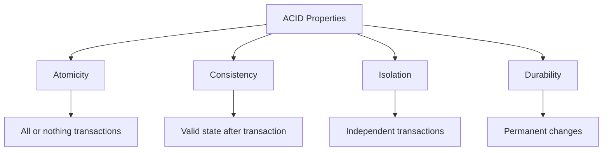

# Database Management System Overview: From Beginner to Expert

## 🎯 Learning Outcomes
By the end of this overview, you will understand:
- What a database is and why it matters
- The evolution and importance of DBMS
- Key characteristics and features of modern DBMS
- Types of DBMS users and their roles
- ACID properties and why they are crucial
- Security, data isolation, and real-world applications
- Advanced concepts and future trends in database technology

---

## 👶 What is a Database? (For Everyone)
A **database** is like a super-organized digital notebook or a giant electronic filing cabinet. It stores information (data) in a way that makes it easy to find, update, and use. Imagine a school storing all student records, grades, and schedules in one place—this is a database in action!

- **Simple Example:**
  - A contact list on your phone
  - A library catalog
  - Your favorite video game's high score table

---

## 🧑‍🎓 Why Do We Need a DBMS?
Before DBMS, people used file cabinets or simple files on computers. This caused problems:
- Data duplication (same info in many places)
- Hard to update or find data
- No security or access control
- Prone to errors and inconsistencies

A **Database Management System (DBMS)** is a special software that solves these problems by:
- Centralizing data storage
- Reducing duplication and errors
- Providing security and access control
- Supporting multiple users at once
- Maintaining data integrity

---

## 🏗️ Key Characteristics of Modern DBMS

### 1. Real-World Entity Representation
- Stores data as real things (students, books, products)
- Example: Student table with name, age, grade

### 2. Relation-Based Tables
- Data is organized in tables (rows and columns)
- Easy to visualize and query

### 3. Data-Application Isolation
- Data is separate from the programs that use it
- Makes updates and changes easier

### 4. Reduced Redundancy
- Normalization removes duplicate data
- Example: Store student info once, not in every class record

### 5. Consistency & Integrity
- Rules ensure data is always correct
- Example: No two students with the same ID

### 6. Query Language Support
- Use SQL to ask questions and get answers
- Example: "Show all students older than 15"

### 7. Security & Access Control
- Only authorized users can see or change data
- Example: Teachers can update grades, students can only view

### 8. Multi-User Support
- Many people can use the database at once
- Handles conflicts and keeps data safe

### 9. Backup & Recovery
- Automatic backups and restore options
- Protects against data loss

### 10. Scalability & Performance
- Handles small to massive amounts of data
- Optimized for speed and efficiency

---

## ⚡ ACID Properties: The Foundation of Reliable Databases

- **Atomicity:** All steps in a transaction happen, or none do
- **Consistency:** Data always follows the rules
- **Isolation:** Transactions don't interfere with each other
- **Durability:** Once done, changes stay even if the system crashes

---

## 👥 Types of DBMS Users

### 1. Database Administrators (DBA)
- Manage and secure databases
- Control access and monitor performance
- Handle backup and recovery

### 2. Designers
- Plan and design the database structure
- Define tables, relationships, and constraints

### 3. Developers
- Build applications that use the database
- Write queries and programs

### 4. End Users
- Use applications that rely on the database
- Example: Students checking grades, customers shopping online

---

## 🔒 Security and Data Isolation
- **Access Control:** Only authorized users can access or modify data
- **Data Isolation:** Each user or department can have their own view of the data
- **Encryption:** Protects sensitive data from unauthorized access
- **Audit Trails:** Tracks who did what and when

---

## 🏆 Real-World Applications
- **Banking:** Track accounts, transactions, and balances
- **E-commerce:** Manage products, orders, and customers
- **Social Media:** Store user profiles, posts, and messages
- **Healthcare:** Patient records, appointments, and billing
- **Education:** Student records, grades, and schedules

---

## 🧠 Advanced Concepts & Future Trends
- **Cloud Databases:** Databases hosted on the internet (e.g., AWS, Azure)
- **Big Data:** Handling massive, complex datasets
- **NoSQL:** Flexible, scalable databases for modern apps
- **AI & Machine Learning Integration:** Databases that support analytics and predictions
- **Blockchain Databases:** Decentralized, tamper-proof data storage
- **Self-Healing & Autonomous Databases:** Databases that tune and repair themselves

---

## 📝 Quick Summary
- DBMS is the backbone of modern data management
- Organizes, secures, and optimizes data storage and access
- Supports multiple users, complex queries, and large-scale applications
- Essential for businesses, science, and technology

---

## 📚 Further Reading & Practice
- "Database System Concepts" by Silberschatz, Korth, and Sudarshan
- "Database Design for Mere Mortals" by Michael J. Hernandez
- Online platforms: LeetCode (SQL), HackerRank (Databases), W3Schools (SQL)
- Practice: Install MySQL/PostgreSQL and try creating your own database!

---
*This overview is designed to be the most comprehensive and accessible introduction to Database Management Systems. For hands-on practice, refer to the exercises and projects in the course materials.* 