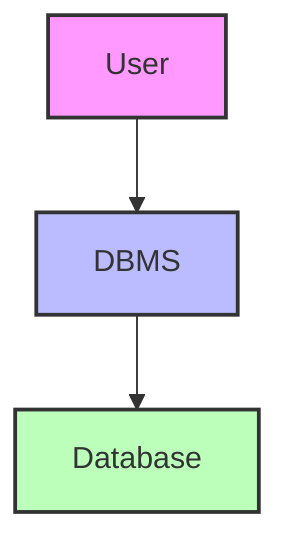
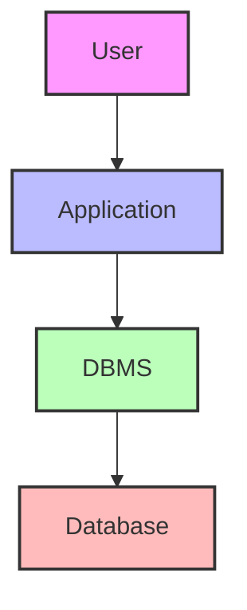
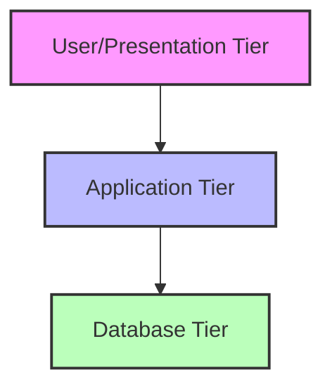

# DBMS Architecture Overview

## 🎯 Learning Outcomes
By the end of this overview, you will understand:
- Different types of DBMS architectures
- Single-tier vs Multi-tier architecture
- Components of 3-tier architecture
- Benefits of modular architecture
- Role of each tier in DBMS

## 📚 Introduction to DBMS Architecture
The architecture of a DBMS can be:
- Centralized
- Decentralized
- Hierarchical
- Single-tier
- Multi-tier

An n-tier architecture divides the system into related but independent modules that can be:
- Independently modified
- Altered
- Changed
- Replaced

## 🏗️ Types of DBMS Architecture

### 1. Single-Tier Architecture

**Characteristics:**
- Direct user interaction with DBMS
- Changes directly affect the DBMS
- Limited end-user tools
- Preferred by database designers and programmers

### 2. Two-Tier Architecture

**Characteristics:**
- Application layer between user and DBMS
- Independent application tier
- Separate operation, design, and programming
- Common in programmer environments

## 🏢 Three-Tier Architecture
The most widely used architecture in DBMS design.

### 1. Database (Data) Tier
**Components:**
- Database storage
- Query processing languages
- Data relations
- Constraints

### 2. Application (Middle) Tier
**Components:**
- Application server
- Database access programs
- Abstracted database view
- Mediator between user and database

### 3. User (Presentation) Tier
**Components:**
- End-user interface
- Multiple database views
- Application-generated views
- User interaction layer

## 🔄 Architecture Benefits

### Modularity
- Independent components
- Easy modification
- Flexible updates
- Isolated changes

### Security
- Tier separation
- Access control
- Data isolation
- User abstraction

### Scalability
- Component independence
- Easy expansion
- Flexible deployment
- Resource optimization

## 📊 Architecture Comparison

| Architecture | Complexity | Use Case | User Type |
|--------------|------------|----------|-----------|
| Single-Tier | Low | Development | Programmers |
| Two-Tier | Medium | Applications | Programmers/Users |
| Three-Tier | High | Enterprise | End Users |

## 🔍 Key Features of Three-Tier Architecture

### Database Tier
- Data storage and management
- Query processing
- Data integrity
- Security constraints

### Application Tier
- Business logic
- Data abstraction
- User authentication
- Request processing

### Presentation Tier
- User interface
- Input validation
- View generation
- User interaction

## 📝 Quick Summary
- DBMS architecture can be single or multi-tier
- Three-tier architecture is most common
- Each tier has specific responsibilities
- Architecture affects system flexibility and security
- Modular design enables easy maintenance

## 🎓 Best Practices
1. Choose architecture based on requirements
2. Implement proper security at each tier
3. Maintain clear separation of concerns
4. Design for scalability
5. Consider maintenance requirements

---
*This overview provides a comprehensive understanding of DBMS architecture. For implementation details and specific examples, refer to the practical sections of the course.* 