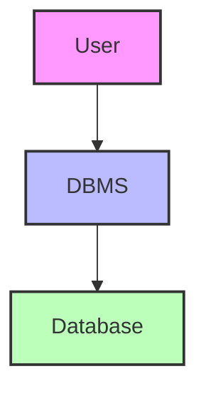
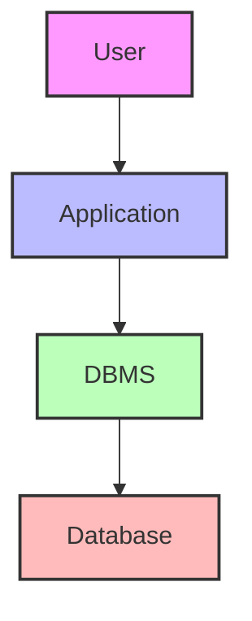
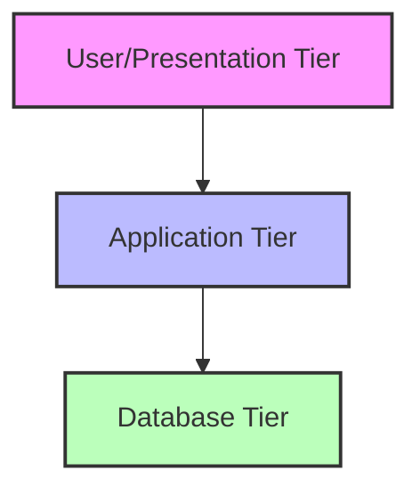

# Understanding DBMS Architecture: From Basics to Enterprise Systems

## Introduction: Why Architecture Matters
Imagine building a house. You need a blueprint to decide where the rooms, doors, and windows go. In the same way, a Database Management System (DBMS) needs an architecture—a blueprint for how data is stored, accessed, and managed. The right architecture makes databases secure, fast, and easy to use, whether for a small app or a global enterprise.

---

## What is DBMS Architecture?
DBMS architecture is the design and structure of a database system. It defines how users, applications, and the database itself interact. The architecture affects performance, security, scalability, and maintenance.

---

## The Evolution of DBMS Architectures
- **Centralized (Single-Tier):** Everything on one machine—simple but not scalable.
- **Client-Server (Two-Tier):** Users interact with an application, which talks to the database—better for teams and small businesses.
- **Multi-Tier (Three-Tier and Beyond):** Web and enterprise systems use multiple layers for flexibility, security, and scalability.

---

## Visualizing DBMS Architectures

### 1. Single-Tier (Centralized)
- All components (user, application, DBMS, and database) are on one system.
- **Analogy:** Like writing in your personal diary—no one else can access it.

### 2. Two-Tier (Client-Server)
- User interacts with an application (client), which communicates with the DBMS (server).
- **Analogy:** Like a bank teller (application) helping you access your account (database).

### 3. Three-Tier (Web/Enterprise)
- User (browser/app) → Application server → Database server
- **Analogy:** Like ordering food online: you (user) use an app (application server) that places your order with the restaurant (database server).

---

## Deep Dive: Three-Tier Architecture
This is the most common architecture for modern, scalable systems.

### 1. Presentation (User) Tier
- The interface users interact with (web browser, app, dashboard)
- Handles input, output, and user experience

### 2. Application (Logic) Tier
- Processes user requests, applies business logic
- Communicates between the user and the database
- Can be scaled independently for performance

### 3. Database (Data) Tier
- Stores and manages data
- Handles queries, transactions, and data integrity
- Secured and optimized for reliability

---

## Why Use Multi-Tier Architectures?
- **Security:** Sensitive data is protected in the database tier
- **Scalability:** Each tier can be scaled independently
- **Maintainability:** Easier to update or fix one layer without affecting others
- **Performance:** Distributes workload for faster response times

---

## Real-World Examples
- **Banking Apps:** Three-tier for secure transactions
- **E-commerce:** Web front-end, application logic, and product/order databases
- **Social Media:** User interface, business logic (feeds, notifications), and massive data storage

---

## Advanced Topics
- **N-Tier Architectures:** More than three layers for complex systems (e.g., microservices, caching, analytics)
- **Cloud & Distributed Databases:** Data spread across multiple servers or locations for reliability and speed
- **Load Balancing:** Distributes user requests to prevent overload
- **Failover & Redundancy:** Ensures system stays online even if one part fails

---

## Learning Outcomes (Revisited)
By the end of this section, you should be able to:
- Explain the different types of DBMS architectures
- Visualize and compare single-tier, two-tier, and three-tier systems
- Understand the benefits and trade-offs of each architecture
- Recognize real-world applications and advanced trends

---

## Key Takeaways & Best Practices
- Choose architecture based on project needs (security, scale, budget)
- Keep layers separate for easier maintenance and upgrades
- Plan for growth: design with scalability and security in mind
- Document your architecture for your team and future developers

---

## Further Exploration
- "Database System Concepts" by Silberschatz, Korth, and Sudarshan
- Explore cloud database architectures (AWS, Azure, Google Cloud)
- Try building a simple three-tier app (web front-end, API, database)

---
*This guide is designed to make DBMS architecture clear and practical for everyone, from beginners to experts. For hands-on practice, refer to the exercises and projects in the course materials.* 