# DBMS Data Models: A Comprehensive Guide

## 🎯 Learning Outcomes
By the end of this comprehensive guide, you will understand:
- Different types of data models in DBMS and their evolution
- Entity-Relationship (ER) Model concepts and practical applications
- Relational Model fundamentals and implementation
- Mapping cardinalities and their real-world implications
- Data model evolution and importance in modern database systems
- Advanced concepts for database design and optimization

## 📚 Introduction to Data Models

### What is a Data Model?
Think of a data model as a blueprint for your database - just like an architect creates a blueprint before building a house. It defines:
- How data is connected (relationships)
- How data is processed (operations)
- How data is stored (structure)
- Relationships between data elements (constraints)

### Why Do We Need Data Models?
1. **Organization**: Helps organize data in a structured way
2. **Communication**: Provides a common language between developers and stakeholders
3. **Efficiency**: Ensures efficient data storage and retrieval
4. **Integrity**: Maintains data accuracy and consistency

## 📊 Evolution of Data Models

### 1. Flat Data Models (1960s)
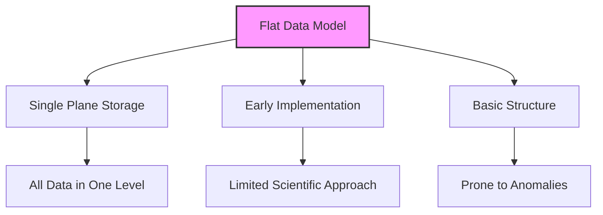

**Real-World Example:**
```
Name,Age,Class,Subject,Grade
John,15,10A,Math,A
John,15,10A,Science,B
Mary,14,9B,Math,A
Mary,14,9B,Science,A
```

**Problems with Flat Models:**
1. Data Duplication (John's age appears twice)
2. Update Anomalies (changing John's age requires multiple updates)
3. Insertion Anomalies (can't add a new subject without a student)
4. Deletion Anomalies (deleting a student removes all their data)

### 2. Hierarchical Model (1970s)
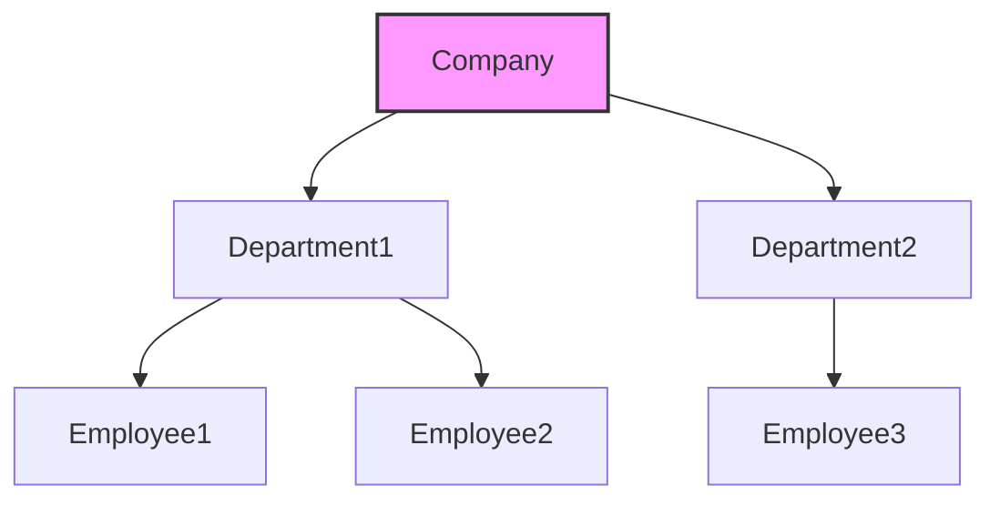

**Example:**
```
Company
├── HR Department
│   ├── John (Manager)
│   └── Mary (Assistant)
└── IT Department
    ├── Bob (Developer)
    └── Alice (Designer)
```

### 3. Network Model (1980s)
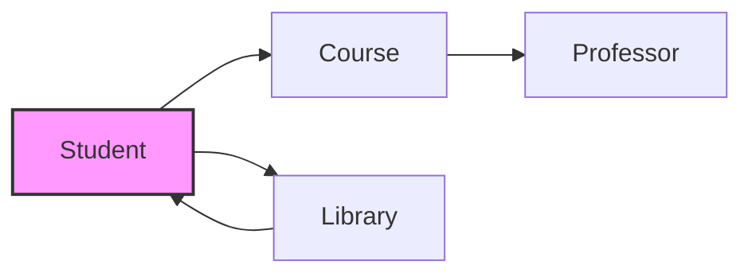

## 🔄 Entity-Relationship (ER) Model

### Basic Concepts
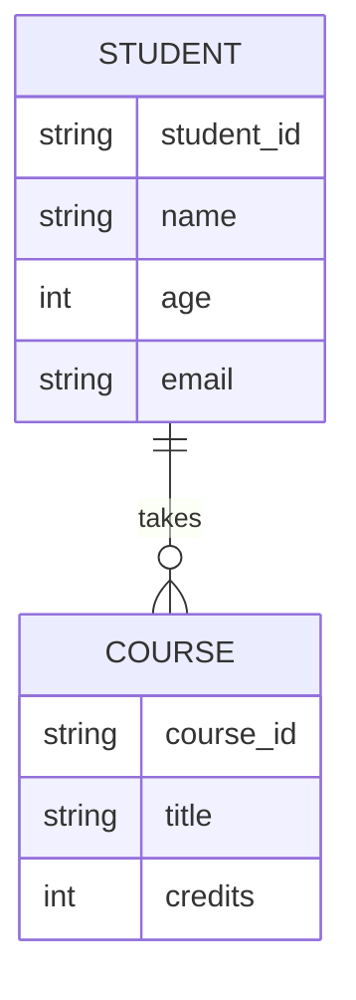

### 1. Entities
**Definition**: Real-world objects that can be identified uniquely

**Examples:**
- Student
- Course
- Professor
- Department

**Entity Types:**
1. **Strong Entity**: Can exist independently
   - Example: Student, Course
2. **Weak Entity**: Depends on another entity
   - Example: Student's Grade (depends on Student)

### 2. Attributes
**Types of Attributes:**
1. **Simple vs Composite**
   - Simple: Age, Name
   - Composite: Address (Street, City, State)

2. **Single-valued vs Multi-valued**
   - Single: Age
   - Multi: Phone Numbers

3. **Derived vs Stored**
   - Stored: Date of Birth
   - Derived: Age (calculated from DOB)

4. **Key Attributes**
   - Primary Key: Student ID
   - Foreign Key: Course ID in Enrollment

### 3. Relationships
**Types of Relationships:**
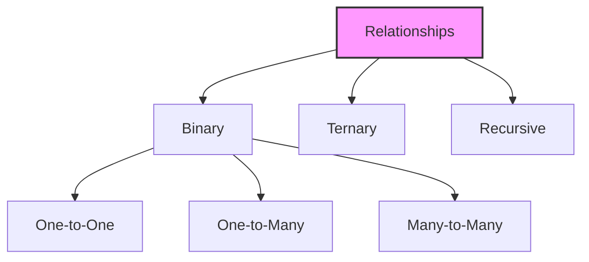

## 📈 Mapping Cardinalities

### Detailed Examples

1. **One to One (1:1)**
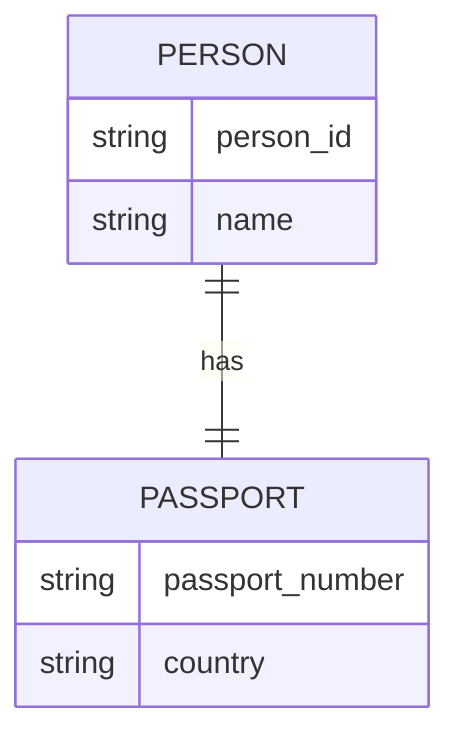
**Example**: Person to Passport
- Each person has exactly one passport
- Each passport belongs to exactly one person

2. **One to Many (1:N)**
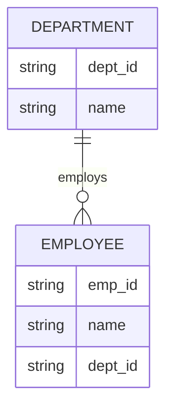
**Example**: Department to Employees
- One department can have many employees
- Each employee belongs to one department

3. **Many to One (N:1)**
```mermaid
erDiagram
    STUDENT }o--|| CLASS : belongs_to
    STUDENT {
        string student_id
        string name
        string class_id
    }
    CLASS {
        string class_id
        string name
    }
```
**Example**: Students to Class
- Many students can be in one class
- Each student belongs to one class

4. **Many to Many (M:N)**
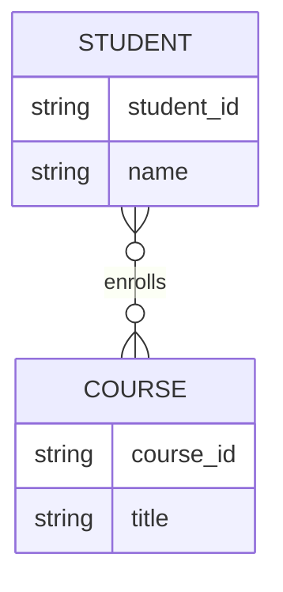
**Example**: Students to Courses
- One student can take many courses
- One course can have many students

## 📑 Relational Model

### Key Features
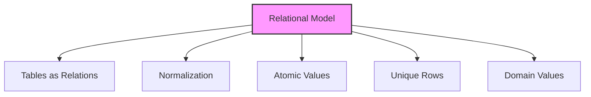

### Detailed Characteristics

1. **Table Structure**
```sql
CREATE TABLE Students (
    student_id INT PRIMARY KEY,
    name VARCHAR(100),
    age INT,
    class_id INT,
    FOREIGN KEY (class_id) REFERENCES Classes(class_id)
);
```

2. **Normalization Forms**
   - 1NF: Atomic values
   - 2NF: No partial dependencies
   - 3NF: No transitive dependencies
   - BCNF: Boyce-Codd Normal Form

3. **Data Properties**
   - Atomic values
   - Unique rows
   - Domain-specific columns
   - Referential integrity

## 📊 Model Comparison

| Feature | Flat Model | ER Model | Relational Model |
|---------|------------|----------|------------------|
| Structure | Single plane | Entity-based | Table-based |
| Scientific Approach | Basic | Moderate | Advanced |
| Anomalies | High | Moderate | Low |
| Use Case | Simple data | Conceptual design | Implementation |
| Flexibility | Low | High | High |
| Query Complexity | Simple | N/A | Complex |
| Data Integrity | Poor | Good | Excellent |
| Scalability | Limited | Good | Excellent |

## 🔍 Advanced Concepts

### 1. Normalization Process
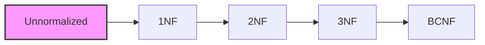

### 2. Denormalization
- Purpose: Performance optimization
- When to use: Read-heavy applications
- Trade-offs: Space vs Speed

### 3. Data Warehousing Models
- Star Schema
- Snowflake Schema
- Fact Tables
- Dimension Tables

## 📝 Best Practices

1. **Design Phase**
   - Start with ER modeling
   - Identify entities and relationships
   - Define attributes and constraints
   - Validate with stakeholders

2. **Implementation Phase**
   - Convert ER to relational model
   - Apply normalization
   - Define indexes
   - Set up constraints

3. **Optimization Phase**
   - Monitor performance
   - Apply denormalization if needed
   - Optimize queries
   - Regular maintenance

## 🎓 Practical Examples

### School Management System
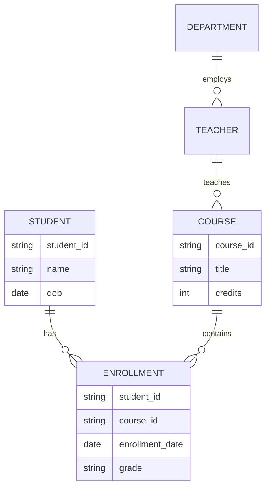

## 📚 Further Reading
1. Database Design for Mere Mortals
2. Database Systems: The Complete Book
3. An Introduction to Database Systems

---
*This comprehensive guide provides both theoretical knowledge and practical insights into DBMS data models. For hands-on practice, refer to the exercises and projects in the course materials.* 