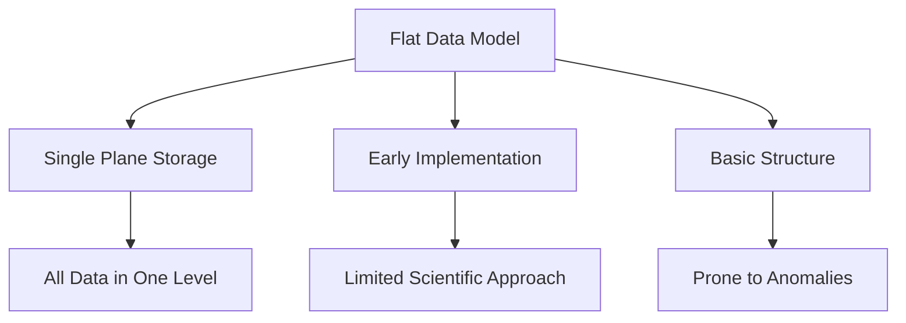
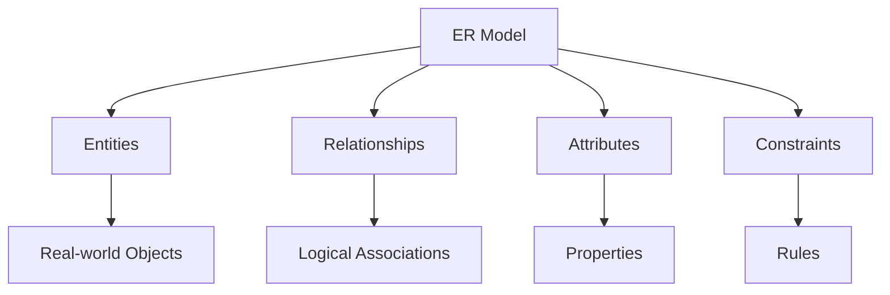
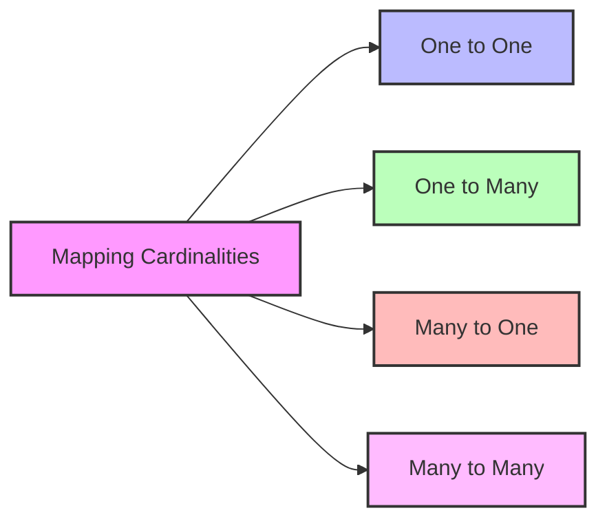
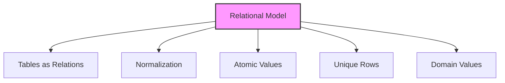

# DBMS Data Models

## 🎯 Learning Outcomes
By the end of this overview, you will understand:
- Different types of data models in DBMS
- Entity-Relationship (ER) Model concepts
- Relational Model fundamentals
- Mapping cardinalities
- Data model evolution and importance

## 📚 Introduction to Data Models
Data models define the logical structure of a database and introduce abstraction in DBMS. They determine:
- How data is connected
- How data is processed
- How data is stored
- Relationships between data elements

## 📊 Evolution of Data Models

### Flat Data Models

**Characteristics:**
- Single plane data storage
- Early implementation
- Limited scientific approach
- Prone to duplication
- Update anomalies

## 🔄 Entity-Relationship (ER) Model

### Basic Concepts

### 1. Entities
- Real-world objects
- Properties called attributes
- Defined by domain values
- Example: Student in school database

### 2. Attributes
- Name
- Age
- Class
- Other properties

### 3. Relationships
- Logical associations between entities
- Various mapping types
- Defined by cardinality

## 📈 Mapping Cardinalities

### Types of Relationships

1. **One to One (1:1)**
   - Single entity to single entity
   - Example: Person to Passport

2. **One to Many (1:N)**
   - Single entity to multiple entities
   - Example: Department to Employees

3. **Many to One (N:1)**
   - Multiple entities to single entity
   - Example: Students to Class

4. **Many to Many (M:N)**
   - Multiple entities to multiple entities
   - Example: Students to Courses

## 📑 Relational Model

### Key Features

### Characteristics
1. **Table Structure**
   - Data stored in relations (tables)
   - Scientific approach
   - Based on first-order predicate logic

2. **Normalization**
   - Relations can be normalized
   - Reduces redundancy
   - Improves data integrity

3. **Data Properties**
   - Atomic values
   - Unique rows
   - Domain-specific columns

## 📊 Model Comparison

| Feature | Flat Model | ER Model | Relational Model |
|---------|------------|----------|------------------|
| Structure | Single plane | Entity-based | Table-based |
| Scientific Approach | Basic | Moderate | Advanced |
| Anomalies | High | Moderate | Low |
| Use Case | Simple data | Conceptual design | Implementation |
| Flexibility | Low | High | High |

## 🔍 Key Concepts

### ER Model Benefits
- Conceptual design tool
- Real-world representation
- Clear relationship mapping
- Visual understanding

### Relational Model Benefits
- Scientific foundation
- Normalization support
- Data integrity
- Efficient querying

## 📝 Quick Summary
- Data models define database structure
- ER Model for conceptual design
- Relational Model for implementation
- Mapping cardinalities define relationships
- Models evolve from simple to complex

## 🎓 Best Practices
1. Choose appropriate model for requirements
2. Use ER Model for initial design
3. Implement using Relational Model
4. Consider mapping cardinalities
5. Apply normalization where needed

---
*This overview provides a comprehensive understanding of DBMS data models. For practical implementation and examples, refer to the hands-on sections of the course.* 