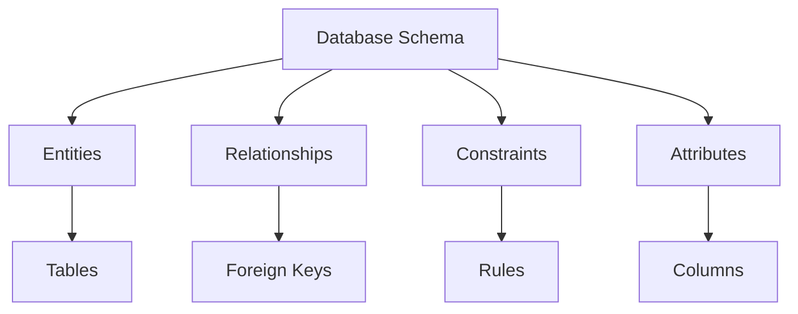
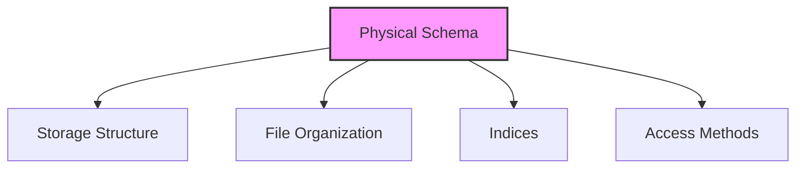
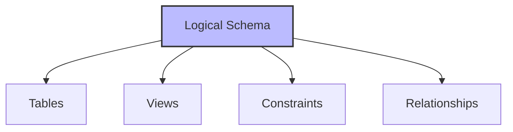
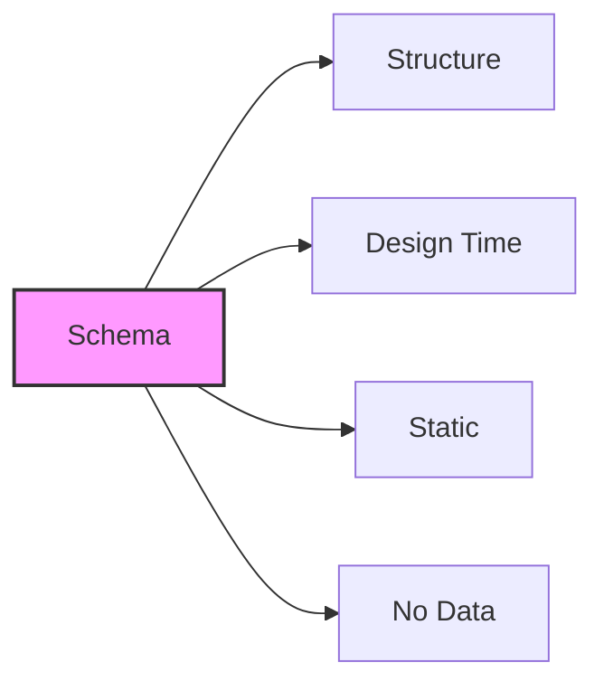
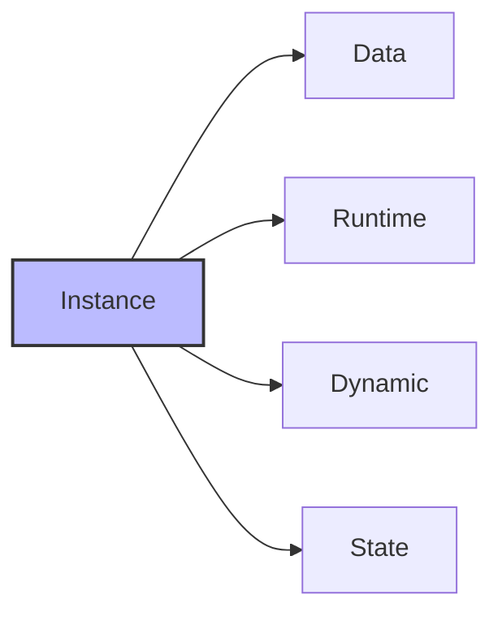

# Database Schema: The Blueprint of Your Data World

## 🎯 Learning Outcomes
By the end of this overview, you will understand:
- What is a database schema
- Types of database schemas
- Difference between schema and instance
- Role of database designers
- Schema design considerations

## 📚 Introduction to Database Schema
A database schema is the skeleton structure that represents the logical view of the entire database. It:
- Defines data organization
- Establishes relationships
- Formulates constraints
- Provides logical structure

## 🏗️ Schema Components

### Basic Elements


## 📊 Types of Database Schema

### 1. Physical Database Schema


**Characteristics:**
- Defines actual storage
- File organization
- Index structures
- Access methods
- Secondary storage details

### 2. Logical Database Schema


**Characteristics:**
- Defines logical constraints
- Table structures
- View definitions
- Integrity constraints
- Relationship rules

## 🔄 Schema vs Instance

### Database Schema


**Characteristics:**
- Skeleton structure
- Designed before database creation
- Difficult to modify after implementation
- Contains no data
- Defines structure and constraints

### Database Instance


**Characteristics:**
- Operational state
- Contains actual data
- Changes over time
- Validated by DBMS
- Follows schema constraints

## 📈 Schema Design Process

### 1. Planning Phase
- Requirements analysis
- Entity identification
- Relationship mapping
- Constraint definition

### 2. Design Phase
- Logical schema design
- Physical schema design
- Index planning
- Access method selection

### 3. Implementation Phase
- Schema creation
- Constraint implementation
- Index creation
- View definition

## 🔍 Key Considerations

### Design Principles
1. **Normalization**
   - Reduce redundancy
   - Maintain integrity
   - Optimize structure

2. **Performance**
   - Efficient access
   - Optimal storage
   - Quick retrieval

3. **Security**
   - Access control
   - Data protection
   - User permissions

## 📊 Schema vs Instance Comparison

| Feature | Schema | Instance |
|---------|---------|-----------|
| Timing | Design time | Runtime |
| Content | Structure | Data |
| Change | Difficult | Frequent |
| Purpose | Definition | Operation |
| State | Static | Dynamic |

## 📝 Quick Summary
- Schema is the database structure
- Two types: Physical and Logical
- Instance is the operational state
- Schema design is crucial
- Changes require careful planning

## 🎓 Best Practices
1. Plan schema carefully before implementation
2. Consider future requirements
3. Implement proper constraints
4. Design for performance
5. Document schema design

## ⚠️ Important Notes
- Schema changes are difficult after implementation
- Instances must follow schema constraints
- DBMS validates instance states
- Schema design affects performance
- Documentation is crucial

---
*This overview provides a comprehensive understanding of database schema concepts. For practical implementation and examples, refer to the hands-on sections of the course.*

## Introduction: Why Schema Matters
Imagine you're building a LEGO city. Before you start, you need a plan: where the houses go, how the roads connect, and what rules each building must follow. In databases, this plan is called the **schema**. It's the master blueprint that defines how all your data fits together, what rules it must follow, and how it can be used.

## What is a Database Schema?
A **database schema** is the logical design and structure of a database. It defines:
- What tables exist and what they contain
- How tables relate to each other
- What rules (constraints) must be followed
- The overall organization and integrity of your data

**Analogy:**
- Schema = Blueprint for a building
- Data = The furniture and people inside

## Why is Schema Important?
- Ensures data is organized and consistent
- Prevents errors and duplication
- Makes it easy to find, update, and analyze data
- Supports security and access control
- Enables efficient storage and fast queries

## Visualizing a Schema


## Schema in Action: Example
Suppose you're designing a school database. Your schema might include:
- **Tables:** Students, Teachers, Classes, Enrollments
- **Relationships:** Students enroll in Classes, Teachers teach Classes
- **Constraints:** Each student has a unique ID, grades must be valid

```mermaid
erDiagram
    STUDENT ||--o{ ENROLLMENT : enrolls
    CLASS ||--o{ ENROLLMENT : contains
    TEACHER ||--o{ CLASS : teaches
    STUDENT {
        string student_id
        string name
        date dob
    }
    CLASS {
        string class_id
        string subject
    }
    ENROLLMENT {
        string student_id
        string class_id
        string grade
    }
```

## Advanced Topics
- **Schema Evolution:** How to safely change your schema as requirements grow
- **Versioning:** Tracking changes to your schema over time
- **Reverse Engineering:** Creating a schema from existing data
- **Schema Migration Tools:** Automate changes and keep environments in sync

## Key Takeaways & Best Practices
- Design your schema before adding data
- Normalize, but balance with performance
- Use constraints to enforce rules
- Document everything
- Plan for future changes

## Further Exploration
- "Database System Concepts" by Silberschatz, Korth, and Sudarshan
- Practice designing schemas for different scenarios (school, shop, hospital)
- Explore schema migration tools (Flyway, Liquibase)

---
*This guide is designed to make database schema design clear and practical for everyone, from beginners to experts. For hands-on practice, refer to the exercises and projects in the course materials.* 