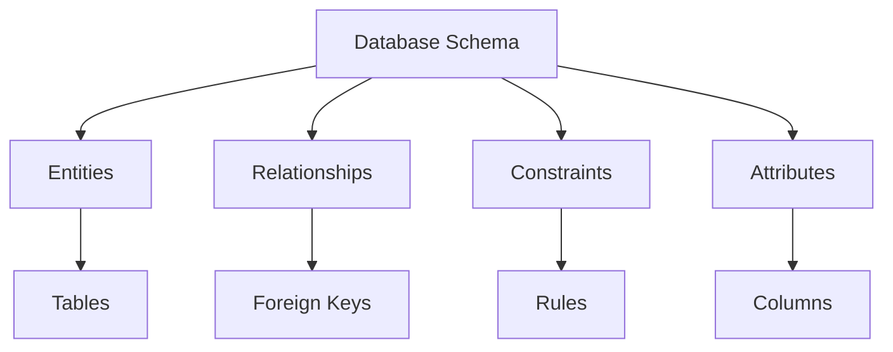
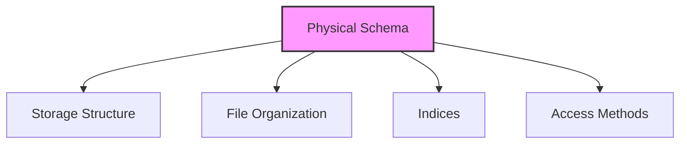
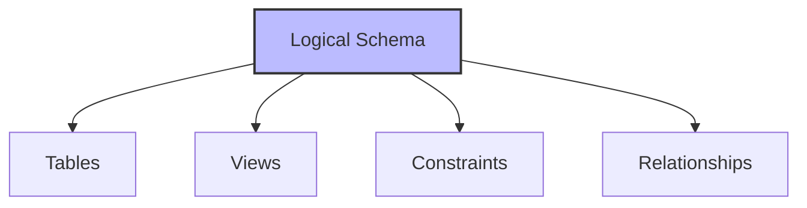
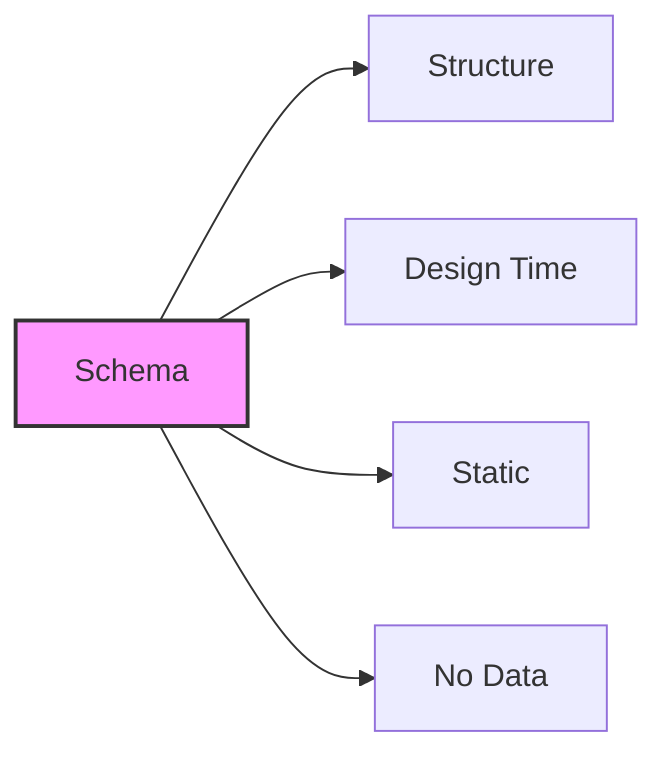
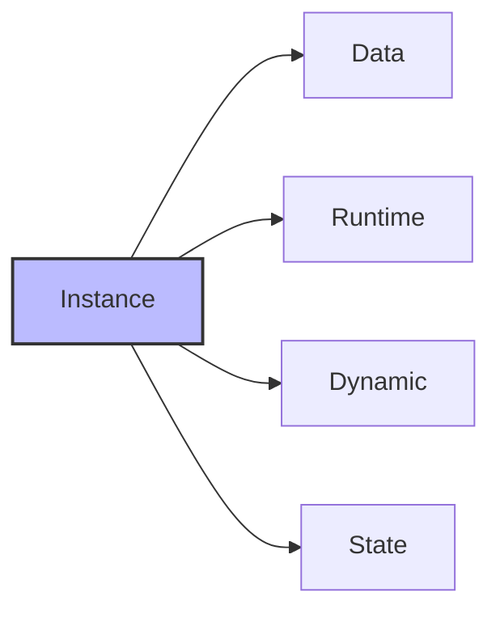

# Database Schema

## 🎯 Learning Outcomes
By the end of this overview, you will understand:
- What is a database schema
- Types of database schemas
- Difference between schema and instance
- Role of database designers
- Schema design considerations

## 📚 Introduction to Database Schema
A database schema is the skeleton structure that represents the logical view of the entire database. It:
- Defines data organization
- Establishes relationships
- Formulates constraints
- Provides logical structure

## 🏗️ Schema Components

### Basic Elements

## 📊 Types of Database Schema

### 1. Physical Database Schema

**Characteristics:**
- Defines actual storage
- File organization
- Index structures
- Access methods
- Secondary storage details

### 2. Logical Database Schema

**Characteristics:**
- Defines logical constraints
- Table structures
- View definitions
- Integrity constraints
- Relationship rules

## 🔄 Schema vs Instance

### Database Schema

**Characteristics:**
- Skeleton structure
- Designed before database creation
- Difficult to modify after implementation
- Contains no data
- Defines structure and constraints

### Database Instance

**Characteristics:**
- Operational state
- Contains actual data
- Changes over time
- Validated by DBMS
- Follows schema constraints

## 📈 Schema Design Process

### 1. Planning Phase
- Requirements analysis
- Entity identification
- Relationship mapping
- Constraint definition

### 2. Design Phase
- Logical schema design
- Physical schema design
- Index planning
- Access method selection

### 3. Implementation Phase
- Schema creation
- Constraint implementation
- Index creation
- View definition

## 🔍 Key Considerations

### Design Principles
1. **Normalization**
   - Reduce redundancy
   - Maintain integrity
   - Optimize structure

2. **Performance**
   - Efficient access
   - Optimal storage
   - Quick retrieval

3. **Security**
   - Access control
   - Data protection
   - User permissions

## 📊 Schema vs Instance Comparison

| Feature | Schema | Instance |
|---------|---------|-----------|
| Timing | Design time | Runtime |
| Content | Structure | Data |
| Change | Difficult | Frequent |
| Purpose | Definition | Operation |
| State | Static | Dynamic |

## 📝 Quick Summary
- Schema is the database structure
- Two types: Physical and Logical
- Instance is the operational state
- Schema design is crucial
- Changes require careful planning

## 🎓 Best Practices
1. Plan schema carefully before implementation
2. Consider future requirements
3. Implement proper constraints
4. Design for performance
5. Document schema design

## ⚠️ Important Notes
- Schema changes are difficult after implementation
- Instances must follow schema constraints
- DBMS validates instance states
- Schema design affects performance
- Documentation is crucial

---
*This overview provides a comprehensive understanding of database schema concepts. For practical implementation and examples, refer to the hands-on sections of the course.* 