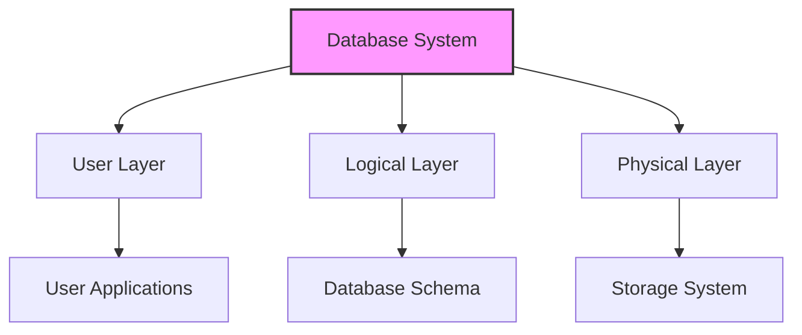
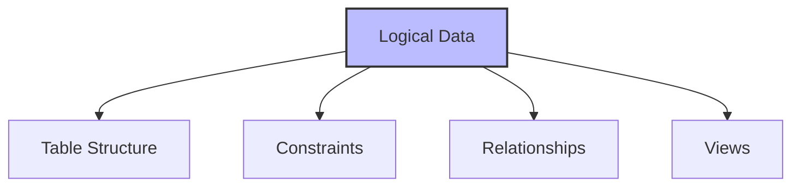
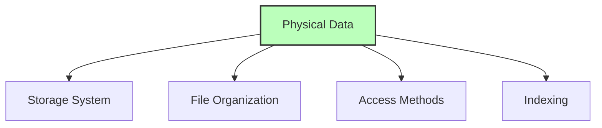
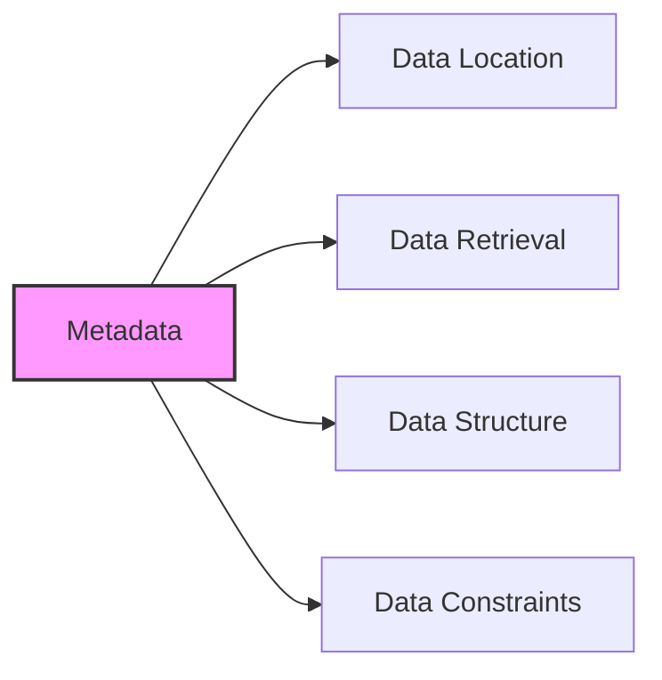

# Data Independence in DBMS

## 🎯 Learning Outcomes
By the end of this overview, you will understand:
- Concept of data independence
- Types of data independence
- Importance of layered architecture
- Logical vs Physical independence
- Impact of changes on database layers

## 📚 Introduction to Data Independence
Data independence is a crucial concept in database systems that allows:
- Changes in one layer without affecting others
- System evolution and updates
- Efficient maintenance
- Flexible modifications

## 🏗️ Multi-layered Architecture

### Why Multi-layered?
- Easier to make changes
- Better system maintenance
- Flexible updates
- Reduced complexity

## 🔄 Types of Data Independence

### 1. Logical Data Independence

**Characteristics:**
- Data about database structure
- Table formats and constraints
- Independent of physical storage
- Can be modified without affecting data

**Example:**
- Changing table structure
- Modifying constraints
- Adding new relationships
- Creating new views

### 2. Physical Data Independence

**Characteristics:**
- Actual data storage
- Bit format on disk
- Independent of logical schema
- Can be changed without affecting schema

**Example:**
- Upgrading storage devices
- Changing file organization
- Modifying access methods
- Updating indexing structures

## 📊 Data Independence Benefits

### 1. System Evolution
- Easy updates
- Flexible modifications
- Reduced maintenance
- Better scalability

### 2. Change Management
- Isolated changes
- Minimal impact
- Controlled updates
- Safe modifications

### 3. Maintenance
- Simplified updates
- Reduced complexity
- Better organization
- Efficient management

## 🔍 Key Concepts

### Metadata Management

- Data about data
- Layered architecture
- Independent mapping
- Change management

## 📈 Implementation Considerations

### 1. Logical Layer
- Table definitions
- Constraint management
- Relationship mapping
- View definitions

### 2. Physical Layer
- Storage management
- File organization
- Access methods
- Index structures

## 📝 Quick Summary
- Data independence enables isolated changes
- Two types: Logical and Physical
- Multi-layered architecture is essential
- Changes in one layer don't affect others
- Metadata management is crucial

## 🎓 Best Practices
1. Maintain clear layer separation
2. Plan changes carefully
3. Consider impact on other layers
4. Document modifications
5. Test changes thoroughly

## ⚠️ Important Notes
- Changes should be isolated
- Metadata must be properly managed
- Layer independence is crucial
- System evolution requires planning
- Maintenance should be considered

---
*This overview provides a comprehensive understanding of data independence in DBMS. For practical implementation and examples, refer to the hands-on sections of the course.* 