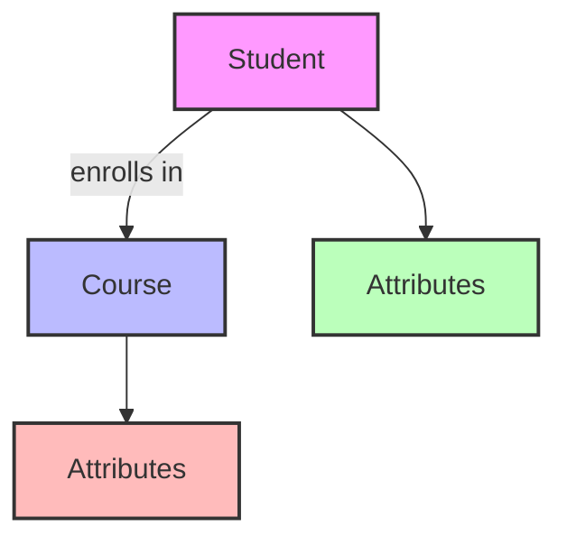

# Entity-Relationship (ER) Model: The Foundation of Database Design

## Introduction: Why ER Models Matter
Imagine you're designing a new city. You need to know what buildings (entities) exist, what properties (attributes) they have, and how they connect (relationships). The **Entity-Relationship (ER) Model** is the blueprint for building a database city—it helps you plan, organize, and visualize all the data and their connections before you start construction.

---

## What is the ER Model?
The **ER Model** is a conceptual framework for describing the structure of a database. It uses diagrams to show:
- What entities (things) exist
- What attributes (properties) they have
- How entities are related to each other

**Analogy:**
- Entities = Buildings
- Attributes = Features of each building (color, size)
- Relationships = Roads connecting buildings

---

## Key Concepts in the ER Model

### 1. Entities
- Real-world objects or concepts (Student, Course, Product)
- Each entity has a set of attributes
- **Example:** Student (student_id, name, age)

### 2. Attributes
- Properties that describe an entity
- **Types:**
  - Simple (atomic, e.g., age)
  - Composite (made of parts, e.g., address)
  - Single-valued (one value, e.g., gender)
  - Multi-valued (many values, e.g., phone numbers)
  - Derived (calculated, e.g., age from DOB)

### 3. Relationships
- Associations between entities (Student enrolls in Course)
- Can have attributes (e.g., enrollment date)
- **Types:**
  - One-to-One
  - One-to-Many
  - Many-to-Many

---

## Visualizing ER Models

---

## Keys in ER Model
- **Super Key:** Any set of attributes that uniquely identifies an entity
- **Candidate Key:** Minimal super key (no unnecessary attributes)
- **Primary Key:** Chosen candidate key for unique identification

---

## Advanced Topics
- **Weak Entities:** Depend on another entity for identification
- **Recursive Relationships:** Entity relates to itself (Employee manages Employee)
- **Ternary and Higher-Order Relationships:** Involve more than two entities

---

## Best Practices & Key Takeaways
- Start with clear entity and relationship identification
- Use ER diagrams to communicate with stakeholders
- Normalize attributes for clarity and efficiency
- Document all keys and constraints

---

## Further Exploration
- "Database System Concepts" by Silberschatz, Korth, and Sudarshan
- Practice drawing ER diagrams for real-world scenarios (school, shop, hospital)
- Explore tools for ER modeling (draw.io, Lucidchart, dbdiagram.io)

---
*This guide is designed to make ER modeling clear and practical for everyone, from beginners to experts. For hands-on practice, refer to the exercises and projects in the course materials.* 