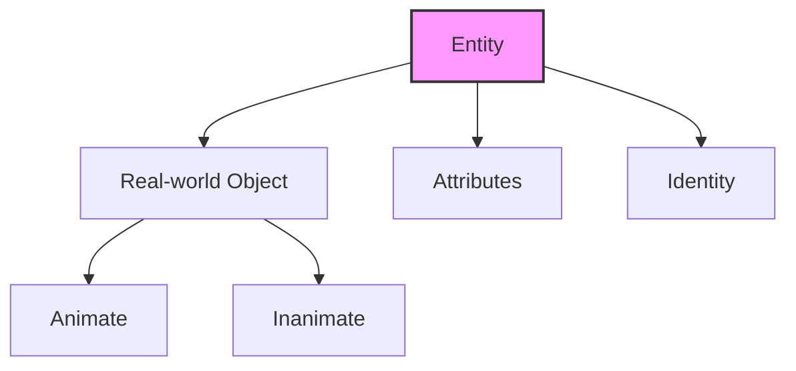
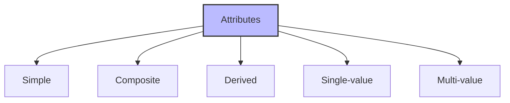
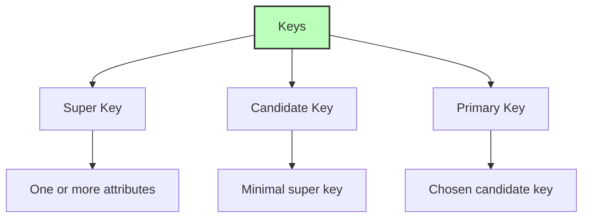
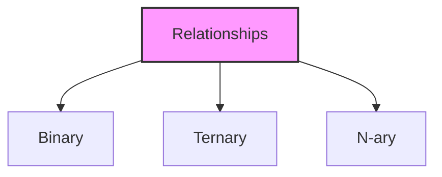

# Entity-Relationship (ER) Model Basic Concepts

## 🎯 Learning Outcomes
By the end of this overview, you will understand:
- Basic concepts of ER Model
- Types of entities and attributes
- Relationship types and cardinalities
- Key concepts in ER modeling
- Entity sets and their properties

## 📚 Introduction to ER Model
The ER model defines the conceptual view of a database by:
- Working with real-world entities
- Defining associations between entities
- Providing a good option for database design
- Representing data at view level

## 🔑 Entity Concepts

### What is an Entity?

**Characteristics:**
- Real-world object
- Can be animate or inanimate
- Easily identifiable
- Has attributes/properties

### Entity Set
- Collection of similar entities
- Entities share similar attributes
- May contain overlapping entities
- Example: Students set, Teachers set

## 📊 Attributes

### Types of Attributes

1. **Simple Attribute**
   - Atomic values
   - Cannot be divided
   - Example: Phone number

2. **Composite Attribute**
   - Made of multiple simple attributes
   - Example: Full name (first_name + last_name)

3. **Derived Attribute**
   - Calculated from other attributes
   - Not stored physically
   - Example: Age from date_of_birth

4. **Single-value Attribute**
   - Contains single value
   - Example: Social Security Number

5. **Multi-value Attribute**
   - Contains multiple values
   - Example: Phone numbers, Email addresses

## 🔑 Keys in ER Model

### Types of Keys

1. **Super Key**
   - One or more attributes
   - Uniquely identifies entity

2. **Candidate Key**
   - Minimal super key
   - Multiple possible keys

3. **Primary Key**
   - Chosen candidate key
   - Main identifier

## 🔄 Relationships

### Relationship Types

### Mapping Cardinalities
1. **One-to-One (1:1)**
   - One entity to one entity
   - Example: Person to Passport

2. **One-to-Many (1:N)**
   - One entity to multiple entities
   - Example: Department to Employees

3. **Many-to-One (N:1)**
   - Multiple entities to one entity
   - Example: Students to Class

4. **Many-to-Many (M:N)**
   - Multiple entities to multiple entities
   - Example: Students to Courses

## 📈 Relationship Sets
- Collection of similar relationships
- Can have descriptive attributes
- Defines degree of relationship
- Shows cardinality

## 📝 Quick Summary
- ER Model represents real-world entities
- Attributes define entity properties
- Keys uniquely identify entities
- Relationships connect entities
- Cardinality defines relationship types

## 🎓 Best Practices
1. Choose appropriate attributes
2. Define clear relationships
3. Use proper cardinality
4. Select suitable keys
5. Maintain data integrity

## ⚠️ Important Notes
- Entities must be identifiable
- Attributes have domains
- Relationships can have attributes
- Cardinality must be defined
- Keys must be unique

---
*This overview provides a comprehensive understanding of ER Model basic concepts. For practical implementation and examples, refer to the hands-on sections of the course.* 