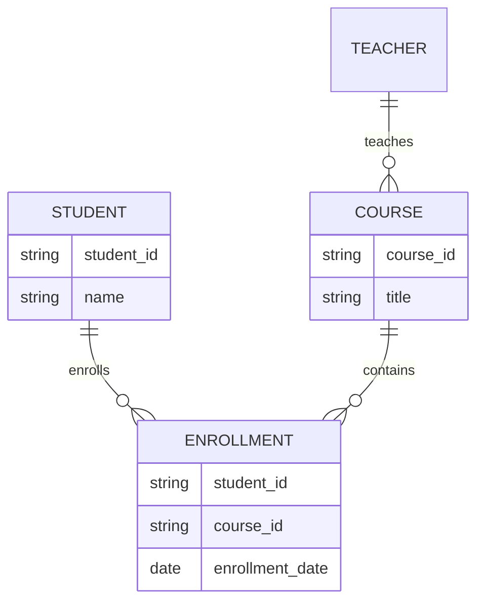

# ER Diagram Presentation: Turning Concepts into Visuals

## Introduction: Why ER Diagrams Matter
Imagine trying to build a LEGO set without the instruction booklet. ER diagrams are the instruction booklets for databases—they turn abstract ideas into clear, visual plans that everyone can understand and follow.

---

## What is an ER Diagram?
An **Entity-Relationship (ER) Diagram** is a visual representation of the entities, attributes, and relationships in a database. It helps you:
- See the big picture of your data
- Communicate designs with others
- Spot errors or missing connections before building

---

## Key Elements of ER Diagrams

### 1. Entities
- Represented by rectangles
- Named clearly (e.g., Student, Course)

### 2. Attributes
- Represented by ellipses
- Connected to their entity
- Types: Simple, Composite, Multivalued, Derived

### 3. Relationships
- Represented by diamonds
- Connect entities
- Labeled with relationship name (e.g., Enrolls, Teaches)

### 4. Cardinality
- Shows how many entities participate in a relationship (1:1, 1:N, M:N)
- Indicated by symbols or numbers on connecting lines

### 5. Participation Constraints
- Total (double line): All entities must participate
- Partial (single line): Participation is optional

---

## Example ER Diagram

---

## Best Practices & Key Takeaways
- Use clear, consistent symbols and labels
- Show all entities, attributes, and relationships
- Indicate cardinality and participation constraints
- Keep diagrams readable and uncluttered
- Review with stakeholders for feedback

---

## Further Exploration
- "Database System Concepts" by Silberschatz, Korth, and Sudarshan
- Practice drawing ER diagrams for different scenarios
- Explore ER diagram tools (draw.io, Lucidchart, dbdiagram.io)

---
*This guide is designed to make ER diagrams clear and practical for everyone, from beginners to experts. For hands-on practice, refer to the exercises and projects in the course materials.* 