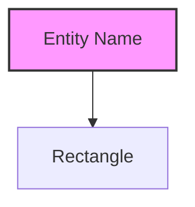
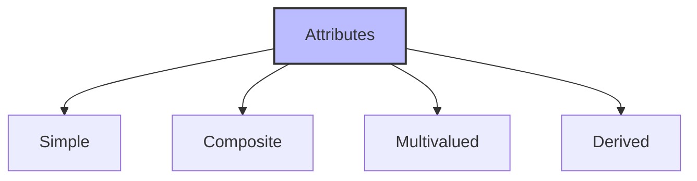
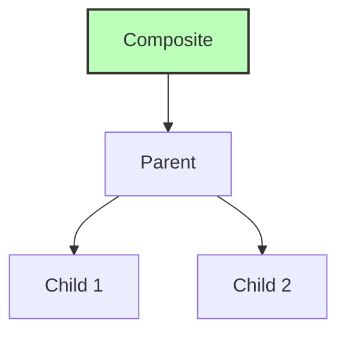
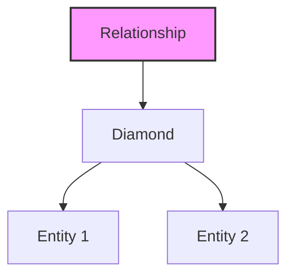
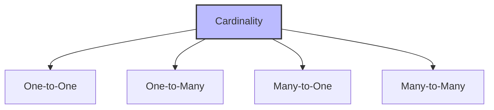
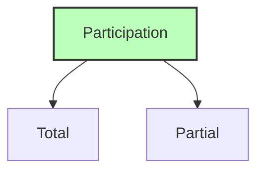

# ER Diagram Presentation

## 🎯 Learning Outcomes
By the end of this overview, you will understand:
- How to represent entities in ER diagrams
- Different types of attribute representations
- Relationship notations and cardinalities
- Participation constraints
- Complete ER diagram structure

## 📚 Introduction
ER diagrams are visual representations of the ER Model that show:
- Entities and their attributes
- Relationships between entities
- Cardinality constraints
- Participation constraints
- Complete database structure

## 🔲 Entity Representation

### Basic Entity Notation

**Key Points:**
- Entities are represented by rectangles
- Rectangle contains entity name
- Each entity type has one rectangle
- Clear and distinct naming
- Example: Student, Teacher, Course

## 📊 Attribute Representation

### Types of Attributes

### 1. Simple Attributes
- Represented by single ellipse
- Directly connected to entity
- Contains attribute name
- Example: age, name, id

### 2. Composite Attributes

- Tree-like structure
- Parent-child relationship
- Connected ellipses
- Example: address (street, city, state)

### 3. Multivalued Attributes
- Double ellipse notation
- Multiple values possible
- Example: phone numbers, email addresses

### 4. Derived Attributes
- Dashed ellipse notation
- Calculated values
- Example: age from date_of_birth

## 🔄 Relationship Representation

### Basic Relationship

**Key Points:**
- Diamond-shaped box
- Contains relationship name
- Connected to entities by lines
- Clear relationship naming
- Shows entity connections

## 📈 Cardinality Representation

### Types of Cardinality

### 1. One-to-One (1:1)
- Single instance connection
- Example: Person to Passport
- Marked as '1:1'

### 2. One-to-Many (1:N)
- One to multiple instances
- Example: Department to Employees
- Marked as '1:N'

### 3. Many-to-One (N:1)
- Multiple to single instance
- Example: Students to Class
- Marked as 'N:1'

### 4. Many-to-Many (M:N)
- Multiple to multiple instances
- Example: Students to Courses
- Marked as 'M:N'

## 📊 Participation Constraints

### Types of Participation

### 1. Total Participation
- Double line notation
- All entities participate
- Mandatory relationship
- Example: Student must be enrolled in a course

### 2. Partial Participation
- Single line notation
- Optional relationship
- Not all entities participate
- Example: Student may have a mentor

## 🎓 Best Practices
1. Use clear and consistent notation
2. Label all entities and relationships
3. Show all cardinality constraints
4. Indicate participation constraints
5. Maintain proper spacing and layout

## ⚠️ Important Notes
- Follow standard notation
- Be consistent with symbols
- Show all relationships
- Include all constraints
- Keep diagrams readable

## 📝 Quick Summary
- Entities are rectangles
- Attributes are ellipses
- Relationships are diamonds
- Cardinality shows connections
- Participation shows constraints

---
*This overview provides a comprehensive understanding of ER Diagram presentation. For practical implementation and examples, refer to the hands-on sections of the course.* 