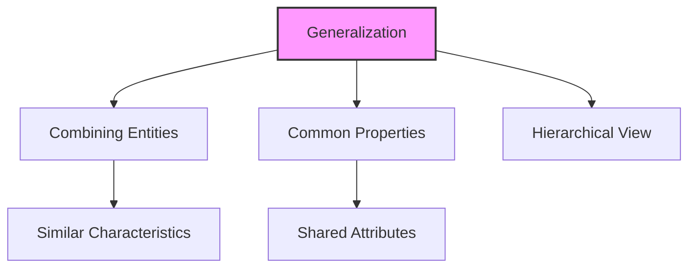
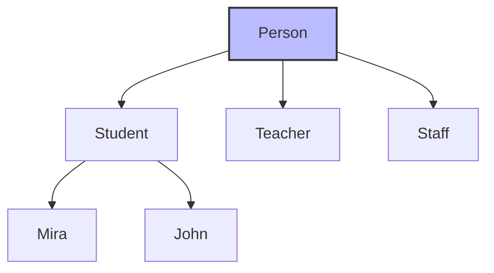
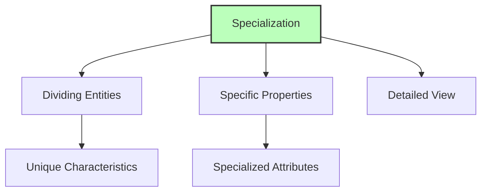
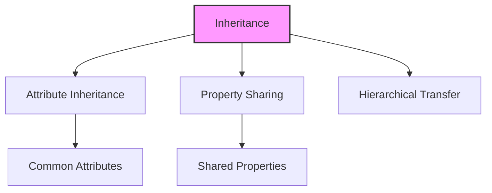
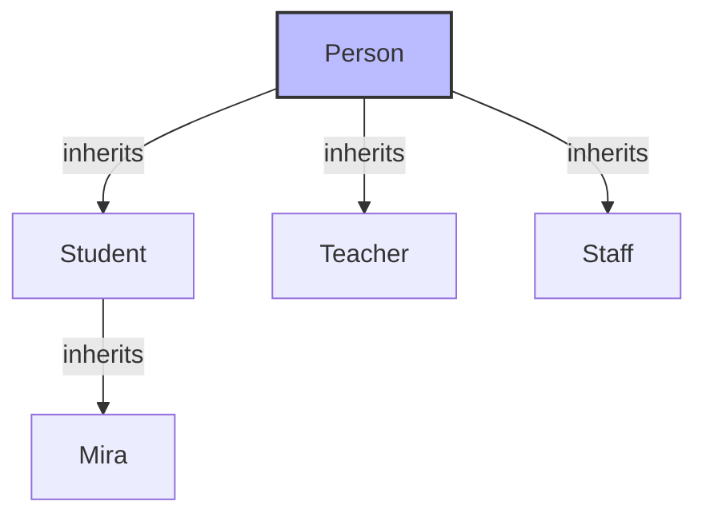

# Generalization and Aggregation in ER Model

## 🎯 Learning Outcomes
By the end of this overview, you will understand:
- Concept of generalization and specialization
- Hierarchical representation in ER Model
- Inheritance in database design
- Aggregation relationships
- Abstraction in database modeling

## 📚 Introduction
The ER Model provides powerful capabilities for expressing database entities in a conceptual hierarchical manner:
- Hierarchical representation of entities
- Generalization for broader views
- Specialization for detailed views
- Inheritance of properties
- Abstraction of details

## 🔄 Generalization

### What is Generalization?

**Key Points:**
- Combines multiple entities into one
- Creates a more generalized view
- Preserves common properties
- Moves up the hierarchy
- Example: Student → Person

### Example

## 📊 Specialization

### What is Specialization?

**Key Points:**
- Divides entities into subgroups
- Creates more specific views
- Adds specialized properties
- Moves down the hierarchy
- Example: Person → Student → Mira

### Examples
1. **Company Context:**
   - Person → Employee
   - Person → Employer
   - Person → Customer
   - Person → Vendor

2. **School Context:**
   - Person → Teacher
   - Person → Student
   - Person → Staff

## 🔑 Inheritance

### Concept of Inheritance

**Characteristics:**
- Lower-level entities inherit higher-level attributes
- Maintains data consistency
- Reduces redundancy
- Supports code reuse
- Enables polymorphism

### Example

**Inherited Attributes:**
- Name
- Age
- Gender
- Contact Information

## 📈 Abstraction

### What is Abstraction?
- Hiding implementation details
- Showing only essential features
- Simplifying complex systems
- Focusing on important aspects
- Reducing complexity

## 🎓 Best Practices
1. Use generalization for common properties
2. Apply specialization for unique features
3. Implement inheritance properly
4. Maintain clear hierarchy
5. Document relationships

## ⚠️ Important Notes
- Generalization moves up the hierarchy
- Specialization moves down the hierarchy
- Inheritance must be properly implemented
- Abstraction helps in simplification
- Maintain data integrity

## 📝 Quick Summary
- Generalization combines entities
- Specialization divides entities
- Inheritance shares properties
- Abstraction hides details
- Hierarchy provides structure

---
*This overview provides a comprehensive understanding of generalization and aggregation concepts in ER modeling. For practical implementation and examples, refer to the hands-on sections of the course.* 