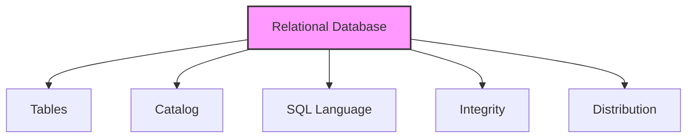

# Codd's 12 Rules: The Gold Standard for Relational Databases

## Introduction: Why Codd's Rules Matter
Imagine setting the rules for a world-class sports league. Dr. Edgar F. Codd did something similar for databases—he defined 12 rules that every true relational database should follow. These rules ensure data integrity, flexibility, and power.

---

## What are Codd's 12 Rules?
Codd's rules are a set of criteria for evaluating whether a database system is truly relational. They cover everything from how data is stored to how it can be accessed and protected.

---

## The 12 Rules Explained (with Examples)

1. **Information Rule:** All information is stored in tables.
   - *Example:* Customer data is in a table, not in files or code.
2. **Guaranteed Access Rule:** Every data element is accessible by table name, primary key, and column name.
3. **Systematic Treatment of NULLs:** NULLs represent missing or inapplicable information, handled consistently.
4. **Active Online Catalog:** The database structure (metadata) is stored in tables and accessible via the same language as data.
5. **Comprehensive Data Sub-language:** The system supports at least one language (like SQL) for all operations.
6. **View Updating Rule:** All theoretically updatable views are updatable by the system.
7. **High-Level Insert, Update, Delete:** The system supports set-level operations, not just single-row changes.
8. **Physical Data Independence:** Changes in physical storage do not affect how data is accessed.
9. **Logical Data Independence:** Changes in logical structure do not affect how data is accessed.
10. **Integrity Independence:** Integrity constraints are stored in the catalog, not in application code.
11. **Distribution Independence:** Users see a single database, even if data is distributed across locations.
12. **Non-Subversion Rule:** No way to bypass integrity rules using low-level operations.

---

## Visualizing the Rules

---

## Why Do These Rules Matter?
- Ensure data consistency and integrity
- Enable powerful, flexible queries
- Make databases easier to maintain and scale
- Set the foundation for modern database systems

---

## Best Practices & Key Takeaways
- Choose database systems that adhere to Codd's rules for mission-critical applications
- Understand which rules your DBMS supports
- Use the rules as a checklist for evaluating new technologies

---

## Further Exploration
- "An Introduction to Database Systems" by C.J. Date
- Research which modern DBMSs fully comply with Codd's rules
- Try mapping Codd's rules to features in your favorite database

---
*This guide is designed to make Codd's 12 Rules clear and practical for everyone, from beginners to experts. For hands-on practice, refer to the exercises and projects in the course materials.* 