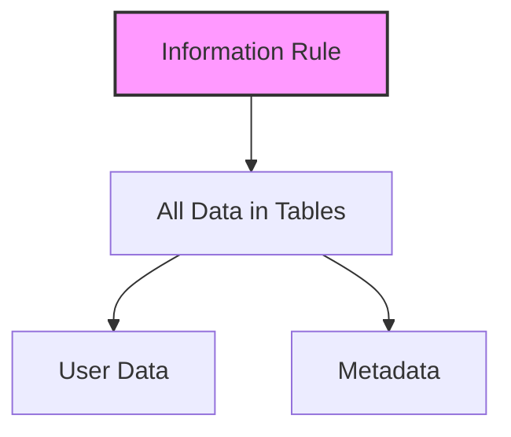
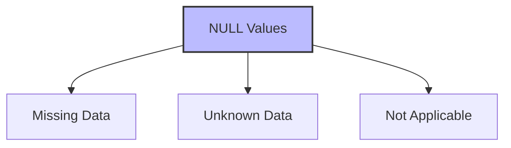
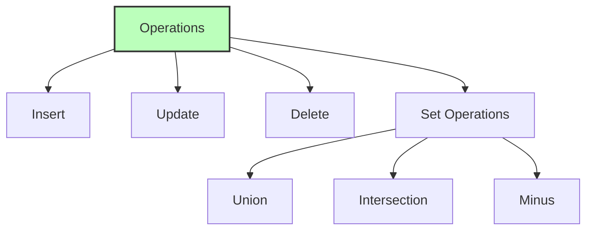
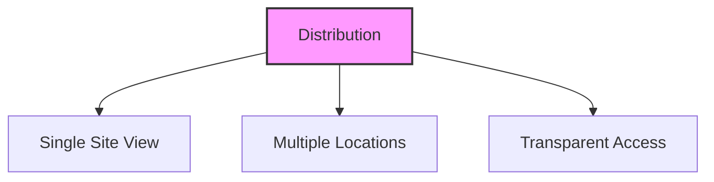

# Codd's 12 Rules for Relational Databases

## 🎯 Learning Outcomes
By the end of this overview, you will understand:
- The fundamental rules for relational databases
- Importance of data integrity and independence
- System requirements for true relational databases
- Data access and manipulation rules
- Database design principles

## 📚 Introduction
Dr. Edgar F. Codd established twelve rules that a database must follow to be considered a true relational database. These rules form the foundation of relational database theory and design.

## 📋 The Twelve Rules

### Rule 1: Information Rule

**Key Points:**
- All data must be stored in tables
- Includes both user data and metadata
- No exceptions to table storage
- Foundation for other rules

### Rule 2: Guaranteed Access Rule
- Every data element must be accessible
- Access through:
  - Table name
  - Primary key
  - Attribute name
- No pointer-based access allowed

### Rule 3: Systematic Treatment of NULL Values

**Interpretations:**
- Data is missing
- Data is not known
- Data is not applicable

### Rule 4: Active Online Catalog
- Database structure stored in catalog
- Accessible to authorized users
- Uses same query language
- Contains data dictionary

### Rule 5: Comprehensive Data Sub-Language Rule
**Requirements:**
- Linear syntax support
- Data definition capabilities
- Data manipulation features
- Transaction management
- Direct or application access

### Rule 6: View Updating Rule
- All theoretically updatable views
- Must be system-updatable
- Maintains data consistency
- Supports view modifications

### Rule 7: High-Level Operations Rule

### Rule 8: Physical Data Independence
- Data independent of applications
- Physical changes don't affect access
- Maintains application compatibility
- Supports system evolution

### Rule 9: Logical Data Independence
- Logical data independent of user views
- Changes don't affect applications
- Supports schema evolution
- Most challenging rule to implement

### Rule 10: Integrity Independence
- Database independent of applications
- Integrity constraints modifiable
- No application changes needed
- Maintains data consistency

### Rule 11: Distribution Independence

**Key Points:**
- Users see single data location
- Supports distributed systems
- Transparent data distribution
- Foundation for distributed databases

### Rule 12: Non-Subversion Rule
- Low-level access interface
- Must maintain security
- Preserves integrity constraints
- Prevents system bypass

## 🎓 Best Practices
1. Follow all twelve rules
2. Maintain data independence
3. Ensure data integrity
4. Support high-level operations
5. Implement proper security

## ⚠️ Important Notes
- Rules are foundational
- Not all databases follow all rules
- Rules guide database design
- Support system evolution
- Maintain data consistency

## 📝 Quick Summary
- Information must be in tables
- Guaranteed data access
- Systematic NULL handling
- Online catalog required
- Comprehensive language support
- View updating capability
- High-level operations
- Physical independence
- Logical independence
- Integrity independence
- Distribution independence
- Non-subversion security

---
*This overview provides a comprehensive understanding of Codd's 12 Rules for relational databases. For practical implementation and examples, refer to the hands-on sections of the course.* 