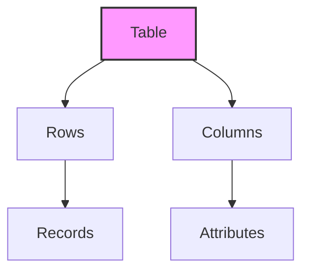
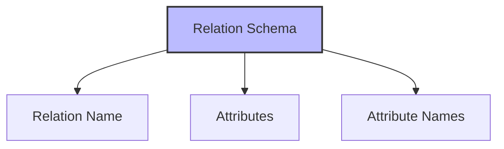
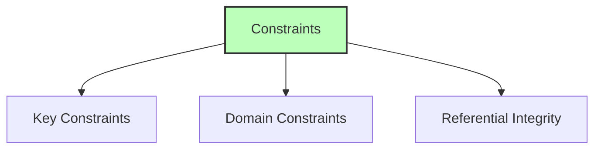
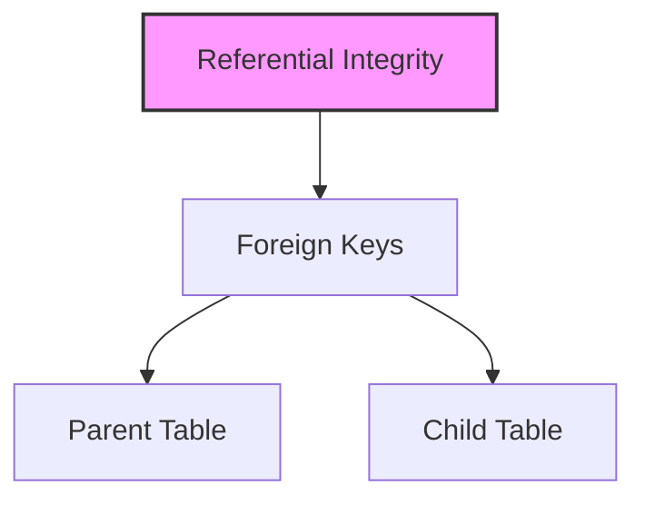

# Relational Data Models

## 🎯 Learning Outcomes
By the end of this overview, you will understand:
- Basic concepts of relational data models
- Components of relational databases
- Types of constraints
- Key concepts and their importance
- Data integrity rules

## 📚 Introduction
The relational data model is the primary data model used worldwide for:
- Data storage
- Data processing
- Efficient data management
- Structured data organization

## 📊 Basic Concepts

### Tables

**Characteristics:**
- Stores relations among entities
- Organized in rows and columns
- Rows represent records
- Columns represent attributes

### Tuple
- Single row in a table
- Contains one record
- Represents one instance
- Part of relation instance

### Relation Instance
- Finite set of tuples
- No duplicate tuples
- Represents current state
- Maintains data integrity

## 🔑 Relation Schema

### Components

**Key Elements:**
- Relation name (table name)
- Attribute names
- Attribute definitions
- Structure description

### Relation Key
- Identifies rows uniquely
- One or more attributes
- Unique identification
- Primary identifier

### Attribute Domain
- Pre-defined value scope
- Valid value range
- Data type constraints
- Value restrictions

## ⚖️ Constraints

### Types of Constraints

### 1. Key Constraints
**Requirements:**
- Minimal subset of attributes
- Unique tuple identification
- No NULL values allowed
- No duplicate values

**Types of Keys:**
- Candidate keys
- Primary key
- Foreign key
- Composite key

### 2. Domain Constraints
**Examples:**
- Age: positive integers
- Phone: digits 0-9
- Email: valid format
- Date: valid calendar date

**Characteristics:**
- Value range restrictions
- Data type constraints
- Format requirements
- Business rules

### 3. Referential Integrity Constraints

**Key Points:**
- Based on foreign keys
- Maintains relationships
- Ensures data consistency
- Prevents orphaned records

## 🎓 Best Practices
1. Define clear schemas
2. Use appropriate keys
3. Set proper constraints
4. Maintain referential integrity
5. Follow naming conventions

## ⚠️ Important Notes
- Tables must be properly normalized
- Keys must be carefully chosen
- Constraints must be enforced
- Data integrity must be maintained
- Relationships must be valid

## 📝 Quick Summary
- Tables store relations
- Tuples are rows
- Schemas define structure
- Keys identify records
- Constraints ensure integrity
- Domains restrict values
- Referential integrity maintains relationships

---
*This overview provides a comprehensive understanding of Relational Data Models. For practical implementation and examples, refer to the hands-on sections of the course.* 