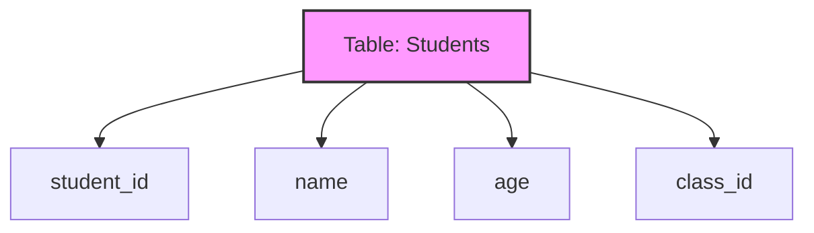

# Relational Data Models: The Backbone of Modern Databases

## Introduction: Why Relational Models Matter
Imagine organizing your school or business with a set of perfectly structured spreadsheets—each row is a record, each column is a property, and every table is connected. The **relational data model** is the foundation of almost every major database system in the world.

---

## What is the Relational Data Model?
A **relational data model** organizes data into tables (relations) made up of rows (tuples) and columns (attributes). It uses mathematical principles to ensure data is consistent, reliable, and easy to query.

**Analogy:**
- Table = Spreadsheet
- Row = Record
- Column = Property

---

## Key Concepts

### 1. Tables (Relations)
- Store data in rows and columns
- Each table has a unique name

### 2. Tuples (Rows)
- Each row represents a single record
- No duplicate rows allowed

### 3. Attributes (Columns)
- Each column has a name and a data type
- Defines the kind of data stored

### 4. Keys
- **Primary Key:** Uniquely identifies each row
- **Foreign Key:** Connects rows in different tables
- **Candidate Key:** Any column or set of columns that could be a primary key

### 5. Domains
- The set of valid values for a column

### 6. Constraints
- Rules that ensure data integrity (e.g., no negative ages, unique emails)

---

## Visualizing a Relational Model

---

## Advanced Topics
- **Normalization:** Organizing tables to reduce redundancy
- **Referential Integrity:** Ensuring foreign keys match primary keys
- **Joins:** Combining data from multiple tables
- **Views:** Virtual tables for custom queries

---

## Best Practices & Key Takeaways
- Always define primary keys
- Use foreign keys to maintain relationships
- Apply constraints to enforce business rules
- Normalize tables, but balance with performance

---

## Further Exploration
- "Database System Concepts" by Silberschatz, Korth, and Sudarshan
- Practice designing relational schemas for real-world scenarios
- Explore SQL queries for joins, constraints, and views

---
*This guide is designed to make relational data models clear and practical for everyone, from beginners to experts. For hands-on practice, refer to the exercises and projects in the course materials.* 