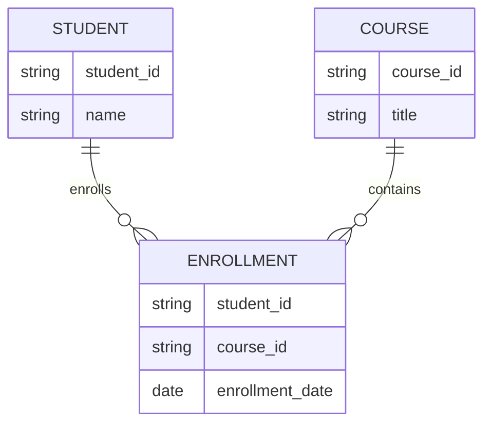

# ER to Relational Model Mapping: Bridging Design and Implementation

## Introduction: Why Mapping Matters
Designing a database is like drawing a map. But to use it in the real world, you need to turn that map into roads and buildings. In databases, this means converting your ER (Entity-Relationship) model into a relational schema that your DBMS can use.

---

## What is ER to Relational Mapping?
**ER to Relational Mapping** is the process of transforming an ER diagram (conceptual design) into a set of relational tables (logical design) that can be implemented in a database.

**Analogy:**
- ER Diagram = Blueprint
- Relational Schema = Actual construction plan

---

## The Mapping Process (Step by Step)

### 1. Mapping Entities
- Each strong entity becomes a table
- Attributes become columns
- Primary key is chosen

### 2. Mapping Relationships
- **One-to-One:** Add foreign key to either table
- **One-to-Many:** Add foreign key to the "many" side
- **Many-to-Many:** Create a new table with foreign keys from both entities

### 3. Mapping Weak Entities
- Create a table for the weak entity
- Include primary key of the owner entity as part of the primary key

### 4. Mapping Hierarchies (Generalization/Specialization)
- Several strategies: single table, multiple tables, or a table for the supertype and each subtype

---

## Example: School Database

- **Entities:** STUDENT, COURSE
- **Relationship:** ENROLLMENT (many-to-many)
- **Relational Tables:**
  - STUDENT(student_id, name)
  - COURSE(course_id, title)
  - ENROLLMENT(student_id, course_id, enrollment_date)

---

## Best Practices & Key Takeaways
- Always define primary and foreign keys
- Use appropriate mapping strategies for hierarchies
- Document all mapping decisions
- Test your schema with sample data

---

## Further Exploration
- "Database System Concepts" by Silberschatz, Korth, and Sudarshan
- Practice mapping ER diagrams to relational schemas for different scenarios
- Explore SQL DDL for implementing relational schemas

---
*This guide is designed to make ER to relational mapping clear and practical for everyone, from beginners to experts. For hands-on practice, refer to the exercises and projects in the course materials.* 