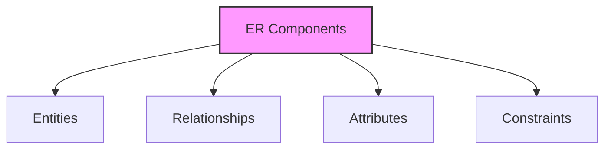
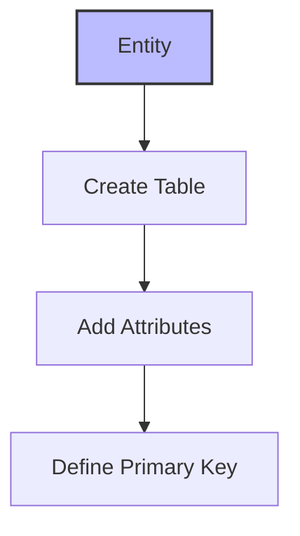
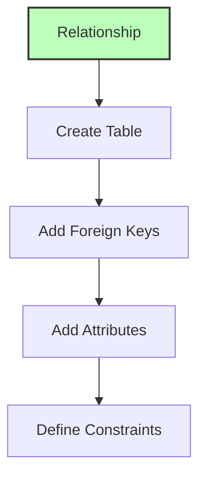
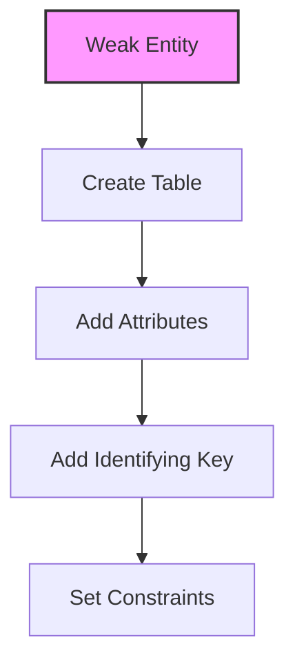
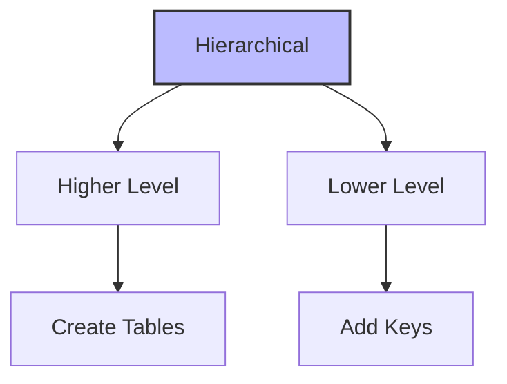

# ER to Relational Model Mapping

## 🎯 Learning Outcomes
By the end of this overview, you will understand:
- How to convert ER diagrams to relational schema
- Mapping processes for different ER components
- Handling of various entity types
- Relationship mapping techniques
- Constraint preservation in mapping

## 📚 Introduction
The conversion from ER Model to Relational Model involves:
- Mapping entities to tables
- Converting relationships
- Handling attributes
- Preserving constraints
- Maintaining data integrity

## 🔄 Mapping Process Overview

### Components to Map


## 📊 Entity Mapping

### Basic Entity Mapping


**Process:**
1. Create table for each entity
2. Convert attributes to fields
3. Define appropriate data types
4. Declare primary key

### Example
```sql
CREATE TABLE Employee (
    emp_id INT PRIMARY KEY,
    name VARCHAR(100),
    age INT,
    department VARCHAR(50)
);
```

## 🔗 Relationship Mapping

### Basic Relationship Mapping


**Process:**
1. Create relationship table
2. Add participating entity keys
3. Include relationship attributes
4. Define primary key
5. Set foreign key constraints

### Example
```sql
CREATE TABLE Works_On (
    emp_id INT,
    project_id INT,
    hours INT,
    PRIMARY KEY (emp_id, project_id),
    FOREIGN KEY (emp_id) REFERENCES Employee(emp_id),
    FOREIGN KEY (project_id) REFERENCES Project(project_id)
);
```

## 📈 Weak Entity Mapping

### Weak Entity Process


**Process:**
1. Create table for weak entity
2. Add all attributes
3. Include identifying entity key
4. Set foreign key constraints

### Example
```sql
CREATE TABLE Dependent (
    emp_id INT,
    dep_name VARCHAR(100),
    relationship VARCHAR(50),
    PRIMARY KEY (emp_id, dep_name),
    FOREIGN KEY (emp_id) REFERENCES Employee(emp_id)
);
```

## 🔄 Hierarchical Entity Mapping

### Specialization/Generalization


**Process:**
1. Create higher-level tables
2. Create lower-level tables
3. Add higher-level keys
4. Include lower-level attributes
5. Set primary keys
6. Define foreign keys

### Example
```sql
-- Higher Level
CREATE TABLE Person (
    person_id INT PRIMARY KEY,
    name VARCHAR(100),
    address VARCHAR(200)
);

-- Lower Level
CREATE TABLE Employee (
    person_id INT PRIMARY KEY,
    salary DECIMAL(10,2),
    department VARCHAR(50),
    FOREIGN KEY (person_id) REFERENCES Person(person_id)
);
```

## 🎓 Best Practices
1. Maintain data integrity
2. Preserve relationships
3. Handle constraints properly
4. Use appropriate data types
5. Follow naming conventions

## ⚠️ Important Notes
- Not all ER constraints can be mapped
- Some information may be lost
- Choose appropriate mapping strategy
- Consider performance implications
- Maintain referential integrity

## 📝 Quick Summary
- Entities become tables
- Attributes become columns
- Relationships become tables
- Weak entities need identifying keys
- Hierarchical entities need proper keys
- Constraints must be preserved
- Foreign keys maintain relationships

---
*This overview provides a comprehensive understanding of mapping ER Models to Relational Models. For practical implementation and examples, refer to the hands-on sections of the course.* 