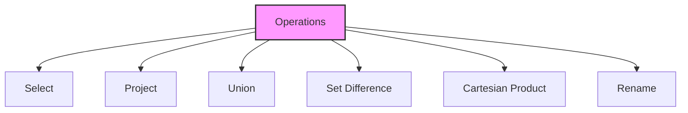
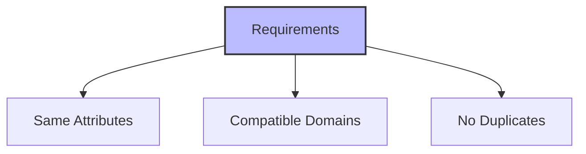
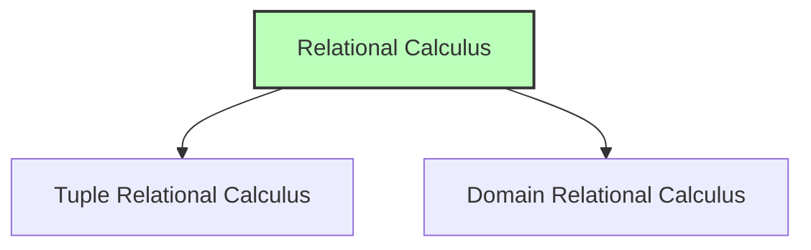

# Relational Algebra

## 🎯 Learning Outcomes
By the end of this overview, you will understand:
- Basic operations of relational algebra
- Query language concepts
- Set operations in databases
- Relational calculus
- Query optimization

## 📚 Introduction
Relational algebra is a procedural query language that:
- Takes relation instances as input
- Yields relation instances as output
- Uses operators for queries
- Supports recursive operations
- Maintains intermediate results

## 🔄 Fundamental Operations

### Basic Operations


## 📊 Select Operation (σ)

### Notation
- σp(r)
- p: selection predicate
- r: relation

### Examples
```sql
σsubject = "database"(Books)
σsubject = "database" and price = "450"(Books)
σsubject = "database" and price = "450" or year > "2010"(Books)
```

**Characteristics:**
- Filters tuples based on condition
- Uses logical operators
- Supports comparison operators
- Returns subset of relation

## 📈 Project Operation (∏)

### Notation
- ∏A1, A2, An (r)
- A1, A2, An: attribute names
- r: relation

### Example
```sql
∏subject, author (Books)
```

**Features:**
- Projects specific columns
- Eliminates duplicates
- Returns vertical subset
- Maintains relation properties

## 🔄 Union Operation (∪)

### Notation
- r ∪ s = { t | t ∈ r or t ∈ s}

### Requirements


### Example
```sql
∏ author (Books) ∪ ∏ author (Articles)
```

## ⚖️ Set Difference (−)

### Notation
- r − s
- Returns tuples in r but not in s

### Example
```sql
∏ author (Books) − ∏ author (Articles)
```

## 📦 Cartesian Product (Χ)

### Notation
- r Χ s = { q t | q ∈ r and t ∈ s}

### Example
```sql
σauthor = 'tutorialspoint'(Books Χ Articles)
```

## 🔄 Rename Operation (ρ)

### Notation
- ρ x (E)
- x: new name
- E: expression

## 📚 Relational Calculus

### Types


### 1. Tuple Relational Calculus (TRC)
**Notation:**
- {T | Condition}
- T: tuple variable
- Condition: filtering criteria

**Example:**
```sql
{ T.name | Author(T) AND T.article = 'database' }
```

### 2. Domain Relational Calculus (DRC)
**Notation:**
- { a1, a2, a3, ..., an | P (a1, a2, a3, ... ,an)}

**Example:**
```sql
{ <Article, Page, Subject> | 
  <Article, Page, Subject> ∈ TutorialsPoint ∧ subject = 'database'}
```

## 🎓 Best Practices
1. Use appropriate operations
2. Optimize query performance
3. Maintain data integrity
4. Consider set properties
5. Use proper notation

## ⚠️ Important Notes
- Operations are recursive
- Results are relations
- Maintain set properties
- Support complex queries
- Equivalent power in calculus

## 📝 Quick Summary
- Select filters tuples
- Project selects columns
- Union combines relations
- Difference finds unique tuples
- Cartesian product combines all
- Rename changes names
- Calculus provides declarative queries

---
*This overview provides a comprehensive understanding of Relational Algebra. For practical implementation and examples, refer to the hands-on sections of the course.* 