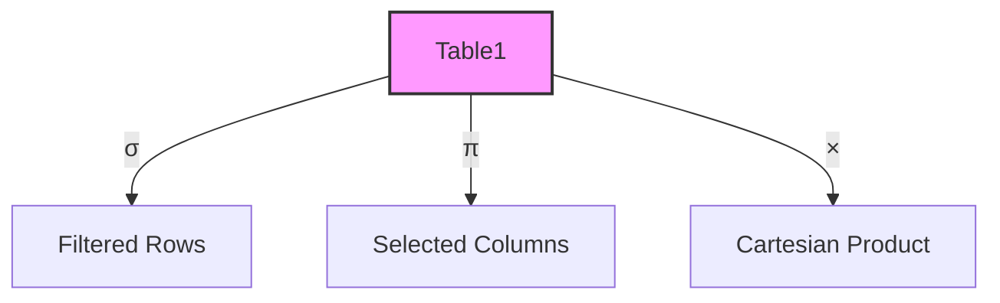

# Relational Algebra: The Language of Database Queries

## Introduction: Why Relational Algebra Matters
Imagine you're a chef with a set of ingredients (tables) and a recipe book (operations). **Relational algebra** is the recipe book for databases—it tells you how to combine, filter, and transform data to get exactly what you want.

---

## What is Relational Algebra?
**Relational algebra** is a set of mathematical operations for manipulating and querying data in relational databases. It forms the theoretical foundation for SQL and other query languages.

**Analogy:**
- Tables = Ingredients
- Operations = Recipes

---

## Core Operations in Relational Algebra

### 1. Select (σ)
- Filters rows based on a condition
- **Example:** Get all students older than 18

### 2. Project (π)
- Selects specific columns
- **Example:** Get only student names and ages

### 3. Union (∪)
- Combines rows from two tables (removes duplicates)
- **Example:** List all unique customers from two regions

### 4. Set Difference (−)
- Rows in one table but not the other
- **Example:** Customers who haven't placed orders

### 5. Cartesian Product (×)
- Combines every row of one table with every row of another
- **Example:** All possible pairs of students and courses

### 6. Rename (ρ)
- Changes the name of a table or column

---

## Advanced Operations
- **Join:** Combines related rows from two tables
- **Intersection:** Rows common to both tables
- **Division:** Finds rows in one table related to all rows in another

---

## Visualizing Relational Algebra

---

## Why Learn Relational Algebra?
- Forms the basis for SQL and query optimization
- Helps you understand how queries work under the hood
- Enables you to write more efficient and powerful queries

---

## Best Practices & Key Takeaways
- Master the core operations before moving to advanced ones
- Visualize operations with Venn diagrams or tables
- Practice translating SQL queries to relational algebra and vice versa

---

## Further Exploration
- "Database System Concepts" by Silberschatz, Korth, and Sudarshan
- Practice relational algebra problems online
- Explore query optimization techniques

---
*This guide is designed to make relational algebra clear and practical for everyone, from beginners to experts. For hands-on practice, refer to the exercises and projects in the course materials.* 