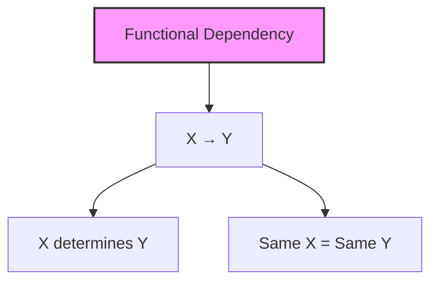
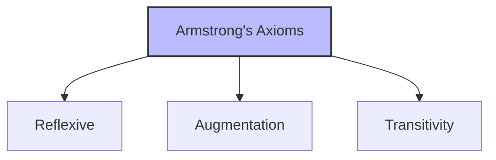
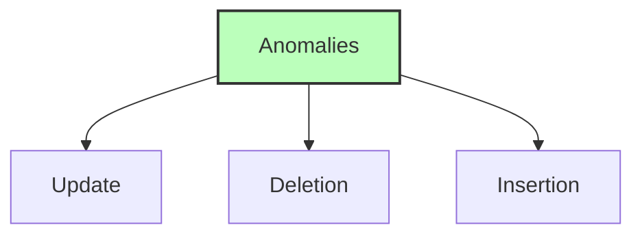

# Database Normalization

## 🎯 Learning Outcomes
By the end of this overview, you will understand:
- Functional dependencies and their types
- Armstrong's Axioms
- Normal forms and their requirements
- Database anomalies
- Normalization process

## 📚 Introduction
Database normalization is a process that:
- Removes database anomalies
- Improves data integrity
- Reduces data redundancy
- Organizes data efficiently
- Maintains consistency

## 🔄 Functional Dependencies

### Basic Concept

**Definition:**
- Set of constraints between attributes
- X functionally determines Y
- Same X values imply same Y values
- Represented as X → Y

## 📊 Armstrong's Axioms

### Rules

### 1. Reflexive Rule
- If β ⊆ α, then α → β
- Subset determines superset
- Always holds true

### 2. Augmentation Rule
- If α → β holds
- Then αγ → βγ holds
- Adding attributes preserves FD

### 3. Transitivity Rule
- If α → β and β → γ
- Then α → γ holds
- Similar to algebraic transitivity

## 📈 Types of Functional Dependencies

### 1. Trivial FD
- X → Y where Y ⊆ X
- Always holds true
- Example: {A,B} → {A}

### 2. Non-trivial FD
- X → Y where Y ⊄ X
- Contains new information
- Example: {A} → {B}

### 3. Completely Non-trivial FD
- X → Y where X ∩ Y = Φ
- No common attributes
- Example: {A} → {B,C}

## ⚠️ Database Anomalies

### Types of Anomalies

### 1. Update Anomalies
- Inconsistent updates
- Multiple copies of data
- Partial updates
- Data inconsistency

### 2. Deletion Anomalies
- Unintended data loss
- Partial deletions
- Orphaned records
- Data integrity issues

### 3. Insertion Anomalies
- Cannot insert data
- Missing dependencies
- Incomplete records
- Data validation issues

## 📊 Normal Forms

### First Normal Form (1NF)
**Requirements:**
- Atomic values
- No repeating groups
- Single value per attribute
- Unique column names

### Second Normal Form (2NF)
**Requirements:**
- Must be in 1NF
- No partial dependencies
- Full functional dependency
- Prime vs non-prime attributes

### Third Normal Form (3NF)
**Requirements:**
- Must be in 2NF
- No transitive dependencies
- Non-prime attributes
- Superkey or prime attribute

### Boyce-Codd Normal Form (BCNF)
**Requirements:**
- Must be in 3NF
- X must be superkey
- Stricter than 3NF
- No non-trivial FDs

## 🎓 Best Practices
1. Identify all FDs
2. Apply normalization rules
3. Check for anomalies
4. Maintain data integrity
5. Consider performance

## ⚠️ Important Notes
- Normalization reduces redundancy
- May impact performance
- Balance is important
- Consider denormalization
- Document dependencies

## 📝 Quick Summary
- FDs define relationships
- Armstrong's rules generate FDs
- Normal forms remove anomalies
- 1NF: Atomic values
- 2NF: No partial dependencies
- 3NF: No transitive dependencies
- BCNF: Stricter than 3NF

---
*This overview provides a comprehensive understanding of Database Normalization. For practical implementation and examples, refer to the hands-on sections of the course.* 