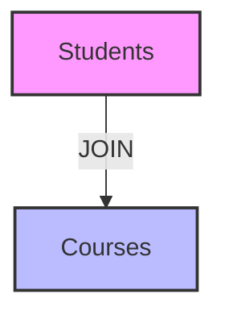

# Database Joins: Connecting Data for Powerful Insights

## Introduction: Why Joins Matter
Imagine you have a list of students and a separate list of the courses they take. How do you find out which student is in which course? **Joins** are the magic that connect different tables in a database, letting you answer real-world questions and unlock the full power of your data.

---

## What is a Join?
A **join** is an operation that combines rows from two or more tables based on a related column between them. Joins let you:
- See related data together (e.g., students and their courses)
- Answer complex questions with simple queries
- Avoid data duplication by keeping information in separate tables

**Analogy:**
- Like matching puzzle pieces by their shapes (keys)

---

## Types of Joins (with Examples)

### 1. Inner Join
- Returns only rows with matching values in both tables
- **Example:** Students who are enrolled in a course

### 2. Left (Outer) Join
- Returns all rows from the left table, and matching rows from the right table (NULL if no match)
- **Example:** All students, even those not enrolled in any course

### 3. Right (Outer) Join
- Returns all rows from the right table, and matching rows from the left table (NULL if no match)
- **Example:** All courses, even those with no students enrolled

### 4. Full (Outer) Join
- Returns all rows from both tables, with NULLs where there is no match
- **Example:** All students and all courses, showing matches and non-matches

### 5. Cross Join
- Returns the Cartesian product (all possible combinations)
- **Example:** Every student paired with every course

---

## Visualizing Joins

---

## Real-World Example: School Database
- **Tables:** Students, Courses, Enrollments
- **Query:** Find all students and the courses they are enrolled in
- **Join:** Students INNER JOIN Enrollments ON student_id, then Enrollments INNER JOIN Courses ON course_id

---

## Best Practices & Key Takeaways
- Use INNER JOIN for matching data
- Use OUTER JOINs to include unmatched rows
- Always specify join conditions to avoid Cartesian products
- Use indexes on join columns for better performance
- Test queries with real data to ensure accuracy

---

## Further Exploration
- "Database System Concepts" by Silberschatz, Korth, and Sudarshan
- Practice writing join queries for different scenarios
- Explore advanced join types (self-join, natural join)

---
*This guide is designed to make database joins clear and practical for everyone, from beginners to experts. For hands-on practice, refer to the exercises and projects in the course materials.* 