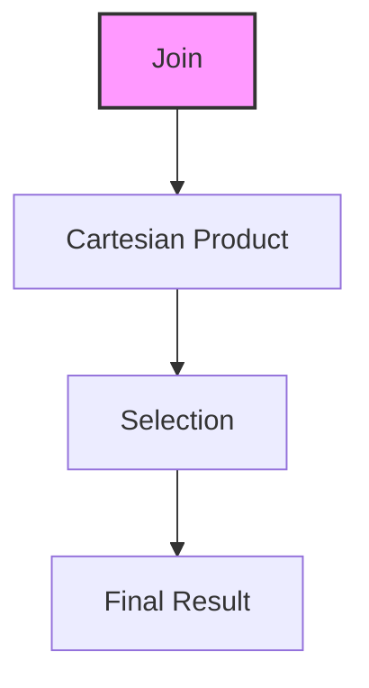
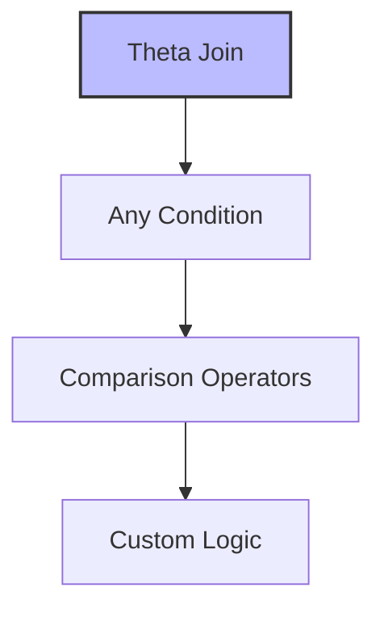
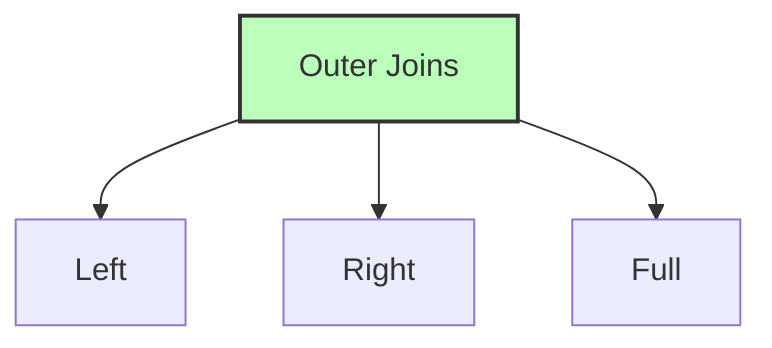

# Database Joins

## 🎯 Learning Outcomes
By the end of this overview, you will understand:
- Different types of joins
- Join conditions and operations
- Inner vs Outer joins
- Join syntax and notation
- Practical join examples

## 📚 Introduction
Database joins are operations that:
- Combine data from multiple relations
- Apply selection conditions
- Create meaningful relationships
- Handle missing data
- Optimize data retrieval

## 🔄 Basic Join Concepts

### Join Process


**Key Points:**
- Combines Cartesian product
- Applies selection condition
- Pairs matching tuples
- Maintains data integrity
- Optimizes performance

## 📊 Types of Joins

### 1. Theta (θ) Join


**Notation:** R1 ⋈θ R2

**Example:**
```sql
STUDENT ⋈Student.Std = Subject.Class SUBJECT
```

**Result:**
| SID | Name | Std | Class | Subject |
|-----|------|-----|-------|---------|
| 101 | Alex | 10  | 10    | Math    |
| 101 | Alex | 10  | 10    | English |
| 102 | Maria| 11  | 11    | Music   |
| 102 | Maria| 11  | 11    | Sports  |

### 2. Equijoin
- Special case of Theta join
- Uses only equality operator
- Matches equal values
- Common in practice

### 3. Natural Join (⋈)
**Requirements:**
- Common attributes
- Same name and domain
- Matching values
- No comparison operator

**Example:**
```sql
Courses ⋈ HoD
```

**Result:**
| Dept | CID  | Course    | Head |
|------|------|-----------|------|
| CS   | CS01 | Database  | Alex |
| ME   | ME01 | Mechanics | Maya |
| EE   | EE01 | Electronics| Mira |

## 📈 Outer Joins

### Types of Outer Joins


### 1. Left Outer Join
- Includes all left relation tuples
- NULL for unmatched right tuples
- Preserves left data
- Example: Courses Left Outer Join HoD

### 2. Right Outer Join
- Includes all right relation tuples
- NULL for unmatched left tuples
- Preserves right data
- Example: Courses Right Outer Join HoD

### 3. Full Outer Join
- Includes all tuples from both relations
- NULL for unmatched attributes
- Preserves all data
- Example: Courses Full Outer Join HoD

## 🎓 Best Practices
1. Choose appropriate join type
2. Consider performance impact
3. Handle NULL values
4. Use proper indexing
5. Optimize join conditions

## ⚠️ Important Notes
- Joins can be expensive
- Consider table sizes
- Use appropriate indexes
- Handle NULL values
- Check join conditions

## 📝 Quick Summary
- Theta join: Any condition
- Equijoin: Equality only
- Natural join: Common attributes
- Left join: All left tuples
- Right join: All right tuples
- Full join: All tuples
- NULL handling is important

---
*This overview provides a comprehensive understanding of Database Joins. For practical implementation and examples, refer to the hands-on sections of the course.* 