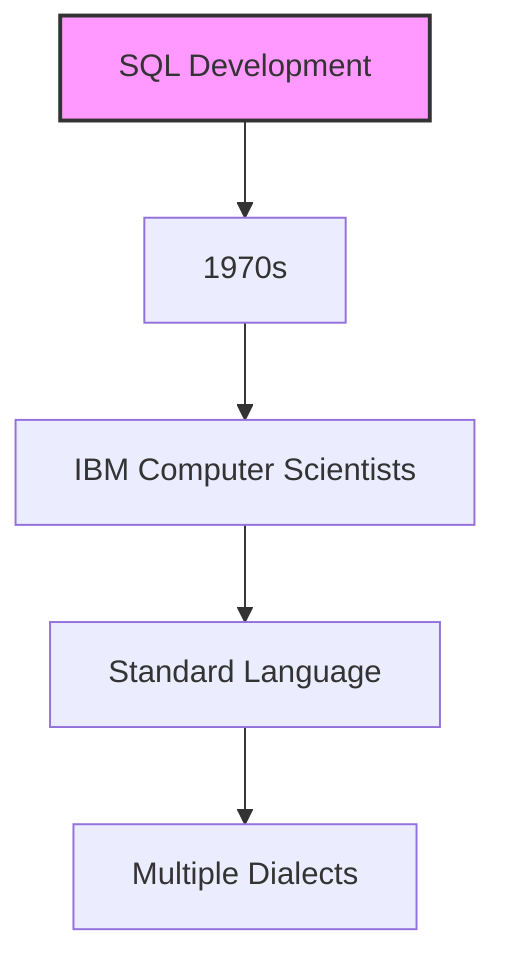
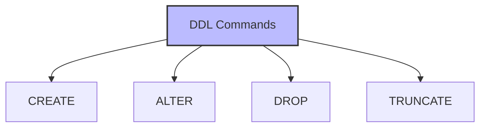
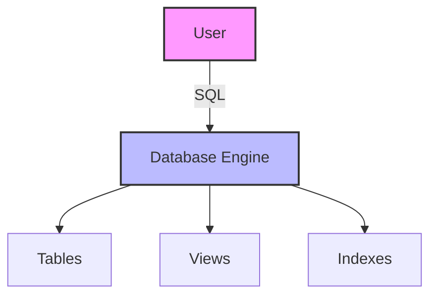

# SQL (Structured Query Language): The Universal Language of Databases

## 🎯 Learning Outcomes
By the end of this overview, you will understand:
- Basic SQL concepts and history
- SQL commands and their categories
- Data manipulation techniques
- Database management fundamentals
- SQL applications and career opportunities

## 📚 Introduction
SQL is a programming language that:
- Manages data in relational databases
- Retrieves and manipulates data
- Controls database access
- Defines database structures
- Communicates with databases

## 🔄 SQL Overview

### History and Development


**Key Points:**
- Developed in 1970s by IBM
- Standard for relational databases
- Multiple dialects available
- Industry-wide adoption
- Continuous evolution

## 📊 SQL Commands

### 1. Data Definition Language (DDL)


**Commands:**
| Command | Description |
|---------|-------------|
| CREATE | Creates new database objects |
| ALTER | Modifies existing objects |
| DROP | Deletes database objects |
| TRUNCATE | Removes all table data |

### 2. Data Manipulation Language (DML)
**Commands:**
| Command | Description |
|---------|-------------|
| SELECT | Retrieves records |
| INSERT | Creates records |
| UPDATE | Modifies records |
| DELETE | Removes records |

### 3. Data Control Language (DCL)
**Commands:**
| Command | Description |
|---------|-------------|
| GRANT | Gives user privileges |
| REVOKE | Removes user privileges |

## 📈 SQL Examples

### Sample Table: CUSTOMERS
| ID | Name | Age | Salary | City | Country |
|----|------|-----|---------|------|----------|
| 1 | Ramesh | 32 | 2000.00 | Maryland | USA |
| 2 | Mukesh | 40 | 5000.00 | New York | USA |
| 3 | Sumit | 45 | 4500.00 | Muscat | Oman |
| 4 | Kaushik | 25 | 2500.00 | Kolkata | India |
| 5 | Hardik | 29 | 3500.00 | Bhopal | India |
| 6 | Komal | 38 | 3500.00 | Saharanpur | India |
| 7 | Ayush | 25 | 3500.00 | Delhi | India |

### Example Query
```sql
SELECT * FROM CUSTOMERS WHERE country = 'USA';
```

**Result:**
| ID | Name | Age | Salary | City | Country |
|----|------|-----|---------|------|----------|
| 1 | Ramesh | 32 | 2000.00 | Maryland | USA |
| 2 | Mukesh | 40 | 5000.00 | New York | USA |

## 💼 Career Opportunities

### Top Companies Hiring SQL Professionals
- Google
- Amazon
- Netflix
- Infosys
- TCS
- Tech Mahindra
- Wipro
- Pinterest
- Uber
- Trello

### Job Roles
- Database Administrator (DBA)
- Database Developer
- Database Tester
- Data Scientist
- ETL Developer
- Database Migration Expert
- Cloud Database Expert

## 🎓 Why Learn SQL?
1. Industry standard language
2. High demand in job market
3. Essential for software development
4. Used across various domains
5. Relatively easy to learn
6. Good salary prospects
7. Multiple career paths

## ⚠️ Prerequisites
- Basic computer science knowledge
- Understanding of databases
- RDBMS concepts
- Data structure basics
- Programming fundamentals

## 📝 Quick Summary
- SQL is a standard database language
- Multiple command categories (DDL, DML, DCL)
- Used across various industries
- High demand in job market
- Essential for software development
- Multiple dialects available
- Continuous learning required

## ❓ Frequently Asked Questions
1. What are SQL skills?
2. What are the 5 different types of SQL?
3. How long should it take to learn SQL?
4. What are the benefits of using SQL over Excel?
5. How do I start learning SQL?
6. What are the 4 basic commands in SQL?
7. What are data types in SQL?
8. Which is the best place to learn SQL?

## Introduction: Why SQL Matters
Imagine you could talk to any database in the world using a single language. That's what SQL is—a universal way to ask questions, update information, and manage data in almost every major database system. Whether you're a beginner or a data scientist, SQL is your passport to the world of data.

## What is SQL?
**SQL (Structured Query Language)** is a programming language designed for managing and manipulating relational databases. It lets you:
- Create and modify database structures
- Insert, update, and delete data
- Retrieve and analyze information
- Control access and security

**Analogy:**
- SQL is like English for databases—clear, powerful, and widely understood.

## Core SQL Commands (with Examples)

### 1. Data Definition Language (DDL)
- **CREATE:** Make new tables or databases
- **ALTER:** Change existing structures
- **DROP:** Remove tables or databases
- **TRUNCATE:** Remove all data from a table

### 2. Data Manipulation Language (DML)
- **SELECT:** Retrieve data
- **INSERT:** Add new data
- **UPDATE:** Change existing data
- **DELETE:** Remove data

### 3. Data Control Language (DCL)
- **GRANT:** Give permissions
- **REVOKE:** Remove permissions

## Visualizing SQL


## Real-World Example: Customer Database
- **SELECT:** Find all customers from India
- **INSERT:** Add a new customer
- **UPDATE:** Change a customer's address
- **DELETE:** Remove a customer who closed their account

## Best Practices & Key Takeaways
- Use clear, consistent naming for tables and columns
- Always back up data before making major changes
- Test queries on sample data first
- Use comments to document complex queries
- Practice regularly to build fluency

## Further Exploration
- "SQL For Smarties" by Joe Celko
- "Learning SQL" by Alan Beaulieu
- Practice on LeetCode, HackerRank, or W3Schools
- Build your own sample database and experiment

---
*This guide is designed to make SQL clear and practical for everyone, from beginners to experts. For hands-on practice, refer to the exercises and projects in the course materials.* 