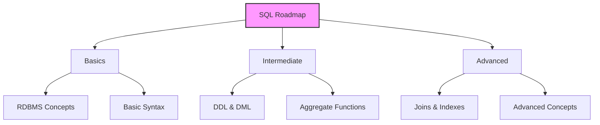
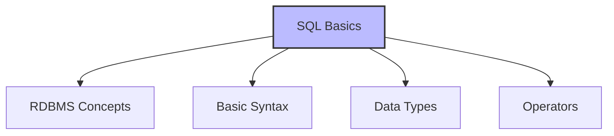
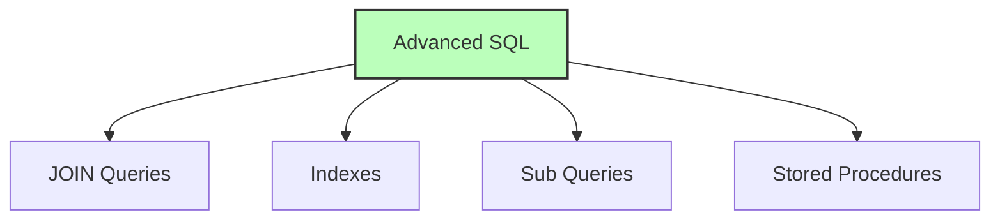

# SQL Learning Roadmap

## 🎯 Learning Outcomes
By following this roadmap, you will:
- Master SQL from basics to advanced concepts
- Understand RDBMS fundamentals
- Learn data manipulation techniques
- Develop database management skills
- Become proficient in SQL operations

## 📚 Introduction
This roadmap provides:
- Structured learning path
- Step-by-step progression
- Comprehensive coverage
- Practical applications
- Best practices

## 🔄 Roadmap Overview

## 📊 Learning Path

### 1. SQL Basics

**Core Concepts:**
- RDBMS Benefits
- SQL Database
- Basic Syntax
- SQL Comments
- Data Types
- Operators
- Expressions
- Basic Statements

### 2. Data Definition Language (DDL)
**Key Operations:**
| Operation | Description |
|-----------|-------------|
| CREATE | Create database objects |
| RENAME | Rename objects |
| SHOW | Display objects |
| TRUNCATE | Remove all data |
| CLONE | Copy objects |
| ALTER | Modify objects |
| DROP | Delete objects |
| DELETE | Remove data |
| CONSTRAINTS | Define rules |

### 3. Data Manipulation Language (DML)
**Essential Commands:**
- SELECT
- INSERT
- DELETE
- UPDATE

### 4. Aggregate Functions
**Common Functions:**
- SUM
- COUNT
- AVG
- MIN
- MAX

### 5. Advanced SQL Concepts

#### Join Types
- Inner Join
- Left Join
- Full Join
- Right Join
- Cross Join

#### Index Management
- Create Index
- Drop Index
- Show Index
- Unique Index
- Clustered Index
- Non-Clustered Index

### 6. Advanced Features
- Wildcards
- SQL Injection Prevention
- Hoisting
- Sub Queries
- Stored Procedures
- Transactions
- Auto Increment
- Handling Duplicates

### 7. Data Constraints
**Types:**
- Primary Key
- Unique
- Check
- Foreign Key
- Not Null

## 🎓 Learning Strategy
1. Start with basics
2. Practice regularly
3. Build projects
4. Solve problems
5. Review concepts
6. Join communities
7. Read documentation

## ⚠️ Important Notes
- Focus on understanding
- Practice consistently
- Build real projects
- Learn from mistakes
- Stay updated
- Join forums
- Share knowledge

## 📝 Quick Summary
- Structured learning path
- Comprehensive coverage
- Practical applications
- Regular practice needed
- Continuous learning
- Real-world projects
- Community support

## 💡 Tips for Success
1. Set clear goals
2. Create a schedule
3. Practice daily
4. Build projects
5. Join communities
6. Read documentation
7. Share knowledge
8. Stay motivated

---
*This roadmap provides a structured approach to mastering SQL. Remember, expertise comes from consistent practice, curiosity, and real-world problem-solving. Your journey from a beginner to an SQL expert is a marathon, not a sprint.* 