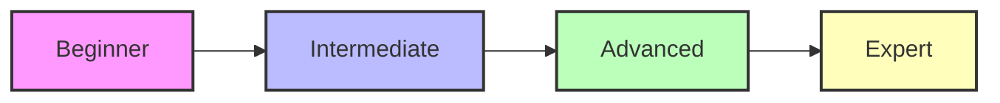

# SQL Learning Roadmap: Your Journey to Database Mastery

## Introduction: Why a Roadmap Matters
Learning SQL is like exploring a new city. Without a map, you might get lost or miss important landmarks. This roadmap guides you step-by-step, from beginner basics to advanced mastery, ensuring you build a strong foundation and reach your goals efficiently.

---

## Stages of SQL Learning

### 1. Beginner: Getting Started
- What is a database?
- Introduction to SQL syntax
- Basic SELECT queries
- Filtering with WHERE
- Sorting with ORDER BY
- Simple INSERT, UPDATE, DELETE

### 2. Intermediate: Building Skills
- Table creation and modification (DDL)
- Data types and constraints
- JOINs (INNER, OUTER, CROSS)
- GROUP BY and aggregate functions
- Subqueries and nested SELECTs
- Indexes and performance basics

### 3. Advanced: Power User
- Views and materialized views
- Stored procedures and functions
- Triggers and events
- Transactions and ACID properties
- Advanced joins and set operations
- Window functions
- Security and permissions

### 4. Expert: Real-World Mastery
- Query optimization and execution plans
- Database design and normalization
- Partitioning and sharding
- Working with big data and NoSQL extensions
- Integrating SQL with programming languages
- Data warehousing and analytics

---

## Visual Roadmap

---

## Tips for Success
- Practice regularly with real data
- Build projects to apply your skills
- Read official documentation and books
- Join online communities and forums
- Never stop exploring new features

---

## Further Exploration
- "SQL Antipatterns" by Bill Karwin
- "SQL Performance Explained" by Markus Winand
- Online platforms: LeetCode, HackerRank, SQLZoo

---
*This roadmap is designed to guide you from your first SQL query to expert-level mastery. Follow the path, practice often, and enjoy your journey!* 