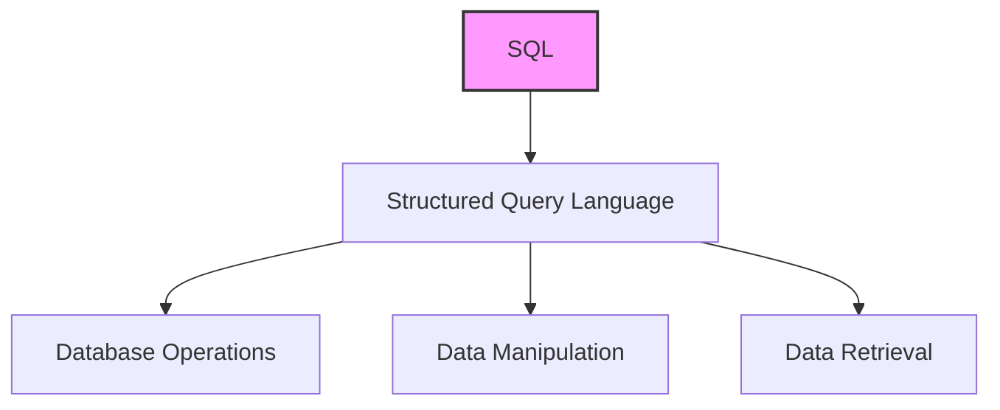
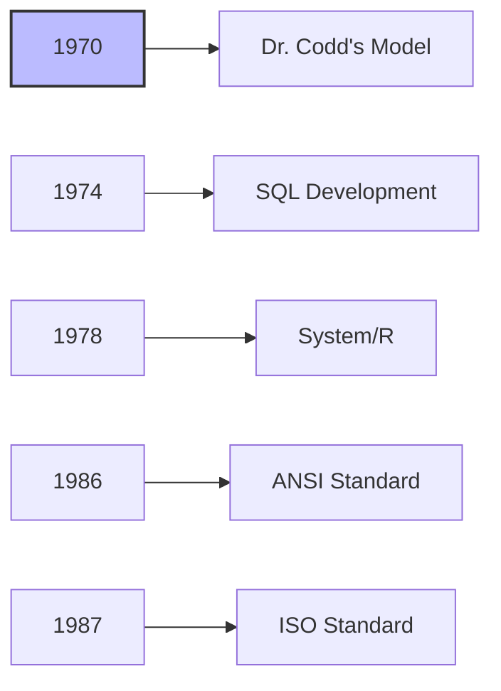
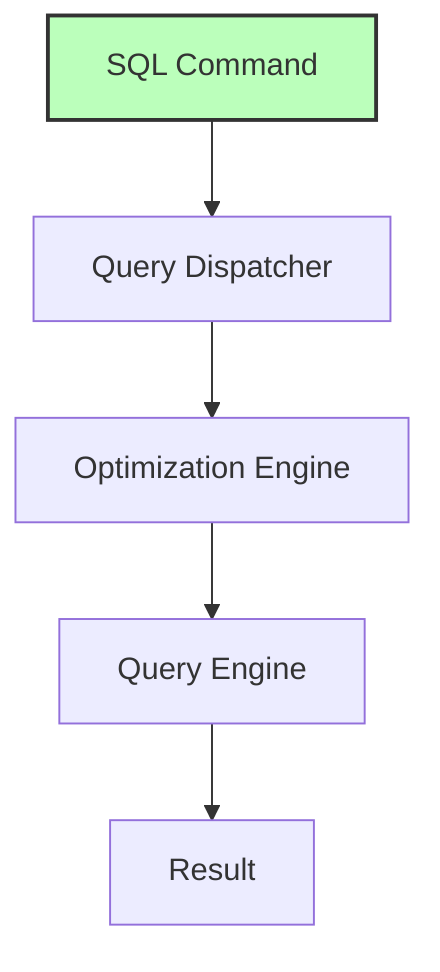

# SQL Overview

## 🎯 Learning Outcomes
By the end of this overview, you will understand:
- What is SQL and its purpose
- History and development of SQL
- Why SQL is important
- How SQL works
- SQL architecture and components

## 📚 Introduction
SQL (Structured Query Language) is:
- A language for database operations
- Used for data manipulation and retrieval
- Standard for relational databases
- Developed by IBM in the 1970s
- ANSI and ISO standard

## 🔄 SQL Definition

**Key Characteristics:**
- Standard database language
- Multiple dialects available
- Used across RDBMS
- ANSI/ISO certified
- Industry standard

## 📊 Why SQL?

### Advantages
1. Data Access
   - Access relational databases
   - Describe data structures
   - Define data relationships
   - Manipulate data efficiently

2. Integration
   - Embed in other languages
   - Use SQL modules
   - Implement libraries
   - Pre-compiler support

3. Database Management
   - Create/drop databases
   - Create/drop tables
   - Create views
   - Manage stored procedures
   - Set permissions

## 📈 History of SQL

### Timeline

**Key Events:**
- 1970: Dr. Edgar F. Codd's relational model
- 1974: SQL development begins
- 1978: IBM's System/R release
- 1986: ANSI standardization
- 1987: ISO standardization

## 🔧 How SQL Works

### Architecture

### Components
1. Query Dispatcher
   - Receives SQL commands
   - Routes to appropriate engine
   - Manages query flow

2. Optimization Engines
   - Analyzes queries
   - Optimizes performance
   - Determines execution plan

3. Classic Query Engine
   - Handles non-SQL queries
   - Processes logical files
   - Manages data access

4. SQL Query Engine
   - Processes SQL commands
   - Executes queries
   - Returns results

## 🎓 Best Practices
1. Use standard SQL when possible
2. Optimize query performance
3. Follow naming conventions
4. Implement proper security
5. Regular maintenance

## ⚠️ Important Notes
- SQL is a standard language
- Multiple dialects exist
- Performance varies by system
- Security is crucial
- Regular updates needed

## 📝 Quick Summary
- SQL is a standard database language
- Developed by IBM in 1970s
- ANSI/ISO certified
- Multiple components work together
- Used across various RDBMS
- Essential for data management
- Continuous evolution

---
*This overview provides a comprehensive understanding of SQL. For practical implementation and examples, refer to the hands-on sections of the course.* 