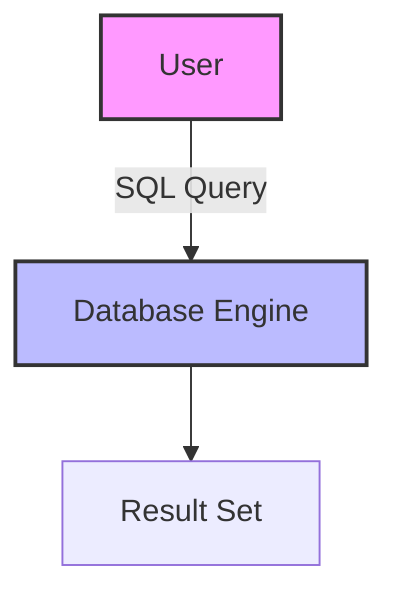

# SQL Overview: The Foundation of Data Interaction

## Introduction: Why SQL is Essential
Imagine trying to find a book in a massive library without a catalog. SQL is the catalog and the librarian—it helps you find, organize, and manage data in any relational database. Whether you're a student, developer, or data scientist, SQL is the key to unlocking the power of your data.

---

## What is SQL?
**SQL (Structured Query Language)** is the standard language for interacting with relational databases. It allows you to:
- Retrieve specific data with queries
- Add, update, or delete information
- Define and modify database structures
- Control access and security

---

## Key Features of SQL
- Universal: Works with almost every major database
- Declarative: You specify what you want, not how to get it
- Powerful: Handles simple lookups to complex analytics
- Extensible: Supports advanced features like triggers, procedures, and window functions

---

## SQL in Action: Example Queries
- **SELECT:** Find all employees in a department
- **INSERT:** Add a new product to inventory
- **UPDATE:** Change a customer's phone number
- **DELETE:** Remove discontinued items

---

## Visualizing SQL Workflow

---

## Best Practices & Key Takeaways
- Write clear, readable queries
- Use comments for complex logic
- Test queries on sample data
- Learn to use indexes for performance
- Practice with real-world scenarios

---

## Further Exploration
- "SQL in 10 Minutes, Sams Teach Yourself" by Ben Forta
- "Learning SQL" by Alan Beaulieu
- Practice on SQLZoo, Mode Analytics, or W3Schools

---
*This overview is designed to make SQL approachable and practical for everyone. For hands-on practice, refer to the exercises and projects in the course materials.* 