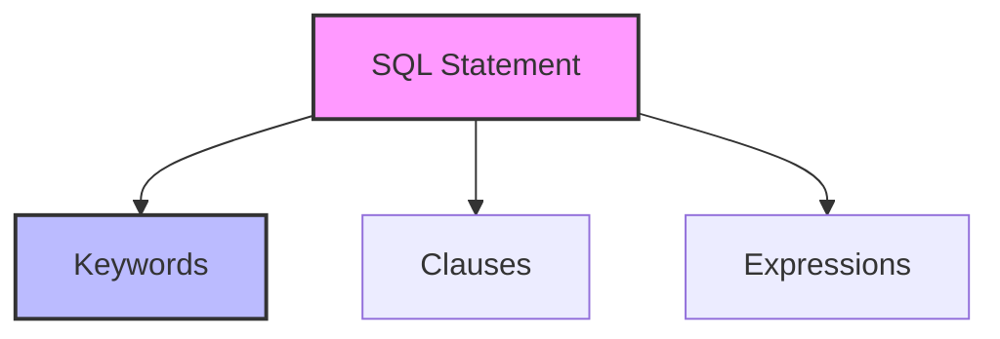

# SQL Syntax: The Grammar of Database Communication

## Introduction: Why Syntax Matters
Imagine writing a letter with no punctuation or structure—no one could understand you! SQL syntax is the grammar and punctuation of database communication. Mastering it means your queries are always clear, correct, and effective.

---

## What is SQL Syntax?
**SQL syntax** is the set of rules that defines how SQL statements are written and understood by the database. It covers:
- Keywords (SELECT, FROM, WHERE, etc.)
- Clauses and expressions
- Statement structure and order
- Case sensitivity and formatting

---

## Basic SQL Statement Structure
```sql
SELECT column1, column2
FROM table_name
WHERE condition
ORDER BY column1;
```

- **SELECT:** What data you want
- **FROM:** Where to get it
- **WHERE:** Filter the data
- **ORDER BY:** Sort the results

---

## Common SQL Syntax Rules
- Statements end with a semicolon (`;`)
- Keywords are not case-sensitive (but best practice is to use UPPERCASE)
- Strings are enclosed in single quotes (`'text'`)
- Identifiers (table/column names) can be quoted with double quotes or backticks
- Comments use `--` for single line or `/* ... */` for multi-line

---

## Visualizing SQL Syntax


---

## Real-World Example: Filtering and Sorting
```sql
SELECT name, age
FROM students
WHERE age > 18
ORDER BY name ASC;
```

---

## Best Practices & Key Takeaways
- Use consistent formatting for readability
- Comment complex queries
- Avoid ambiguous column names
- Test syntax on sample data
- Refer to documentation for dialect-specific rules

---

## Further Exploration
- "SQL Style Guide" by Simon Holywell
- Practice on SQLBolt, Mode Analytics, or W3Schools

---
*This guide is designed to make SQL syntax clear and practical for everyone. For hands-on practice, refer to the exercises and projects in the course materials.* 