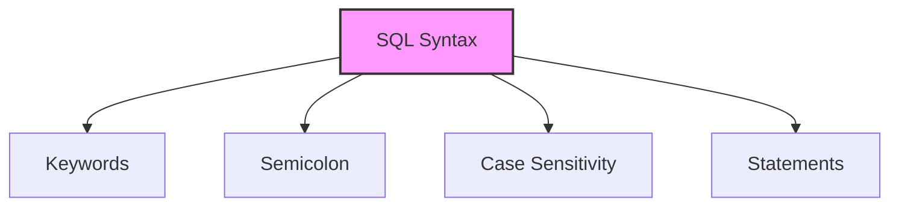

# SQL Syntax

## 🎯 Learning Outcomes
By the end of this overview, you will understand:
- Basic SQL syntax rules
- Common SQL statements
- Data manipulation commands
- Query clauses and operators
- Table management operations

## 📚 Introduction
SQL syntax is:
- A set of rules and guidelines
- Used for writing SQL statements
- Case insensitive (except MySQL table names)
- Ends with semicolon (;)
- Standardized across databases

## 🔄 Basic Syntax Rules


**Key Rules:**
- Start with keywords (SELECT, INSERT, etc.)
- End with semicolon (;)
- Case insensitive for commands
- Case sensitive for table names in MySQL
- Multiple statements per line allowed

## 📊 Common SQL Statements

### 1. Database Management
```sql
-- Create Database
CREATE DATABASE database_name;

-- Use Database
USE database_name;

-- Drop Database
DROP DATABASE database_name;
```

### 2. Table Management
```sql
-- Create Table
CREATE TABLE table_name(
   column1 datatype,
   column2 datatype,
   PRIMARY KEY(column1)
);

-- Drop Table
DROP TABLE table_name;

-- Truncate Table
TRUNCATE TABLE table_name;

-- Alter Table
ALTER TABLE table_name 
ADD column_name datatype;
```

### 3. Data Manipulation
```sql
-- Insert Data
INSERT INTO table_name 
VALUES (value1, value2);

-- Select Data
SELECT column1, column2 
FROM table_name;

-- Update Data
UPDATE table_name 
SET column1 = value1 
WHERE condition;

-- Delete Data
DELETE FROM table_name 
WHERE condition;
```

## 📈 Query Clauses

### 1. WHERE Clause
```sql
SELECT * FROM table_name 
WHERE condition;
```

### 2. ORDER BY Clause
```sql
SELECT * FROM table_name 
ORDER BY column_name ASC|DESC;
```

### 3. GROUP BY Clause
```sql
SELECT column_name, COUNT(*) 
FROM table_name 
GROUP BY column_name;
```

### 4. HAVING Clause
```sql
SELECT column_name, COUNT(*) 
FROM table_name 
GROUP BY column_name 
HAVING COUNT(*) > 1;
```

## 🔍 Operators

### 1. Comparison Operators
- = (Equal)
- != (Not Equal)
- > (Greater Than)
- < (Less Than)
- >= (Greater Than or Equal)
- <= (Less Than or Equal)

### 2. Logical Operators
- AND
- OR
- NOT

### 3. Special Operators
- IN
- BETWEEN
- LIKE
- IS NULL
- IS NOT NULL

## 📝 Example Table: CUSTOMERS
| ID | NAME | AGE | ADDRESS | SALARY |
|----|------|-----|---------|---------|
| 1 | Ramesh | 32 | Ahmedabad | 2000.00 |
| 2 | Khilan | 25 | Delhi | 1500.00 |
| 3 | kaushik | 23 | Kota | 2000.00 |
| 4 | Chaitali | 25 | Mumbai | 6500.00 |
| 5 | Hardik | 27 | Bhopal | 8500.00 |
| 6 | Komal | 22 | Hyderabad | 4500.00 |
| 7 | Muffy | 24 | Indore | 10000.00 |

## 🎓 Best Practices
1. Use meaningful table and column names
2. Include appropriate constraints
3. Use proper data types
4. Add comments for complex queries
5. Format SQL statements properly
6. Use aliases for better readability
7. Optimize query performance

## ⚠️ Important Notes
- Always end statements with semicolon
- Be careful with case sensitivity in MySQL
- Use proper data types
- Include necessary constraints
- Back up data before major operations
- Test queries before execution
- Use transactions when needed

## 📝 Quick Summary
- SQL syntax is standardized
- Statements end with semicolon
- Case sensitivity varies by system
- Multiple clauses available
- Various operators supported
- Proper formatting is important
- Regular practice needed

---
*This overview provides a comprehensive understanding of SQL Syntax. For practical implementation and examples, refer to the hands-on sections of the course.* 