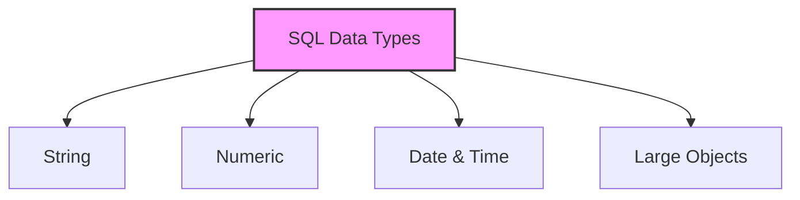

# SQL Data Types

## 🎯 Learning Outcomes
By the end of this overview, you will understand:
- Different categories of SQL data types
- Data type specifications for major RDBMS
- How to choose appropriate data types
- Data type constraints and limitations
- Best practices for data type selection

## 📚 Introduction
SQL data types:
- Define the type of data stored in columns
- Ensure data integrity
- Optimize storage space
- Enable proper data validation
- Vary by database system

## 🔄 Data Type Categories

## 📊 MySQL Data Types

### 1. String Data Types
| Data Type | Description | Size |
|-----------|-------------|------|
| CHAR(size) | Fixed length string | 0-255 chars |
| VARCHAR(size) | Variable length string | 0-65535 chars |
| TEXT | Variable length string | Up to 65,535 bytes |
| LONGTEXT | Large text string | Up to 4GB |
| ENUM | List of values | Up to 65535 values |
| SET | Multiple values | Up to 64 values |

### 2. Numeric Data Types
| Data Type | Description | Range |
|-----------|-------------|-------|
| INT | Integer | ±2.1 billion |
| TINYINT | Small integer | -128 to 127 |
| BIGINT | Large integer | ±9.2 quintillion |
| FLOAT | Floating point | 24-bit precision |
| DOUBLE | Double precision | 53-bit precision |
| DECIMAL | Fixed point | User-defined |

### 3. Date and Time Data Types
| Data Type | Description | Format |
|-----------|-------------|--------|
| DATE | Date only | YYYY-MM-DD |
| DATETIME | Date and time | YYYY-MM-DD HH:MM:SS |
| TIMESTAMP | Timestamp | YYYYMMDDHHMMSS |
| TIME | Time only | HH:MM:SS |
| YEAR | Year only | YYYY |

## 📈 MS SQL Server Data Types

### 1. String Data Types
| Data Type | Description | Size |
|-----------|-------------|------|
| char(n) | Fixed length | 8000 chars |
| varchar(n) | Variable length | 8000 chars |
| text | Variable length | 2GB |
| nchar | Unicode fixed | 4000 chars |
| nvarchar | Unicode variable | 4000 chars |

### 2. Numeric Data Types
| Data Type | Description | Range |
|-----------|-------------|-------|
| bit | Boolean | 0, 1, NULL |
| tinyint | Small integer | 0 to 255 |
| int | Integer | ±2.1 billion |
| bigint | Large integer | ±9.2 quintillion |
| decimal | Fixed point | User-defined |

### 3. Date and Time Data Types
| Data Type | Description | Precision |
|-----------|-------------|-----------|
| datetime | Date and time | 3.33 ms |
| datetime2 | Date and time | 100 ns |
| date | Date only | 1 day |
| time | Time only | 100 ns |

## 🔧 Oracle Data Types

### 1. String Data Types
| Data Type | Description | Size |
|-----------|-------------|------|
| CHAR(size) | Fixed length | 2000 bytes |
| VARCHAR2(size) | Variable length | 4000 bytes |
| NVARCHAR2(size) | Unicode variable | 4000 bytes |

### 2. Numeric Data Types
| Data Type | Description | Precision |
|-----------|-------------|-----------|
| NUMBER(p,s) | Fixed point | User-defined |
| FLOAT(p) | Floating point | 1-126 bits |
| BINARY_FLOAT | 32-bit float | 5 bytes |
| BINARY_DOUBLE | 64-bit float | 9 bytes |

### 3. Large Object Types
| Data Type | Description | Size |
|-----------|-------------|------|
| BLOB | Binary data | 4GB |
| CLOB | Character data | 4GB |
| NCLOB | Unicode data | 4GB |
| BFILE | External file | 4GB |

## 🎓 Best Practices
1. Choose appropriate data types
2. Consider storage requirements
3. Plan for future growth
4. Use consistent naming
5. Document data types
6. Consider performance
7. Validate data types

## ⚠️ Important Notes
- Data types vary by RDBMS
- Size limits differ
- Precision matters
- Storage impacts performance
- Choose carefully
- Consider compatibility
- Plan for migration

## 📝 Quick Summary
- Three main categories
- Multiple RDBMS options
- Size and precision vary
- Storage considerations
- Performance impact
- Compatibility issues
- Regular updates needed

---
*This overview provides a comprehensive understanding of SQL Data Types. For practical implementation and examples, refer to the hands-on sections of the course.* 