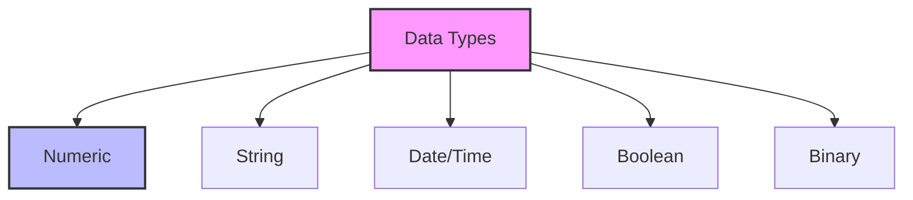

# SQL Data Types: Defining the Nature of Your Data

## Introduction: Why Data Types Matter
Imagine trying to store a phone number as a picture, or a birthday as a sentence. Data types are the rules that tell the database what kind of information goes in each column, ensuring accuracy, efficiency, and reliability.

---

## What are SQL Data Types?
**SQL data types** define the kind of values a column can hold in a database table. They help:
- Store data efficiently
- Prevent errors and inconsistencies
- Optimize performance

---

## Common SQL Data Types (with Examples)

### 1. Numeric Types
- **INT:** Whole numbers (e.g., 42)
- **FLOAT/DOUBLE:** Decimal numbers (e.g., 3.14)
- **DECIMAL:** Fixed-point numbers for money (e.g., 19.99)

### 2. Character/String Types
- **CHAR(n):** Fixed-length text (e.g., 'A123')
- **VARCHAR(n):** Variable-length text (e.g., 'Hello, world!')
- **TEXT:** Large blocks of text

### 3. Date and Time Types
- **DATE:** Calendar date (e.g., '2024-06-01')
- **TIME:** Time of day (e.g., '14:30:00')
- **DATETIME/TIMESTAMP:** Date and time together

### 4. Boolean Type
- **BOOLEAN:** True/False values

### 5. Binary Types
- **BLOB:** Binary Large Object (e.g., images, files)

---

## Visualizing Data Types

---

## Real-World Example: Customer Table
| Column      | Data Type   | Example         |
|-------------|------------|-----------------|
| customer_id | INT        | 101             |
| name        | VARCHAR(50)| 'Alice Smith'   |
| email       | VARCHAR(100)| 'alice@email.com'|
| birthdate   | DATE       | '1990-05-15'    |
| is_active   | BOOLEAN    | TRUE            |

---

## Best Practices & Key Takeaways
- Choose the smallest data type that fits your needs
- Use consistent types for related columns
- Avoid using generic types (like TEXT) unless necessary
- Document your schema for clarity
- Test with real data to ensure accuracy

---

## Further Exploration
- "SQL and Relational Theory" by C.J. Date
- Official documentation for your DBMS (MySQL, PostgreSQL, SQL Server, etc.)
- Practice designing tables with different data types

---
*This guide is designed to make SQL data types clear and practical for everyone. For hands-on practice, refer to the exercises and projects in the course materials.* 