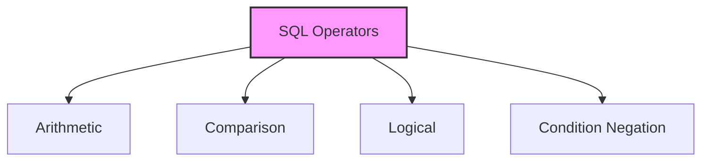
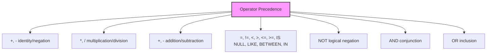

# SQL Operators

## 🎯 Learning Outcomes
By the end of this overview, you will understand:
- Different types of SQL operators
- Operator precedence rules
- How to use operators effectively
- Common operator examples
- Best practices for operator usage

## 📚 Introduction
SQL operators:
- Reserved words or characters
- Used in WHERE clauses
- Perform operations and comparisons
- Can be unary or binary
- Specify conditions in statements

## 🔄 Types of Operators


## 📊 Arithmetic Operators
| Operator | Description | Example | Result |
|----------|-------------|---------|--------|
| + | Addition | 10 + 20 | 30 |
| - | Subtraction | 20 - 30 | -10 |
| * | Multiplication | 10 * 20 | 200 |
| / | Division | 20 / 10 | 2 |
| % | Modulus | 5 % 2 | 1 |

## 📈 Comparison Operators
| Operator | Description | Example | Result |
|----------|-------------|---------|--------|
| = | Equal to | 5 = 5 | TRUE |
| != | Not equal | 5 != 6 | TRUE |
| <> | Not equal | 5 <> 4 | TRUE |
| > | Greater than | 4 > 5 | FALSE |
| < | Less than | 4 < 5 | TRUE |
| >= | Greater than or equal | 4 >= 5 | FALSE |
| <= | Less than or equal | 4 <= 5 | TRUE |
| !< | Not less than | 4 !< 5 | FALSE |
| !> | Not greater than | 4 !> 5 | TRUE |

## 🔧 Logical Operators
| Operator | Description | Example |
|----------|-------------|---------|
| ALL | TRUE if all comparisons are TRUE | `WHERE salary > ALL (1000, 2000)` |
| AND | TRUE if all conditions are TRUE | `WHERE age > 20 AND salary > 50000` |
| ANY | TRUE if any comparison is TRUE | `WHERE salary > ANY (1000, 2000)` |
| BETWEEN | TRUE if within range | `WHERE salary BETWEEN 1000 AND 2000` |
| EXISTS | TRUE if subquery returns records | `WHERE EXISTS (SELECT * FROM orders)` |
| IN | TRUE if matches list | `WHERE id IN (1, 2, 3)` |
| LIKE | TRUE if matches pattern | `WHERE name LIKE 'John%'` |
| NOT | Reverses boolean value | `WHERE NOT (age > 20)` |
| OR | TRUE if any condition is TRUE | `WHERE age > 20 OR salary > 50000` |
| IS NULL | TRUE if value is NULL | `WHERE phone IS NULL` |
| SOME | TRUE if some comparisons are TRUE | `WHERE salary > SOME (1000, 2000)` |
| UNIQUE | TRUE if no duplicates | `WHERE UNIQUE (SELECT id FROM users)` |

## 📝 Operator Precedence


### Example
```sql
SELECT 20 - 3 * 5;
-- Result: 5
-- Multiplication (3 * 5 = 15) is evaluated first
-- Then subtraction (20 - 15 = 5)
```

## 🎓 Best Practices
1. Use parentheses for clarity
2. Understand operator precedence
3. Use appropriate operators
4. Consider NULL handling
5. Test complex expressions
6. Document operator usage
7. Consider performance

## ⚠️ Important Notes
- Operators can be unary or binary
- NULL handling is important
- Precedence affects results
- Different RDBMS may vary
- Test expressions thoroughly
- Consider readability
- Document complex logic

## 📝 Quick Summary
- Four main categories
- Precedence matters
- NULL handling
- Boolean results
- Complex expressions
- Performance impact
- Regular testing needed

---
*This overview provides a comprehensive understanding of SQL Operators. For practical implementation and examples, refer to the hands-on sections of the course.* 