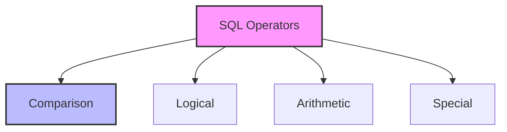

# SQL Operators: The Tools for Data Manipulation

## Introduction: Why Operators Matter
Imagine you're a chef in a kitchen. You need different tools (operators) to chop, mix, and cook ingredients. In SQL, operators are your tools—they help you compare, combine, and transform data to get exactly what you need.

---

## What are SQL Operators?
**SQL operators** are special symbols or keywords that perform specific operations on data. They help you:
- Compare values
- Combine conditions
- Perform calculations
- Filter and sort data

---

## Types of SQL Operators (with Examples)

### 1. Comparison Operators
- **=** (Equal): `WHERE age = 25`
- **!=** or **<>** (Not Equal): `WHERE status != 'inactive'`
- **>** (Greater Than): `WHERE salary > 50000`
- **<** (Less Than): `WHERE price < 100`
- **>=** (Greater Than or Equal): `WHERE quantity >= 10`
- **<=** (Less Than or Equal): `WHERE score <= 100`

### 2. Logical Operators
- **AND:** `WHERE age > 18 AND country = 'USA'`
- **OR:** `WHERE status = 'active' OR status = 'pending'`
- **NOT:** `WHERE NOT status = 'inactive'`

### 3. Arithmetic Operators
- **+** (Addition): `SELECT price + tax`
- **-** (Subtraction): `SELECT price - discount`
- ***** (Multiplication): `SELECT quantity * price`
- **/** (Division): `SELECT total / items`

### 4. Special Operators
- **IN:** `WHERE country IN ('USA', 'Canada', 'Mexico')`
- **BETWEEN:** `WHERE age BETWEEN 18 AND 65`
- **LIKE:** `WHERE name LIKE 'John%'`
- **IS NULL:** `WHERE email IS NULL`
- **IS NOT NULL:** `WHERE phone IS NOT NULL`

---

## Visualizing Operators


---

## Real-World Examples

### Example 1: Customer Filtering
```sql
SELECT * FROM customers
WHERE age >= 18 
AND (country = 'USA' OR country = 'Canada')
AND email IS NOT NULL;
```

### Example 2: Product Pricing
```sql
SELECT product_name,
       price,
       price * 1.1 as price_with_tax,
       CASE 
           WHEN price > 100 THEN 'Premium'
           WHEN price > 50 THEN 'Standard'
           ELSE 'Basic'
       END as category
FROM products;
```

---

## Best Practices & Key Takeaways
- Use parentheses to clarify operator precedence
- Be careful with NULL values in comparisons
- Use appropriate operators for data types
- Consider performance impact of complex conditions
- Test operators with edge cases

---

## Common Pitfalls to Avoid
- Confusing = and == (SQL uses = for equality)
- Forgetting NULL handling
- Misusing LIKE with special characters
- Overlooking operator precedence
- Using wrong data types in comparisons

---

## Further Exploration
- "SQL Performance Explained" by Markus Winand
- Practice on SQLBolt, Mode Analytics, or W3Schools
- Experiment with different operator combinations

---
*This guide is designed to make SQL operators clear and practical for everyone. For hands-on practice, refer to the exercises and projects in the course materials.* 