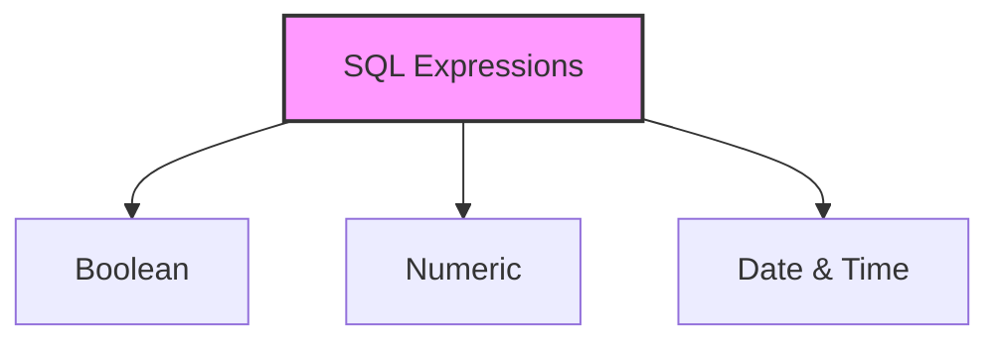

# SQL Expressions

## 🎯 Learning Outcomes
By the end of this overview, you will understand:
- Different types of SQL expressions
- How to use expressions in queries
- Boolean, numeric, and date expressions
- Expression syntax and usage
- Best practices for expressions

## 📚 Introduction
SQL expressions:
- Combine values, operators, and functions
- Evaluate to a single value
- Used in WHERE clauses
- Filter database records
- Written in query language

## 🔄 Types of Expressions


## 📊 Boolean Expressions
Boolean expressions return TRUE, FALSE, or UNKNOWN values.

### Syntax
```sql
SELECT column1, column2, columnN 
FROM table_name 
WHERE BOOLEAN EXPRESSION;
```

### Example
```sql
-- Using comparison operator
SELECT * FROM CUSTOMERS WHERE SALARY = 10000;

-- Using logical operator
SELECT * FROM CUSTOMERS WHERE AGE > 25 AND SALARY > 5000;
```

### Sample Data
| ID | NAME | AGE | ADDRESS | SALARY |
|----|------|-----|---------|---------|
| 1 | Ramesh | 32 | Ahmedabad | 2000.00 |
| 2 | Khilan | 25 | Delhi | 1500.00 |
| 3 | kaushik | 23 | Kota | 2000.00 |
| 4 | Chaitali | 25 | Mumbai | 6500.00 |
| 5 | Hardik | 27 | Bhopal | 8500.00 |
| 6 | Komal | 22 | Hyderabad | 4500.00 |
| 7 | Muffy | 24 | Indore | 10000.00 |

## 📈 Numeric Expressions
Numeric expressions perform mathematical operations.

### Syntax
```sql
SELECT numerical_expression as OPERATION_NAME
FROM table_name
WHERE NUMERICAL EXPRESSION;
```

### Examples
```sql
-- Basic arithmetic
SELECT 15 + 6;  -- Result: 21

-- Using aggregate functions
SELECT COUNT(*) FROM CUSTOMERS;  -- Result: 7
SELECT AVG(SALARY) FROM CUSTOMERS;
SELECT SUM(ORDER_AMOUNT) FROM ORDERS;
```

## 🔧 Date Expressions
Date expressions compare date-related values.

### Syntax
```sql
SELECT column_name(s)
FROM table_name
WHERE DATE EXPRESSION;
```

### Examples
```sql
-- Get current timestamp
SELECT CURRENT_TIMESTAMP;

-- Compare dates
SELECT * FROM ORDERS WHERE DATE < '2008/06/01';
```

### Sample Data
| ORDER_ID | CUSTOMER_ID | DATE | ORDER_AMOUNT | ITEM_COUNT |
|----------|-------------|------|--------------|------------|
| 102 | 3 | 2009-10-08 00:00:00 | 3000 | 4 |
| 100 | 3 | 2009-10-08 00:00:00 | 1500 | 2 |
| 101 | 2 | 2009-11-20 00:00:00 | 1560 | 7 |
| 103 | 4 | 2008-05-20 00:00:00 | 2060 | 3 |

## 🎓 Best Practices
1. Use clear and simple expressions
2. Consider NULL handling
3. Use appropriate data types
4. Test expressions thoroughly
5. Document complex expressions
6. Consider performance
7. Use parentheses for clarity

## ⚠️ Important Notes
- Expressions can be complex
- NULL values affect results
- Date formats matter
- Type conversion occurs
- Performance impacts
- Error handling needed
- Testing is crucial

## 📝 Quick Summary
- Three main types
- Used in WHERE clauses
- Return specific values
- Support filtering
- Enable calculations
- Handle dates
- Regular testing needed

---
*This overview provides a comprehensive understanding of SQL Expressions. For practical implementation and examples, refer to the hands-on sections of the course.* 