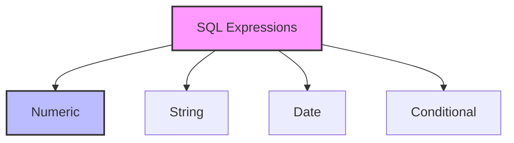

# SQL Expressions: Building Blocks of Data Manipulation

## Introduction: Why Expressions Matter
Imagine you're writing a recipe. You need to combine ingredients (values) with instructions (operations) to create something delicious. SQL expressions are like recipes—they combine values, operators, and functions to create meaningful results from your data.

---

## What are SQL Expressions?
**SQL expressions** are combinations of values, operators, and functions that evaluate to a single value. They help you:
- Calculate new values
- Transform data
- Make decisions
- Filter results

---

## Types of SQL Expressions (with Examples)

### 1. Numeric Expressions
```sql
SELECT 
    price,
    quantity,
    price * quantity as total,
    (price * quantity) * 0.1 as tax
FROM orders;
```

### 2. String Expressions
```sql
SELECT 
    first_name,
    last_name,
    CONCAT(first_name, ' ', last_name) as full_name,
    UPPER(email) as email_upper
FROM customers;
```

### 3. Date Expressions
```sql
SELECT 
    order_date,
    DATE_ADD(order_date, INTERVAL 7 DAY) as delivery_date,
    DATEDIFF(CURRENT_DATE, order_date) as days_since_order
FROM orders;
```

### 4. Conditional Expressions
```sql
SELECT 
    product_name,
    price,
    CASE 
        WHEN price > 100 THEN 'Premium'
        WHEN price > 50 THEN 'Standard'
        ELSE 'Basic'
    END as category
FROM products;
```

---

## Visualizing Expressions


---

## Real-World Examples

### Example 1: Customer Analysis
```sql
SELECT 
    customer_id,
    CONCAT(first_name, ' ', last_name) as customer_name,
    CASE 
        WHEN total_orders > 10 THEN 'VIP'
        WHEN total_orders > 5 THEN 'Regular'
        ELSE 'New'
    END as customer_type,
    total_spent / total_orders as average_order_value
FROM customer_summary;
```

### Example 2: Product Inventory
```sql
SELECT 
    product_name,
    current_stock,
    CASE 
        WHEN current_stock < reorder_level THEN 'Reorder'
        WHEN current_stock = 0 THEN 'Out of Stock'
        ELSE 'In Stock'
    END as stock_status,
    DATE_ADD(last_restock_date, INTERVAL 30 DAY) as next_restock_date
FROM inventory;
```

---

## Best Practices & Key Takeaways
- Use meaningful names for calculated columns
- Break complex expressions into smaller parts
- Consider performance impact of expressions
- Test expressions with edge cases
- Document complex calculations

---

## Common Pitfalls to Avoid
- Forgetting NULL handling in calculations
- Misusing string concatenation
- Overlooking date/time zone issues
- Creating overly complex expressions
- Ignoring data type compatibility

---

## Further Exploration
- "SQL Cookbook" by Anthony Molinaro
- Practice on SQLBolt, Mode Analytics, or W3Schools
- Experiment with different expression combinations

---
*This guide is designed to make SQL expressions clear and practical for everyone. For hands-on practice, refer to the exercises and projects in the course materials.* 