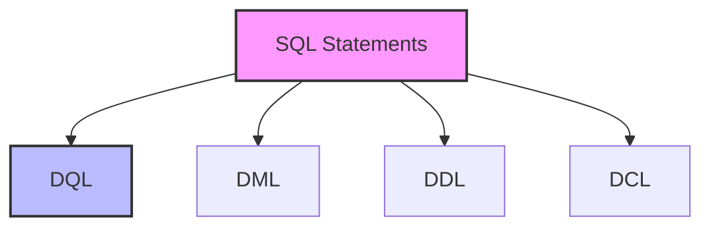

# SQL Statements: The Building Blocks of Database Operations

## Introduction: Why SQL Statements Matter
Imagine you're writing a letter. You need different types of sentences (statements) to ask questions, give instructions, or make requests. SQL statements are like these sentences—they tell the database exactly what you want to do with your data.

---

## What are SQL Statements?
**SQL statements** are complete commands that perform specific operations in a database. They help you:
- Retrieve data
- Modify data
- Create or alter structures
- Control access
- Manage transactions

---

## Types of SQL Statements (with Examples)

### 1. Data Query Language (DQL)
```sql
-- Basic SELECT
SELECT first_name, last_name 
FROM employees 
WHERE department = 'IT';

-- Advanced SELECT with JOIN
SELECT e.name, d.department_name
FROM employees e
JOIN departments d ON e.dept_id = d.id
WHERE e.salary > 50000;
```

### 2. Data Manipulation Language (DML)
```sql
-- INSERT
INSERT INTO customers (name, email) 
VALUES ('John Doe', 'john@example.com');

-- UPDATE
UPDATE products 
SET price = price * 1.1 
WHERE category = 'Electronics';

-- DELETE
DELETE FROM orders 
WHERE status = 'cancelled';
```

### 3. Data Definition Language (DDL)
```sql
-- CREATE TABLE
CREATE TABLE employees (
    id INT PRIMARY KEY,
    name VARCHAR(100),
    department VARCHAR(50),
    salary DECIMAL(10,2)
);

-- ALTER TABLE
ALTER TABLE products 
ADD COLUMN stock_quantity INT;

-- DROP TABLE
DROP TABLE temporary_data;
```

### 4. Data Control Language (DCL)
```sql
-- GRANT
GRANT SELECT, INSERT 
ON customers 
TO sales_team;

-- REVOKE
REVOKE DELETE 
ON orders 
FROM junior_staff;
```

---

## Visualizing SQL Statements


---

## Real-World Examples

### Example 1: E-commerce Database
```sql
-- Create product table
CREATE TABLE products (
    id INT PRIMARY KEY,
    name VARCHAR(100),
    price DECIMAL(10,2),
    stock INT
);

-- Insert products
INSERT INTO products (id, name, price, stock)
VALUES 
    (1, 'Laptop', 999.99, 50),
    (2, 'Smartphone', 499.99, 100);

-- Update stock
UPDATE products 
SET stock = stock - 1 
WHERE id = 1;

-- Query low stock items
SELECT name, stock 
FROM products 
WHERE stock < 10;
```

### Example 2: Employee Management
```sql
-- Create employee table
CREATE TABLE employees (
    id INT PRIMARY KEY,
    name VARCHAR(100),
    department VARCHAR(50),
    salary DECIMAL(10,2)
);

-- Grant permissions
GRANT SELECT ON employees TO managers;
GRANT ALL ON employees TO hr_department;

-- Query department summary
SELECT 
    department,
    COUNT(*) as employee_count,
    AVG(salary) as avg_salary
FROM employees
GROUP BY department;
```

---

## Best Practices & Key Takeaways
- Use consistent formatting
- Include comments for complex statements
- Test statements on sample data first
- Use transactions for multiple operations
- Follow naming conventions
- Consider performance impact

---

## Common Pitfalls to Avoid
- Forgetting WHERE clauses in UPDATE/DELETE
- Not backing up data before major changes
- Using DDL in production without testing
- Overlooking transaction management
- Ignoring security implications

---

## Further Exploration
- "SQL Performance Explained" by Markus Winand
- "SQL Antipatterns" by Bill Karwin
- Practice on SQLBolt, Mode Analytics, or W3Schools

---
*This guide is designed to make SQL statements clear and practical for everyone. For hands-on practice, refer to the exercises and projects in the course materials.* 