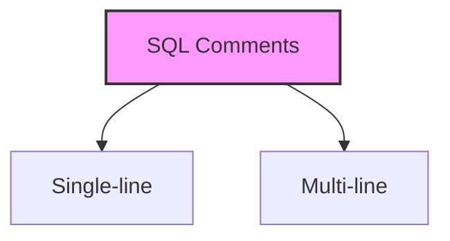

# SQL Comments

## 🎯 Learning Outcomes
By the end of this overview, you will understand:
- Types of SQL comments
- How to use comments effectively
- Single-line comment syntax
- Multi-line comment syntax
- Best practices for commenting

## 📚 Introduction
SQL comments:
- Provide additional information
- Are ignored by the compiler
- Don't affect program functionality
- Make code more readable
- Help document queries

## 🔄 Types of Comments


## 📊 Single-Line Comments
Single-line comments start with `--` and extend to the end of the line.

### Syntax
```sql
-- This is a single-line comment
```

### Examples
```sql
-- Will fetch all the table records
SELECT * from table;

-- Using comment to ignore ORDER BY clause
SELECT * FROM CUSTOMERS -- ORDER BY NAME ASC;

-- Commenting out a statement
SELECT * FROM CUSTOMERS;
SELECT * FROM EMPLOYEES; 
-- SELECT * FROM ORDERS WHERE ID = 6;
```

## 📈 Multi-Line Comments
Multi-line comments start with `/*` and end with `*/`.

### Syntax
```sql
/* This is a
   multi-line
   comment */
```

### Examples
```sql
/* Following query 
   will fetch all the 
   table records */
SELECT * from CUSTOMERS;

-- Commenting out specific columns
SELECT ID /*AGE, SALARY*/ 
FROM CUSTOMERS WHERE SALARY = 1500.00;

-- Commenting out multiple statements
/*SELECT * FROM CUSTOMERS;
SELECT * FROM EMPLOYEE;*/
SELECT * FROM ORDERS WHERE ID = 6;
```

## 🎓 Best Practices
1. Use comments to explain complex queries
2. Document query purpose
3. Comment out unused code
4. Keep comments up to date
5. Use clear language
6. Be consistent with style
7. Don't over-comment

## ⚠️ Important Notes
- Comments are ignored by SQL
- They don't affect performance
- They help with debugging
- They improve code readability
- They document code changes
- They explain complex logic
- They help other developers

## 📝 Quick Summary
- Two main types
- Single-line: --
- Multi-line: /* */
- Used for documentation
- Ignored by compiler
- Improves readability
- Helps maintenance

## 🔍 Common Use Cases
1. Documenting query purpose
2. Explaining complex logic
3. Temporarily disabling code
4. Adding TODO notes
5. Describing parameters
6. Explaining joins
7. Documenting changes

---
*This overview provides a comprehensive understanding of SQL Comments. For practical implementation and examples, refer to the hands-on sections of the course.* 