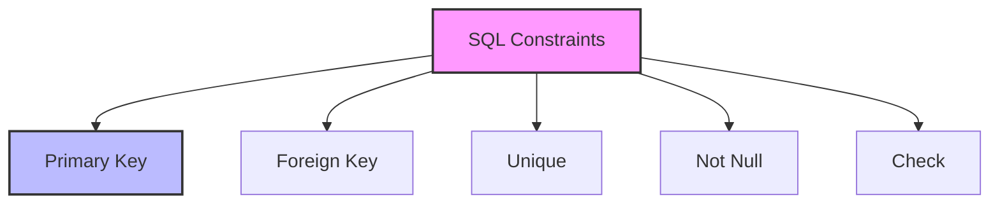

# SQL Constraints: The Rules of Data Integrity

## Introduction: Why Constraints Matter
Imagine a library where books can be placed anywhere, with no organization or rules. Chaos would ensue! SQL constraints are like library rules—they ensure your data stays organized, accurate, and reliable by enforcing specific rules and relationships.

---

## What are SQL Constraints?
**SQL constraints** are rules applied to columns or tables that limit the type of data that can be stored. They help:
- Maintain data accuracy
- Ensure data integrity
- Establish relationships
- Prevent invalid data

---

## Types of SQL Constraints (with Examples)

### 1. Primary Key
```sql
CREATE TABLE employees (
    employee_id INT PRIMARY KEY,
    name VARCHAR(100),
    email VARCHAR(100)
);
```
- Uniquely identifies each row
- Cannot be NULL
- Automatically creates an index

### 2. Foreign Key
```sql
CREATE TABLE orders (
    order_id INT PRIMARY KEY,
    customer_id INT,
    FOREIGN KEY (customer_id) 
    REFERENCES customers(customer_id)
);
```
- Links tables together
- Ensures referential integrity
- Prevents orphaned records

### 3. Unique
```sql
CREATE TABLE users (
    user_id INT PRIMARY KEY,
    username VARCHAR(50) UNIQUE,
    email VARCHAR(100) UNIQUE
);
```
- Ensures no duplicate values
- Can be NULL (unless NOT NULL is specified)
- Can be applied to multiple columns

### 4. Not Null
```sql
CREATE TABLE products (
    product_id INT PRIMARY KEY,
    name VARCHAR(100) NOT NULL,
    price DECIMAL(10,2) NOT NULL
);
```
- Prevents NULL values
- Ensures required data is provided
- Can be combined with other constraints

### 5. Check
```sql
CREATE TABLE students (
    student_id INT PRIMARY KEY,
    age INT CHECK (age >= 18),
    grade CHAR(1) CHECK (grade IN ('A', 'B', 'C', 'D', 'F'))
);
```
- Enforces specific conditions
- Validates data before insertion
- Can use complex expressions

---

## Visualizing Constraints


---

## Real-World Examples

### Example 1: E-commerce Database
```sql
CREATE TABLE products (
    product_id INT PRIMARY KEY,
    name VARCHAR(100) NOT NULL,
    price DECIMAL(10,2) NOT NULL CHECK (price > 0),
    category_id INT,
    FOREIGN KEY (category_id) REFERENCES categories(category_id)
);

CREATE TABLE orders (
    order_id INT PRIMARY KEY,
    customer_id INT NOT NULL,
    order_date DATETIME NOT NULL,
    total_amount DECIMAL(10,2) CHECK (total_amount >= 0),
    status VARCHAR(20) CHECK (status IN ('pending', 'shipped', 'delivered')),
    FOREIGN KEY (customer_id) REFERENCES customers(customer_id)
);
```

### Example 2: Student Management System
```sql
CREATE TABLE students (
    student_id INT PRIMARY KEY,
    first_name VARCHAR(50) NOT NULL,
    last_name VARCHAR(50) NOT NULL,
    email VARCHAR(100) UNIQUE NOT NULL,
    age INT CHECK (age >= 16 AND age <= 100),
    enrollment_date DATE NOT NULL
);

CREATE TABLE courses (
    course_id INT PRIMARY KEY,
    course_name VARCHAR(100) NOT NULL,
    credits INT CHECK (credits > 0 AND credits <= 6),
    department_id INT,
    FOREIGN KEY (department_id) REFERENCES departments(dept_id)
);
```

---

## Best Practices & Key Takeaways
- Use meaningful constraint names
- Consider performance impact
- Plan constraints before table creation
- Document constraint purposes
- Test constraints with edge cases
- Use appropriate constraint types

---

## Common Pitfalls to Avoid
- Over-constraining tables
- Forgetting to index foreign keys
- Using too many CHECK constraints
- Ignoring constraint performance
- Not handling constraint violations

---

## Further Exploration
- "SQL Antipatterns" by Bill Karwin
- "Database Design for Mere Mortals" by Michael J. Hernandez
- Practice on SQLBolt, Mode Analytics, or W3Schools

---
*This guide is designed to make SQL constraints clear and practical for everyone. For hands-on practice, refer to the exercises and projects in the course materials.* 