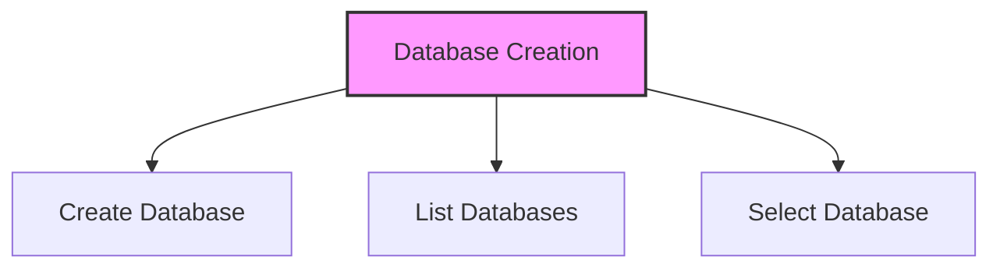

# SQL Database Creation

## 🎯 Learning Outcomes
By the end of this overview, you will understand:
- How to create databases in SQL
- Database naming conventions
- How to list databases
- How to select/use databases
- Best practices for database creation

## 📚 Introduction
SQL databases:
- Store structured data
- Enable efficient data retrieval
- Support multiple query languages
- Require proper naming conventions
- Need appropriate permissions

## 🔄 Database Creation Process


## 📊 CREATE DATABASE Statement
The CREATE DATABASE statement is a DDL command used to create new databases.

### Syntax
```sql
CREATE DATABASE DatabaseName;
```

### Important Notes
- Database names are case-sensitive on Linux/Unix
- Names can contain numbers, letters, and underscores
- Cannot use SQL keywords as database names
- Requires admin privileges
- Must follow naming conventions

### Example
```sql
CREATE DATABASE testDB;
```

## 📈 Listing Databases
Use the SHOW DATABASES command to view all databases.

### Syntax
```sql
SHOW DATABASES;
```

### Example Output
```
Database
--------
master
performance_schema
information_schema
mysql
testDB
```

## 🔧 Selecting/Using Databases
Use the USE statement to set a database as the default.

### Syntax
```sql
USE DatabaseName;
```

### Example
```sql
USE testDB;
```

## 🎓 Best Practices
1. Use meaningful database names
2. Follow naming conventions
3. Check for existing databases
4. Verify permissions
5. Document database creation
6. Plan database structure
7. Consider case sensitivity

## ⚠️ Common Errors
- Access denied errors
- Invalid database names
- Case sensitivity issues
- Permission problems
- Existing database conflicts
- Syntax errors
- Naming convention violations

## 📝 Quick Summary
- CREATE DATABASE syntax
- SHOW DATABASES command
- USE statement
- Naming conventions
- Permission requirements
- Case sensitivity rules
- Error handling

## 🔍 Important Considerations
1. Database naming rules
2. System requirements
3. Permission levels
4. Case sensitivity
5. Existing databases
6. Storage requirements
7. Backup procedures

## 💡 Tips
- Always verify permissions
- Check for existing databases
- Use consistent naming
- Document database creation
- Plan database structure
- Consider future growth
- Regular maintenance

---
*This overview provides a comprehensive understanding of SQL Database Creation. For practical implementation and examples, refer to the hands-on sections of the course.* 