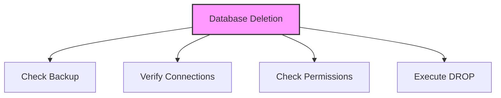

# SQL DROP DATABASE

## 🎯 Learning Outcomes
By the end of this overview, you will understand:
- How to drop databases in SQL
- DROP DATABASE syntax
- IF EXISTS clause usage
- Multiple database deletion
- Best practices for database deletion

## 📚 Introduction
DROP DATABASE:
- Deletes existing databases
- Removes all associated data
- Requires proper permissions
- Should be used with caution
- Needs careful consideration

## 🔄 Database Deletion Process


## 📊 DROP DATABASE Statement
The DROP DATABASE statement permanently removes a database and all its contents.

### Syntax
```sql
DROP DATABASE DatabaseName;
```

### Important Considerations
- Take database backup first
- Ensure no active connections
- Verify admin privileges
- Check database existence
- Consider dependencies

### Example
```sql
-- Create test databases
CREATE DATABASE testDB1;
CREATE DATABASE testDB2;
CREATE DATABASE testDB3;
CREATE DATABASE testDB4;

-- Verify databases
SHOW DATABASES;

-- Drop a database
DROP DATABASE testDB1;

-- Verify deletion
SHOW DATABASES;
```

## 📈 DROP DATABASE IF EXISTS
The IF EXISTS clause prevents errors when dropping non-existent databases.

### Syntax
```sql
DROP DATABASE IF EXISTS DatabaseName;
```

### Example
```sql
-- Drop existing database
DROP DATABASE IF EXISTS testDB2;
-- Output: Query OK, 0 rows affected, 3 warnings (0.024 sec)

-- Drop non-existent database
DROP DATABASE IF EXISTS testDB2;
-- Output: Query OK, 0 rows affected, 1 warning (0.000 sec)
```

## 🔧 Multiple Database Deletion
You can drop multiple databases in a single statement.

### Syntax
```sql
DROP DATABASE DatabaseName1, DatabaseName2, ...;
```

### Example
```sql
DROP DATABASE testDB3, testDB4;
```

## 🎓 Best Practices
1. Always backup before dropping
2. Check for active connections
3. Verify database existence
4. Use IF EXISTS clause
5. Document deletion process
6. Consider dependencies
7. Verify permissions

## ⚠️ Common Errors
- Permission denied
- Database in use
- Non-existent database
- Syntax errors
- Connection issues
- Dependency conflicts
- Backup failures

## 📝 Quick Summary
- DROP DATABASE syntax
- IF EXISTS clause
- Multiple database deletion
- Permission requirements
- Backup importance
- Connection checking
- Error handling

## 🔍 Important Considerations
1. Data backup
2. Active connections
3. User permissions
4. Database existence
5. Dependencies
6. System impact
7. Recovery plan

## 💡 Tips
- Always backup first
- Check connections
- Verify permissions
- Use IF EXISTS
- Document process
- Test in development
- Plan recovery

---
*This overview provides a comprehensive understanding of SQL DROP DATABASE. For practical implementation and examples, refer to the hands-on sections of the course.* 