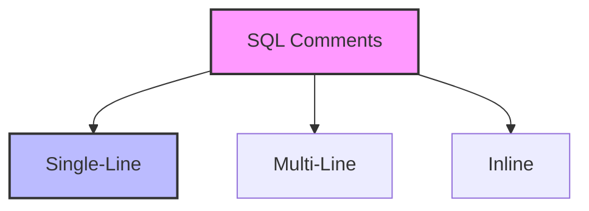

# SQL Comments: Documenting Your Database Code

## Introduction: Why Comments Matter
Imagine reading a complex recipe without any notes or explanations. You'd be lost! SQL comments are like recipe notes—they explain what your code does, why it does it, and how it works, making it easier for you and others to understand and maintain.

---

## What are SQL Comments?
**SQL comments** are non-executable text that helps document your SQL code. They help:
- Explain complex logic
- Document assumptions
- Provide context
- Make code more maintainable
- Guide future developers

---

## Types of SQL Comments (with Examples)

### 1. Single-Line Comments
```sql
-- This is a single-line comment
SELECT * FROM employees; -- This comment explains the query
```

### 2. Multi-Line Comments
```sql
/* This is a multi-line comment
   It can span multiple lines
   Useful for longer explanations */
SELECT * FROM products;
```

### 3. Inline Comments
```sql
SELECT 
    employee_id,  -- Unique identifier
    first_name,   -- Employee's first name
    last_name,    -- Employee's last name
    salary        -- Annual salary in USD
FROM employees;
```

---

## Best Practices for Writing Comments

### 1. Document Complex Queries
```sql
/* This query calculates the average salary by department
   and includes only employees who have been with the company
   for more than 1 year */
SELECT 
    department,
    AVG(salary) as avg_salary
FROM employees
WHERE hire_date < DATE_SUB(CURRENT_DATE, INTERVAL 1 YEAR)
GROUP BY department;
```

### 2. Explain Business Logic
```sql
-- Calculate discount based on customer loyalty
-- Gold members: 20% off
-- Silver members: 10% off
-- Regular customers: 5% off
SELECT 
    order_id,
    total_amount,
    CASE 
        WHEN membership_level = 'Gold' THEN total_amount * 0.8
        WHEN membership_level = 'Silver' THEN total_amount * 0.9
        ELSE total_amount * 0.95
    END as discounted_amount
FROM orders;
```

### 3. Document Schema Changes
```sql
/* Added new column 'last_login_date' to track user activity
   This helps identify inactive accounts for cleanup */
ALTER TABLE users
ADD COLUMN last_login_date DATETIME;
```

---

## Visualizing Comment Types


---

## Real-World Examples

### Example 1: Complex Report Query
```sql
/* Monthly Sales Report
   This query generates a report of monthly sales by product category
   It includes:
   - Total sales amount
   - Number of orders
   - Average order value
   - Year-over-year comparison
   Last updated: 2024-03-15 */
SELECT 
    p.category,
    DATE_FORMAT(o.order_date, '%Y-%m') as month,
    SUM(o.total_amount) as total_sales,
    COUNT(DISTINCT o.order_id) as order_count,
    AVG(o.total_amount) as avg_order_value
FROM orders o
JOIN products p ON o.product_id = p.product_id
GROUP BY p.category, DATE_FORMAT(o.order_date, '%Y-%m')
ORDER BY month DESC, total_sales DESC;
```

### Example 2: Data Migration Script
```sql
-- Step 1: Create temporary table for data validation
CREATE TABLE temp_customers (
    customer_id INT,
    name VARCHAR(100),
    email VARCHAR(100)
);

-- Step 2: Import data from legacy system
INSERT INTO temp_customers
SELECT * FROM legacy_customers;

-- Step 3: Validate data
-- Check for duplicate emails
SELECT email, COUNT(*) as count
FROM temp_customers
GROUP BY email
HAVING count > 1;

-- Step 4: Migrate valid data
INSERT INTO customers (customer_id, name, email)
SELECT customer_id, name, email
FROM temp_customers
WHERE email IS NOT NULL;
```

---

## Best Practices & Key Takeaways
- Write clear, concise comments
- Explain why, not just what
- Keep comments up to date
- Use consistent formatting
- Comment complex logic
- Document assumptions
- Include examples where helpful

---

## Common Pitfalls to Avoid
- Writing obvious comments
- Leaving outdated comments
- Over-commenting simple code
- Using comments to explain bad code
- Ignoring comment formatting

---

## Further Exploration
- "Clean Code" by Robert C. Martin
- "SQL Style Guide" by Simon Holywell
- Practice writing and reviewing commented code

---
*This guide is designed to make SQL comments clear and practical for everyone. For hands-on practice, refer to the exercises and projects in the course materials.* 