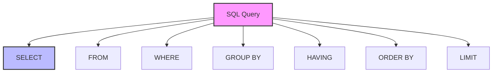

# SQL Clauses: The Building Blocks of Queries

## Introduction: Why Clauses Matter
Imagine building a house - you need different components like walls, doors, and windows to make it functional. SQL clauses are like these building blocks - each one serves a specific purpose in constructing effective database queries. Understanding clauses is key to writing powerful and efficient SQL statements.

---

## What are SQL Clauses?
**SQL clauses** are components of SQL statements that perform specific functions. They help:
- Filter data
- Group results
- Sort output
- Join tables
- Limit results
- Combine queries

---

## Types of SQL Clauses (with Examples)

### 1. WHERE Clause
```sql
-- Basic filtering
SELECT * FROM employees 
WHERE salary > 50000;

-- Multiple conditions
SELECT * FROM products 
WHERE price < 100 
AND category = 'Electronics';

-- Pattern matching
SELECT * FROM customers 
WHERE email LIKE '%@gmail.com';
```

### 2. GROUP BY Clause
```sql
-- Simple grouping
SELECT department, COUNT(*) as employee_count
FROM employees
GROUP BY department;

-- Multiple columns
SELECT department, job_title, 
       AVG(salary) as avg_salary
FROM employees
GROUP BY department, job_title;
```

### 3. HAVING Clause
```sql
-- Filter grouped results
SELECT department, AVG(salary) as avg_salary
FROM employees
GROUP BY department
HAVING AVG(salary) > 60000;

-- Complex conditions
SELECT category, COUNT(*) as product_count
FROM products
GROUP BY category
HAVING COUNT(*) > 10 
AND AVG(price) < 100;
```

### 4. ORDER BY Clause
```sql
-- Basic sorting
SELECT * FROM products
ORDER BY price DESC;

-- Multiple columns
SELECT * FROM employees
ORDER BY department ASC, salary DESC;

-- Custom sorting
SELECT * FROM products
ORDER BY 
    CASE category
        WHEN 'Electronics' THEN 1
        WHEN 'Clothing' THEN 2
        ELSE 3
    END;
```

### 5. LIMIT Clause
```sql
-- Basic limit
SELECT * FROM products
LIMIT 10;

-- With offset
SELECT * FROM products
LIMIT 10 OFFSET 20;

-- Top N results
SELECT * FROM employees
ORDER BY salary DESC
LIMIT 5;
```

### 6. JOIN Clauses
```sql
-- Inner join
SELECT orders.order_id, customers.name
FROM orders
INNER JOIN customers 
ON orders.customer_id = customers.id;

-- Left join
SELECT customers.name, orders.order_id
FROM customers
LEFT JOIN orders 
ON customers.id = orders.customer_id;

-- Multiple joins
SELECT 
    orders.order_id,
    customers.name,
    products.product_name
FROM orders
JOIN customers ON orders.customer_id = customers.id
JOIN order_items ON orders.id = order_items.order_id
JOIN products ON order_items.product_id = products.id;
```

---

## Visualizing Clause Relationships


---

## Real-World Examples

### Example 1: Sales Analysis
```sql
/* Monthly sales analysis by product category
   Shows top 5 categories by revenue */
SELECT 
    p.category,
    DATE_FORMAT(o.order_date, '%Y-%m') as month,
    SUM(oi.quantity * oi.price) as total_revenue,
    COUNT(DISTINCT o.order_id) as order_count
FROM orders o
JOIN order_items oi ON o.order_id = oi.order_id
JOIN products p ON oi.product_id = p.product_id
WHERE o.order_date >= DATE_SUB(CURRENT_DATE, INTERVAL 1 YEAR)
GROUP BY p.category, DATE_FORMAT(o.order_date, '%Y-%m')
HAVING total_revenue > 10000
ORDER BY total_revenue DESC
LIMIT 5;
```

### Example 2: Employee Performance Report
```sql
/* Department performance analysis
   Shows departments with high-performing employees */
SELECT 
    d.department_name,
    COUNT(e.employee_id) as employee_count,
    AVG(e.salary) as avg_salary,
    MAX(e.salary) as max_salary,
    MIN(e.salary) as min_salary
FROM departments d
LEFT JOIN employees e ON d.department_id = e.department_id
WHERE e.hire_date >= DATE_SUB(CURRENT_DATE, INTERVAL 5 YEAR)
GROUP BY d.department_name
HAVING COUNT(e.employee_id) > 5
ORDER BY avg_salary DESC;
```

---

## Best Practices & Key Takeaways
- Use appropriate clauses for your needs
- Consider performance implications
- Order clauses correctly
- Use meaningful aliases
- Test with different data scenarios
- Document complex queries

---

## Common Pitfalls to Avoid
- Using HAVING instead of WHERE
- Forgetting GROUP BY with aggregates
- Overusing subqueries
- Ignoring NULL values
- Not using indexes effectively
- Writing overly complex queries

---

## Further Exploration
- "SQL Performance Explained" by Markus Winand
- "SQL Cookbook" by Anthony Molinaro
- Practice on LeetCode or HackerRank

---
*This guide is designed to make SQL clauses clear and practical for everyone. For hands-on practice, refer to the exercises and projects in the course materials.* 