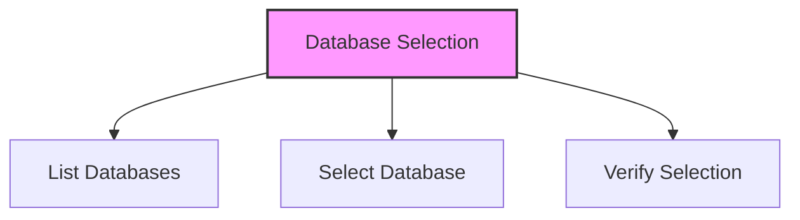

# SQL SELECT Database

## 🎯 Learning Outcomes
By the end of this overview, you will understand:
- How to select databases in SQL
- USE statement syntax
- Database selection process
- Best practices for database selection
- Common database operations

## 📚 Introduction
SELECT Database:
- Allows working with specific databases
- Required before performing operations
- Uses USE statement
- Must be unique within RDBMS
- Essential for data management

## 🔄 Database Selection Process


## 📊 USE Statement
The USE statement selects a database for subsequent operations.

### Syntax
```sql
USE DatabaseName;
```

### Example
```sql
-- List available databases
SHOW DATABASES;

-- Select a database
USE AMROOD;
```

### Sample Output
```
+--------------------+
| Database           |
+--------------------+
| information_schema |
| AMROOD             |
| TUTORIALSPOINT     |
| mysql              |
| orig               |
| test               |
+--------------------+
6 rows in set (0.00 sec)
```

## 📈 Best Practices
1. Always verify database existence
2. Check user permissions
3. Use consistent naming
4. Document database selection
5. Consider case sensitivity
6. Verify active connections
7. Plan database operations

## 🔧 Common Operations
- Creating tables
- Modifying data
- Running queries
- Managing users
- Setting permissions
- Backup operations
- Maintenance tasks

## 🎓 Important Notes
- Database names must be unique
- Case sensitivity matters
- Permissions are required
- Active connections affect operations
- System databases are protected
- Backup before major changes
- Document all changes

## ⚠️ Common Errors
- Database not found
- Permission denied
- Invalid syntax
- Connection issues
- Case sensitivity errors
- System database access
- Lock conflicts

## 📝 Quick Summary
- USE statement syntax
- Database listing
- Selection process
- Permission requirements
- Case sensitivity
- Common operations
- Error handling

## 🔍 Important Considerations
1. Database existence
2. User permissions
3. Active connections
4. System requirements
5. Backup procedures
6. Maintenance schedule
7. Security measures

## 💡 Tips
- Always verify selection
- Check permissions
- Use consistent naming
- Document changes
- Plan operations
- Monitor performance
- Regular maintenance

---
*This overview provides a comprehensive understanding of SQL SELECT Database. For practical implementation and examples, refer to the hands-on sections of the course.* 