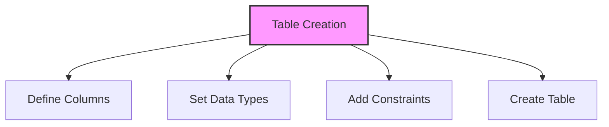

# SQL CREATE TABLE

## 🎯 Learning Outcomes
By the end of this overview, you will understand:
- How to create tables in SQL
- Table structure and columns
- Data type specifications
- Table constraints
- Best practices for table creation

## 📚 Introduction
CREATE TABLE:
- Defines new table structure
- Specifies column definitions
- Sets data types
- Establishes constraints
- Creates database objects

## 🔄 Table Creation Process


## 📊 Basic Table Creation
The CREATE TABLE statement creates a new table with specified columns.

### Syntax
```sql
CREATE TABLE table_name (
    column1 datatype,
    column2 datatype,
    column3 datatype,
    ...
);
```

### Example
```sql
CREATE TABLE Customers (
    ID INT,
    Name VARCHAR(50),
    Age INT,
    Address VARCHAR(100),
    Salary DECIMAL(10,2)
);
```

## 📈 Data Types
Common SQL data types include:

### Numeric Types
- INT: Integer values
- FLOAT: Floating-point numbers
- DECIMAL: Fixed-point numbers

### Character Types
- CHAR: Fixed-length strings
- VARCHAR: Variable-length strings
- TEXT: Large text data

### Date/Time Types
- DATE: Date values
- TIME: Time values
- DATETIME: Date and time values

### Binary Types
- BINARY: Fixed-length binary data
- VARBINARY: Variable-length binary data

### Boolean Type
- BOOLEAN: True/False values

## 🔧 Table Constraints
Common constraints include:

### Primary Key
```sql
CREATE TABLE Customers (
    ID INT PRIMARY KEY,
    Name VARCHAR(50)
);
```

### Foreign Key
```sql
CREATE TABLE Orders (
    OrderID INT PRIMARY KEY,
    CustomerID INT,
    FOREIGN KEY (CustomerID) REFERENCES Customers(ID)
);
```

### Not Null
```sql
CREATE TABLE Products (
    ID INT PRIMARY KEY,
    Name VARCHAR(50) NOT NULL
);
```

### Unique
```sql
CREATE TABLE Users (
    ID INT PRIMARY KEY,
    Email VARCHAR(100) UNIQUE
);
```

## 🎓 Best Practices
1. Use meaningful table names
2. Choose appropriate data types
3. Define primary keys
4. Set up foreign keys
5. Add necessary constraints
6. Document table structure
7. Plan for scalability

## ⚠️ Common Errors
- Invalid data types
- Missing primary key
- Incorrect constraints
- Syntax errors
- Naming conflicts
- Permission issues
- Storage limitations

## 📝 Quick Summary
- CREATE TABLE syntax
- Data type selection
- Constraint definition
- Primary/Foreign keys
- Table relationships
- Data integrity
- Performance considerations

## 🔍 Important Considerations
1. Table naming conventions
2. Data type selection
3. Constraint requirements
4. Indexing strategy
5. Storage requirements
6. Performance impact
7. Maintenance needs

## 💡 Tips
- Plan table structure
- Use appropriate types
- Define relationships
- Add necessary constraints
- Document thoroughly
- Consider performance
- Regular maintenance

---
*This overview provides a comprehensive understanding of SQL CREATE TABLE. For practical implementation and examples, refer to the hands-on sections of the course.* 